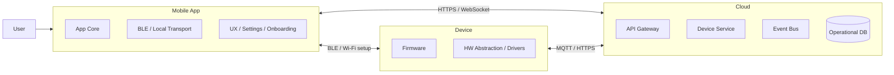
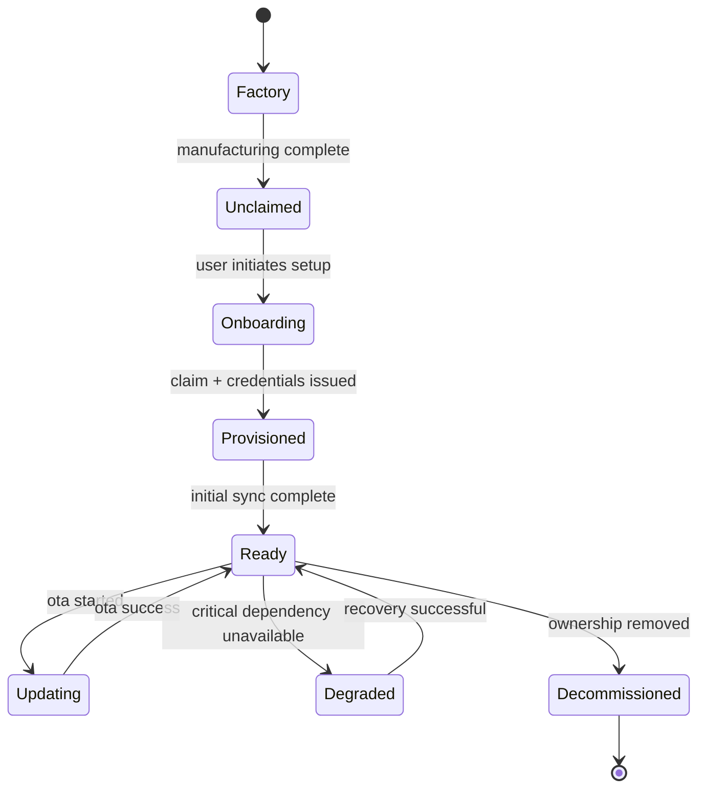
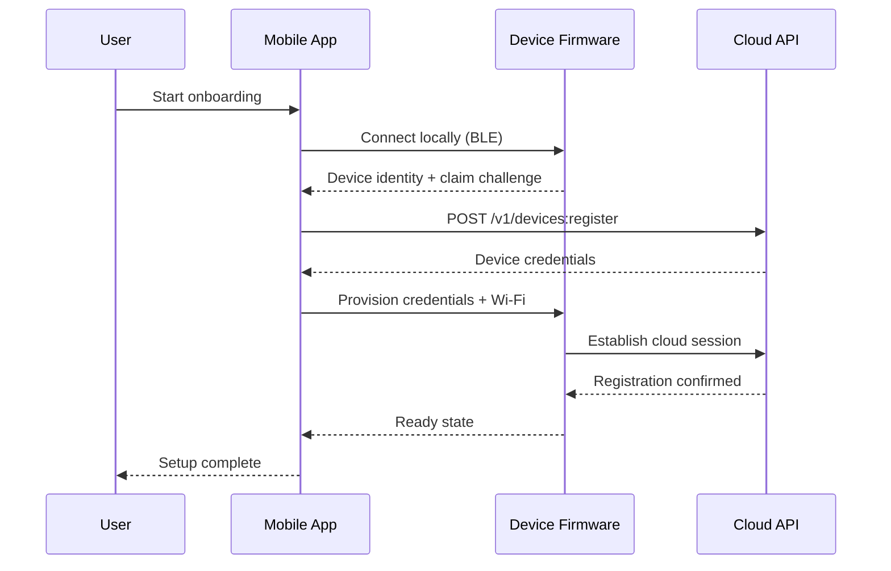

# Software Architecture

Translate a PRD plus hardware architecture design into a review-ready software architecture package for connected products spanning firmware, mobile app, and cloud.

## Default deliverables

Produce a single cohesive architecture package with these sections unless the user asks for a subset:

1. Executive summary
2. Scope, goals, and non-goals
3. Assumptions, open questions, and dependencies
4. Feature-to-architecture traceability matrix
5. System context and software block diagrams
6. Component responsibilities for firmware, mobile app, cloud, admin/tooling, and shared libraries
7. External and internal API specifications
8. Data model and event model
9. Top-level state machine
10. UML sequence diagrams for key flows
11. Quality attributes and cross-cutting concerns
12. Verification, rollout, and operational readiness
13. Risks and recommended next steps

When diagrams are requested, prefer Mermaid by default because it is readable in markdown. If the user explicitly asks for PlantUML, draw.io text, or another format, use that format instead. When the user asks for “all of these,” provide Mermaid first and then also provide PlantUML-friendly alternatives only for the most important diagrams if output length allows.

## Input handling

Expected inputs are links to markdown documents containing:
- PRD
- hardware architecture design
- optional supporting docs such as protocol notes, existing APIs, or constraints

When links are provided:
1. Read each linked document before drafting the architecture.
2. Extract explicit requirements, constraints, interfaces, and assumptions.
3. Separate confirmed facts from inferred design choices.
4. If details are missing, make reasonable architectural assumptions and label them clearly.

## Workflow

Follow this sequence.

### 1. Build the requirement baseline

Extract and normalize:
- product goals and user outcomes
- features and user journeys
- hardware elements, sensors, actuators, radios, peripherals, and compute boundaries
- performance, reliability, safety, privacy, regulatory, and manufacturing constraints
- provisioning, ownership, and lifecycle requirements
- any explicit protocols, platforms, or cloud providers

Create a short “requirement baseline” subsection that lists:
- must-have requirements
- should-have requirements
- constraints
- unresolved questions

### 2. Partition the system

Partition software into at least these domains unless the product clearly does not need one:
- firmware / embedded software
- mobile app
- cloud backend
- supporting services such as notifications, analytics, device management, support tooling, CI/CD, observability, or admin console

For each domain define:
- purpose
- major components
- owned data
- inbound and outbound interfaces
- failure containment boundary
- update and versioning boundary

### 3. Create software block diagrams

Always create:
- a system context diagram showing external actors and major domains
- a high-level block diagram showing firmware, mobile, and cloud components
- a deeper per-domain decomposition when the architecture is non-trivial

Diagram rules:
- show direction of communication
- label important protocols and data flows
- distinguish control plane vs data plane when relevant
- explicitly show trust boundaries and network boundaries when meaningful
- avoid mixing hardware blocks with software blocks unless clarifying a hardware/software interface

Default Mermaid block diagram pattern:


### 4. Map features to architecture

Assess every feature in the PRD.

Create a traceability table with at least:
- feature / requirement
- primary user value
- firmware impact
- mobile impact
- cloud impact
- APIs involved
- states/events touched
- data entities affected
- notable risks / complexity

Call out features that are:
- firmware-heavy
- mobile-heavy
- cloud-heavy
- cross-cutting
- better deferred to a later phase

### 5. Define component responsibilities

For each major component provide:
- responsibility
- inputs and outputs
- owned state and persistence
- dependencies
- error handling behavior
- observability signals
- upgrade / migration considerations

At minimum evaluate these common components when relevant:

#### Firmware
- boot / startup manager
- board support package and drivers
- connectivity stack
- pairing / provisioning manager
- command processor
- configuration manager
- local state machine / mode manager
- sensor / control loops
- power management
- storage / credentials / secure element integration
- OTA update agent
- diagnostics / logging / crash reporting

#### Mobile app
- onboarding and setup
- account / auth session management
- device discovery and local transport
- remote device control
- settings and configuration UI
- sync / cache / offline layer
- notification handling
- analytics and experiment hooks
- app update and compatibility checks

#### Cloud
- identity and auth
- API gateway / BFF
- device registry / digital twin
- command and telemetry ingestion
- rules / workflow engine
- notification service
- OTA orchestration
- audit logging
- analytics / data pipeline
- support / admin tools

### 6. Define API specifications

For every important interface define a full API spec. Cover firmware-mobile, mobile-cloud, device-cloud, and cloud-internal APIs as applicable.

For each API include:
- name and purpose
- consumers and providers
- transport and protocol
- endpoint / topic / message name
- authentication and authorization model
- request schema
- response schema
- field definitions and constraints
- examples
- sync vs async semantics
- retry policy
- timeout expectations
- idempotency behavior
- ordering guarantees
- rate limits / throughput expectations
- versioning strategy
- compatibility expectations
- error model and error codes
- telemetry / audit requirements
- privacy or security notes

Preferred presentation:

```markdown
## API: Register device

- Consumers: Mobile app
- Provider: Cloud device service
- Protocol: HTTPS REST
- Endpoint: `POST /v1/devices:register`
- Auth: User access token + proof-of-possession pairing token
- Idempotency: Required via `Idempotency-Key` header
- Timeout: 10s client timeout, 30s server deadline

### Request
```json
{
  "device_serial": "string",
  "claim_code": "string",
  "hw_revision": "string",
  "fw_version": "string",
  "public_key": "base64"
}
```

### Response
```json
{
  "device_id": "dev_123",
  "owner_id": "usr_456",
  "bootstrap_credentials": {
    "client_cert": "...",
    "expires_at": "2026-01-01T00:00:00Z"
  }
}
```

### Errors
- `INVALID_CLAIM_CODE`
- `DEVICE_ALREADY_CLAIMED`
- `HW_SW_INCOMPATIBLE`
- `RATE_LIMITED`
```

When an interface is event-driven, specify topic names, producers, consumers, delivery semantics, dead-letter behavior, and replay expectations.

### 7. Define data and event models

Identify key entities such as:
- device
- user / household / owner
- firmware artifact
- configuration profile
- command
- telemetry sample
- alert / notification
- session / pairing record
- support case / audit log

For each entity define:
- canonical owner
- source of truth
- identifiers
- lifecycle
- retention / deletion requirements
- consistency requirements

Also define important events with producers, consumers, and schemas.

### 8. Design the top-level state machine

Design a top-level state machine that reflects the product lifecycle and major operational modes. Use the PRD language where possible.

Typical state families to evaluate:
- manufacturing / factory state
- unprovisioned / unclaimed
- onboarding / pairing
- provisioned / registered
- ready / normal operation
- active feature modes
- degraded / limited functionality
- offline / reconnecting
- updating firmware
- error / recovery
- decommissioned / transferred ownership

For the state machine include:
- states and substates if necessary
- entry conditions
- exit conditions
- triggers / events
- guard conditions
- actions / side effects
- timers / timeout behavior
- persistence expectations after reboot or app restart
- illegal transitions and how they are handled

Prefer Mermaid state diagrams, for example:



### 9. Create UML sequence diagrams

Create sequence diagrams for the highest-value or highest-risk flows. Always include at least:
- onboarding / provisioning
- command execution from user to device
- telemetry or state synchronization
- OTA update flow
- error recovery or reconnect flow

When relevant also include:
- account linking
- device sharing / multi-user access
- subscription or entitlement checks
- support / diagnostics session

Sequence diagram rules:
- include major participants across firmware, mobile, and cloud
- annotate key APIs or topics on arrows
- show async callbacks and retries where they materially affect behavior
- include failure or timeout branches for critical flows

Preferred Mermaid sequence pattern:



### 10. Evaluate cross-cutting architecture concerns

Always assess these and tailor them to the product.

#### Security
- device identity and credential provisioning
- mutual authentication
- secure boot / chain of trust
- secrets storage and rotation
- least privilege between services
- abuse cases and threat surfaces
- user data privacy and consent

#### Reliability and resilience
- offline behavior
- retry / backoff / deduplication
- eventual consistency risks
- degraded modes
- watchdogs / self-healing
- dependency failure handling

#### Performance
- boot time
- pairing time
- command latency
- sync latency
- battery / CPU / memory budget
- cloud throughput and fan-out

#### Scalability
- fleet growth assumptions
- ingestion volume
- concurrent device sessions
- burst scenarios like OTA rollout

#### Compatibility and versioning
- firmware ↔ mobile ↔ cloud compatibility matrix
- API versioning and deprecation
- staged rollout support
- feature flags / capability negotiation

#### Operations and observability
- metrics, logs, traces, crash dumps
- device diagnostics collection
- dashboards and alerting
- auditability
- support workflows

#### Delivery and quality
- test pyramid across firmware, app, and cloud
- contract tests for APIs
- hardware-in-the-loop and integration tests
- simulation / emulation needs
- release gates and rollback strategy

#### Compliance and safety
- regulatory or market constraints noted in the PRD
- data residency / retention
- accessibility and localization for app surfaces
- consumer device support / warranty implications

### 11. Produce recommendations

End with prioritized recommendations in this order:
1. architectural decisions to lock now
2. assumptions that need validation
3. risky areas needing prototype or spike work
4. APIs or contracts that should be reviewed cross-functionally
5. test and rollout actions required before launch

## Output format

Use this structure unless the user asks for a different format.

# Software Architecture Specification: [Product / Feature Name]

## 1. Executive summary
## 2. Inputs reviewed
## 3. Requirement baseline
## 4. Assumptions and open questions
## 5. Feature traceability matrix
## 6. System context and block diagrams
## 7. Component architecture
### 7.1 Firmware
### 7.2 Mobile app
### 7.3 Cloud
### 7.4 Shared and supporting systems
## 8. API specifications
## 9. Data model and event model
## 10. Top-level state machine
## 11. UML sequence diagrams
## 12. Cross-cutting architecture considerations
## 13. Risks, tradeoffs, and alternatives
## 14. Verification and rollout plan
## 15. Recommendations and next steps

## Quality bar

A good result must:
- clearly separate confirmed requirements from architectural inference
- cover firmware, mobile, and cloud even when one area is thin
- define complete APIs, not just endpoint names
- show how each PRD feature maps into software responsibilities
- include at least one state machine and multiple sequence diagrams
- make cross-cutting concerns explicit rather than implied
- identify non-obvious risks, tradeoffs, and integration dependencies
- be usable as a starting point for engineering review

## Do not

- do not restate the PRD without converting it into architecture
- do not leave APIs underspecified
- do not create diagrams with unlabeled arrows
- do not ignore provisioning, OTA, security, observability, or failure modes
- do not present assumptions as facts
