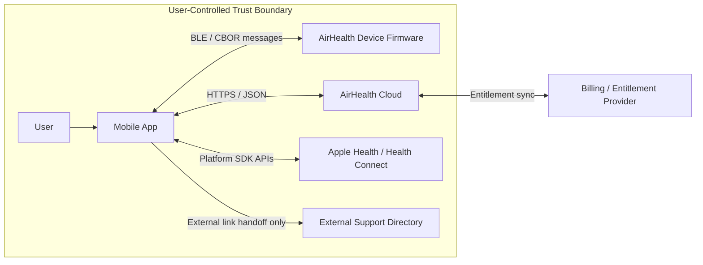
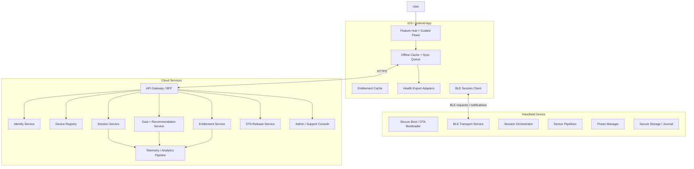
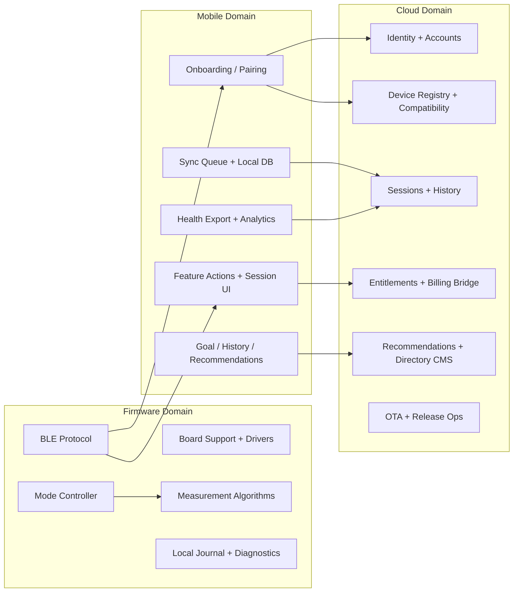
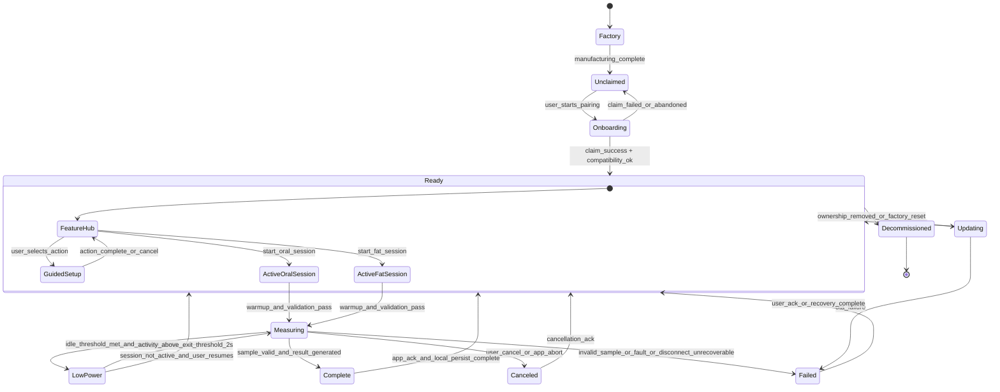
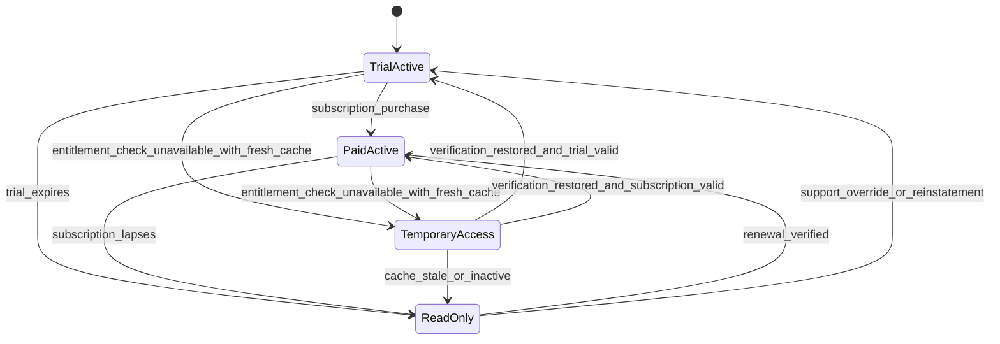
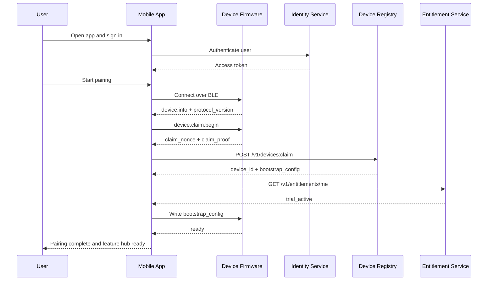
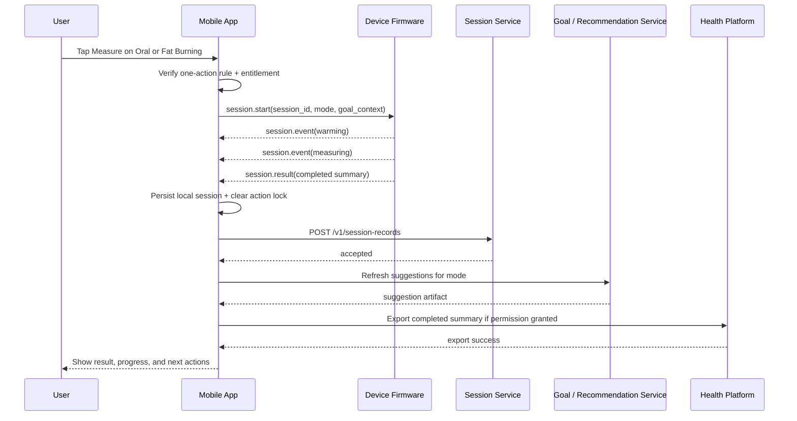
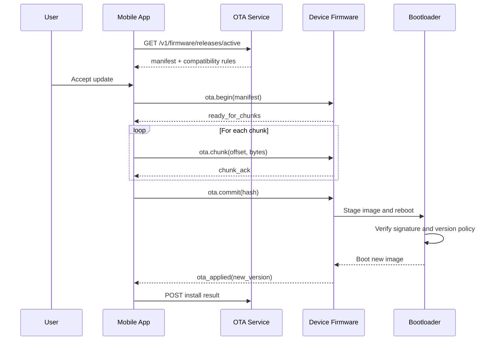
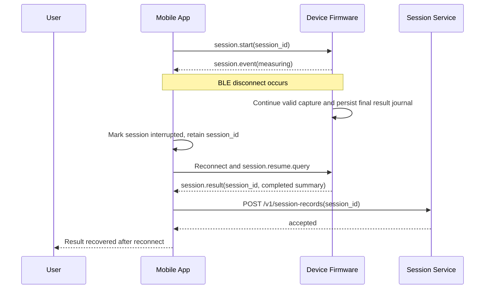

# Software Architecture Specification: AirHealth Connected Breath Analysis Platform

## Versioning

- Version: v0.1
- Date: 2026-03-25
- Author: Codex

## Revision History

| Version | Date | Author | Summary of Changes | Source of Change | Affected Sections |
| --- | --- | --- | --- | --- | --- |
| v0.1 | 2026-03-25 | Codex | Initial software architecture package covering firmware, mobile app, cloud services, APIs, data model, state machines, sequence diagrams, verification, and rollout guidance. | `PM/PRD/PRD.md` v0.6; `HW/EE/EE_Design_Spec_v0.4.md`; `HW/ID/ID_Spec_v0.3.md`; `HW/ME/ME_Design_Spec_v0.3.md`; `HW/Manager/System_Review_Summary_v0.4.md` | Entire document |

## 1. Executive Summary

AirHealth is best implemented in Phase 1 as a mobile-mediated connected product: the handheld device owns sensing, breath-sample validation, session execution, low-power behavior, and final device-side result generation; the mobile app owns onboarding, action gating, user experience, local persistence, health-export integrations, and cloud synchronization; the cloud owns identity, entitlement, goals, longitudinal history, recommendations, OTA release metadata, and support/admin surfaces.

This architecture intentionally avoids direct device-to-cloud connectivity in Phase 1. That choice is an architectural inference, not an explicit PRD requirement, and it is recommended because the approved hardware baseline is BLE-centric, the industrial design is space- and power-constrained, and the PRD already positions the phone as the user's primary control surface. The result is a lower-risk launch architecture that still satisfies the PRD's pairing, offline queueing, session recovery, subscription enforcement, and export requirements.

The core software contract is a single-action, single-session orchestration model. Firmware enforces one active measurement session at a time; the mobile app enforces one active user action at a time across measurement, goal editing, suggestion generation, history mutation, and support handoff; the cloud finalizes entitlement and durable storage decisions. Session records become valid user-visible outcomes only after device confirmation and app reconciliation by `session_id`.

## 2. Inputs Reviewed

- `PM/PRD/PRD.md` v0.6
- `PM/Designs/feature.md`
- `HW/EE/EE_Design_Spec_v0.4.md`
- `HW/ID/ID_Spec_v0.3.md`
- `HW/ME/ME_Design_Spec_v0.3.md`
- `HW/Manager/System_Review_Summary_v0.4.md`

Confirmed facts used from the inputs:

- Product has two Phase 1 modes: Oral & Dental Health and Fat Burning.
- Device is a handheld BLE product with no display and minimal controls.
- Airflow conditioning must stabilize breath before it reaches sensors.
- Device is authoritative for sensing, sample completion, and final result generation.
- Mobile app is authoritative for user-facing state, local queueing, and entitlement-gated actions.
- Cloud is authoritative for entitlement status and final acceptance of synced results.
- The system must preserve one active action at a time and one active measurement session at a time.
- Phase 1 supports Apple Health export on iOS and Health Connect export on Android for completed session summaries only.

Key architectural inferences introduced in this document:

- Phase 1 device connectivity is BLE-only, with no direct Wi-Fi, LTE, or device-cloud MQTT path.
- OTA is delivered through the mobile app using release manifests from the cloud and chunked BLE transfer to the device.
- Goal suggestions and product suggestions are cloud-generated but cached on-device and on-app for read-only access during temporary entitlement or offline states.
- Firmware persists enough final-result metadata locally to reconcile completed sessions after an app crash or BLE disconnect.

## 3. Requirement Baseline

### Must-Have Requirements

- Pair a handheld breath-analysis device to iOS 26+ and Android 16+ phones over BLE.
- Support guided measurement flows for Oral & Dental Health and Fat Burning.
- Enforce one active measurement session at a time and one active user action at a time.
- Make the device authoritative for sensing, warm-up validation, sample validity, and result generation.
- Store goals, history, and progress in the cloud when authenticated and connected.
- Preserve local results and queue sync when the network or entitlement service is unavailable.
- Enforce entitlement states: trial active, paid active, temporary access, and read-only mode.
- Export only completed session summaries to Apple Health and Health Connect.
- Support low-power entry and exit without losing valid session context.
- Provide curated `consult professionals` content without transmitting account or measurement data to external destinations.

### Should-Have Requirements

- AI-assisted goal suggestions with clear non-diagnostic positioning.
- Cached recommendations and historical guidance when the backend is unavailable.
- Fast reconnect and session reconciliation after transient BLE or app interruption.
- OTA update support for firmware and compatibility negotiation across firmware, app, and cloud.
- Admin/support tooling for entitlement review, sync diagnostics, and release operations.

### Constraints

- Handheld industrial design with tight volume, passive airflow conditioning, and minimal moving parts.
- BLE is the only explicitly required device transport in the PRD and EE baseline.
- No standalone device UX beyond minimal indicator/button behavior.
- No Phase 1 in-app appointment booking, referral routing, or medical diagnosis claims.
- No raw sensor-stream export to third-party health apps.
- Subscription policy is currently a 60-day trial followed by $5.99 per month.
- Product cost target is $199 and must avoid unnecessary hardware and operational complexity.

### Unresolved Questions

- Exact regulatory, legal, and clinical review boundaries for AI-generated goals and recommendations.
- Whether device ownership transfer and multi-user household support are needed in Phase 1 support tooling.
- Which billing platform and entitlement provider will be used for iOS and Android purchases.
- Whether recommendation generation is rules-based, LLM-assisted, or hybrid in the first release.
- Exact retry and timeout policy for failed sessions versus canceled sessions in UX copy.

## 4. Assumptions And Open Questions

### Architecture Assumptions

- The device has sufficient flash to store active-session state, latest calibration/configuration, OTA staging data, and a small reconciliation journal.
- Secure boot and signed firmware validation are feasible on the selected nRF5340-class platform with secure-element support.
- The phone app can require authenticated sign-in before enabling cloud-backed history and entitlement-controlled measurement.
- Health-export APIs can be triggered client-side after cloud sync acknowledgment or after local finalization when policy permits.
- Recommendation content can be displayed in historical/cached form even when entitlement is expired or temporarily unverifiable.

### Dependencies

- Mobile identity provider and token issuance.
- Billing and entitlement backend.
- Recommendation/content management stack.
- OTA artifact hosting and release pipeline.
- Firmware calibration and compensation model coming from EE/algorithm development.

### Open Questions To Resolve In Review

- Should a user be allowed to complete a locally started session if entitlement expires during the same session, or should eligibility be locked at session start only?
- Does the product need explicit support tooling for entitlement overrides, manual session reprocessing, or export troubleshooting?
- Is AI suggestion output precomputed server-side, generated on demand, or reviewed/approved content templates?
- Are accountless local-only flows permitted before sign-in, or is account creation mandatory during onboarding?

## 5. Feature Traceability Matrix

| Feature / Requirement | Primary User Value | Firmware Impact | Mobile Impact | Cloud Impact | APIs / Contracts | States / Events | Data Entities | Risks / Complexity |
| --- | --- | --- | --- | --- | --- | --- | --- | --- |
| BLE onboarding and pairing | Get device ready quickly | Device identity, BLE advertising, pairing challenge, compatibility report | Pairing UX, permissions, claim flow, retries | Device registry, account binding, compatibility policy | BLE pairing protocol; `POST /v1/devices:claim` | `powered_on`, `paired`, `ready`, `pairing_failed` | Device, PairingRecord, CompatibilityProfile | Cross-cutting |
| Feature hub with one-action rule | Reduce confusion | Session lock exposed to app | UI action gate, navigation state lock | Optional action policy config | `GET /v1/feature-config`; local action-lock contract | `feature_hub`, `action_locked` | FeatureConfig, ActionLock | Mobile-heavy |
| Oral measurement | Track oral health trend | H2S/MM sensing, warm-up, sample validation, score computation | Guided flow, baseline-building UX, completion handling | Session storage, history, recommendation lookup | BLE session service; `POST /v1/session-records` | `active_oral_session`, `measuring`, `complete`, `failed` | Session, ReadingSummary, BaselineState | Firmware-heavy |
| Fat Burning session | Track session-relative fat-burn delta | CO2 + VOC sensing, repeated readings, best-delta tracking | Multi-step guidance, repeated-reading UI, finish flow | Session storage, progress computation | BLE session service; `POST /v1/session-records` | `active_fat_session`, `measuring`, `complete` | Session, ReadingPoint, Goal | Firmware-heavy |
| Goal setup and AI suggestion | Personalized progress target | Goal values consumed during session | Goal editor, suggestion presentation, conflict gating | Goal service, suggestion engine, audit | `PUT /v1/goals/{mode}`; `POST /v1/goal-suggestions` | `goal_updated`, `suggestion_generated` | Goal, RecommendationArtifact | Cloud-heavy |
| Results, history, and progress | Longitudinal insight | Final result persistence for reconciliation | Local cache, charts, offline queue, export | History store, trend queries | `GET /v1/session-records`; health export adapters | `session_synced`, `history_viewed` | Session, SyncJob, ExportAudit | Cross-cutting |
| Consult professionals | Support handoff | None beyond action availability status | Directory UI, external handoff notice | Curated directory CMS/localization | `GET /v1/support-directory?mode=` | `consult_opened`, `external_link_opened` | SupportDirectoryEntry | Mobile-heavy |
| Entitlement enforcement | Control paid access | Session-start eligibility hint only | Cache freshness, temporary access, read-only UX | Subscription source of truth | `GET /v1/entitlements/me` | `entitlement_updated`, `entitlement_unverified` | EntitlementSnapshot, AuditEvent | Cross-cutting |
| Health export | User-controlled data sharing | Completed-session payload only | Apple Health / Health Connect mapping, permission prompts | Optional export audit and support visibility | Platform adapters; `POST /v1/export-audits` | `export_succeeded`, `export_failed` | ExportAudit, Session | Mobile-heavy |
| Low-power recovery | Battery preservation without false failure | Sensor idle detection, debounce, resume logic | Clear low-power UX, blocked-action messaging | Telemetry only | BLE state events; telemetry ingest | `low_power_entered`, `low_power_exited` | DeviceStatusEvent | Firmware-heavy |
| OTA firmware updates | Field quality and fixes | Bootloader, chunk verification, staged apply, rollback | Manifest fetch, compatibility checks, update UX | Release management, staged rollout, artifact hosting | `GET /v1/firmware/releases/active`; BLE OTA protocol | `ota_available`, `ota_applied`, `ota_failed` | FirmwareRelease, DeviceCompatibility, AuditEvent | Cross-cutting |

## 6. System Context And Block Diagrams

### 6.1 System Context



### 6.2 High-Level Software Architecture



### 6.3 Domain Decomposition



### Partitioning Summary

| Domain | Purpose | Owned Data | Inbound Interfaces | Outbound Interfaces | Failure Boundary | Versioning Boundary |
| --- | --- | --- | --- | --- | --- | --- |
| Firmware | Execute sessions, validate samples, preserve device state | Device config, calibration refs, session journal, firmware version | BLE commands, OTA chunks, button input, sensors | BLE notifications, local indicators | Device reboot, watchdog reset, low-power transitions | Firmware semantic version |
| Mobile app | Orchestrate user experience and local/offline behavior | Local cache, sync queue, export status, cached entitlement snapshot | User input, BLE notifications, cloud responses, OS health APIs | BLE commands, HTTPS APIs, external-link handoff | App process crash, backgrounding, OS permission denial | App release version |
| Cloud backend | Durable source of truth for identity, entitlements, goals, history | Users, devices, goals, sessions, recommendations, releases, audits | HTTPS requests, internal events | Push notifications, analytics events, admin reports | Service-level degradation or regional outage | API version + schema version |
| Supporting systems | Operate, observe, and support the product | Metrics, logs, traces, tickets, release states | Internal service events | Dashboards, alerts, support actions | Tooling failure should not corrupt product data | Independent operational tooling versions |

## 7. Component Architecture

### 7.1 Firmware

| Component | Responsibility | Inputs / Outputs | Owned State | Dependencies | Error Handling | Observability | Upgrade / Migration Notes |
| --- | --- | --- | --- | --- | --- | --- | --- |
| Boot and secure startup manager | Validate firmware image, initialize hardware, expose boot reason | Input: signed image, reset cause. Output: boot status, fallback boot | Boot flags, rollback slot, monotonic version | Secure boot chain, secure element, flash | Enter recovery slot on signature failure; refuse downgrade unless allowed | Boot reason, image hash, recovery count | Support A/B or staged image apply |
| BSP and drivers | Abstract sensors, button, LEDs, flash, secure element, battery, BLE radio | Input: hardware interrupts and read requests. Output: normalized sensor/device signals | Driver config, hardware health | nRF5340-class SoC, sensors, fuel gauge | Mark unhealthy peripherals; surface deterministic fault codes | Driver init latency, sensor health counters | Hardware revision gates per board revision |
| BLE connectivity stack | Maintain pairing, encrypted transport, message framing, notifications | Input: app commands. Output: device info, session events, results | Bonding data, MTU/session transport state | BLE controller, crypto stack | Retries notifications, disconnect timeout, re-advertise on link loss | RSSI, reconnect count, GATT error codes | Protocol version negotiation on connect |
| Pairing and claim manager | Prove device identity and bind device to account | Input: claim challenge, app credentials. Output: proof, claim acknowledgement | Claim status, device identity key reference | Secure element, device registry claim token | Reject duplicate claims; allow rebind only through explicit reset | Claim attempts, claim result | Support factory-reset ownership transfer later |
| Session orchestrator | Enforce one active mode/session, coordinate transitions | Input: start/cancel commands, sensor readiness, low-power triggers. Output: state notifications and final result | Active `session_id`, mode, timers, lock state | Sensor manager, power manager, BLE stack | Convert invalid transitions into explicit error events; persist terminal status | Session duration, cancel/fail cause, illegal transition count | Must preserve compatibility with app state model |
| Measurement algorithm engine | Run mode-specific sample validation and score calculation | Input: compensated sensor samples. Output: oral score or fat deltas and quality flags | Warm-up baseline, sample windows, thresholds, best delta | Flow/CO2/VOC/electrochemical pipelines | Reject invalid sample instead of emitting result | Sample acceptance rate, score variance, calibration warnings | Algorithm version included in every result payload |
| Power manager | Apply low-power hysteresis without losing valid context | Input: sensor activity, user/app wake events, battery state. Output: power-state transitions | Idle counters, debounce timers, battery thresholds | Fuel gauge, session state, sensor readiness | Block low-power if transition would corrupt active capture window | Low-power enter/exit counts, battery low blocks | Thresholds configurable by signed config |
| Secure storage and journal | Persist latest config, active session checkpoint, completed unreconciled result | Input: state snapshots and final results. Output: recovery data on reboot/reconnect | Device config, last entitlement hint, result journal | QSPI flash, secure element | CRC protect records, tombstone after app ACK | Journal replay count, write failures | Schema versioned separately from firmware |
| OTA agent | Receive image chunks over BLE, verify digest, stage reboot | Input: manifest, chunks, apply command. Output: progress and completion status | Chunk bitmap, artifact hash, pending slot | Bootloader, flash, BLE transport | Abort on hash mismatch, resume partial transfer | OTA duration, failure reason | Enforce compatibility matrix |
| Diagnostics and logging | Publish bounded diagnostics for support and telemetry | Input: system events. Output: logs, fault bundle summaries | Ring buffer, crash signature | All firmware subsystems | Rate-limit noisy faults; clear recoverable ones on recovery | Crash count, watchdog resets, fault codes | Log schema versioned |

Firmware architectural notes:

- The device should never emit a user-visible completed result unless the sample-validation path has marked the session `complete`.
- The firmware journal should store only bounded final-result and recovery metadata, not long raw sensor traces, to preserve privacy and flash endurance.
- The low-power state is a valid operational state, not an error state. Session context remains resumable unless the battery threshold or watchdog recovery explicitly invalidates it.

### 7.2 Mobile App

| Component | Responsibility | Inputs / Outputs | Owned State | Dependencies | Error Handling | Observability | Upgrade / Migration Notes |
| --- | --- | --- | --- | --- | --- | --- | --- |
| App shell and feature hub | Render feature cards and action model, enforce one action at a time | Input: user taps, entitlement snapshot, session state. Output: routed flows and disabled states | Current route, action lock, selected feature | Design system, local store | Refuse conflicting navigation, show deterministic explanation | Screen views, blocked-action reasons | Maintain stable route IDs for analytics |
| Onboarding and pairing flow | Permissions, BLE discovery, claim, mode setup | Input: device advertisements, auth state, claim response. Output: paired device and initial setup complete | Pairing progress, last compatible device | BLE client, auth, registry API | Guided retry, permission education, timeout recovery | Pairing funnel, failure step | Backward-compatible for firmware protocol changes |
| Session coordinator | Drive guided measurement, reconcile session result, manage disconnect recovery | Input: BLE events, user actions, entitlement state. Output: session lifecycle UI, cloud sync enqueue | Current session, local `session_id`, recovery markers | BLE client, local DB, sync queue | Distinguish canceled, failed, interrupted, and reconciled | Session start/finish, reconnect outcome | Needs migration-safe local schema |
| Goal and recommendation module | Goal CRUD and suggestion retrieval | Input: cloud responses, cached content. Output: user-facing goals and suggestions | Goals cache, recommendation cache | Goal API, directory API | Fallback to cached data in temporary access/read-only | Suggestion views, goal save failures | Cache schema versioned |
| History and progress store | Show trends, baseline-building, fat session summaries | Input: synced sessions, local pending sessions. Output: charts and summaries | SQLite tables, baseline calculations cache | Session API, sync queue | Mark pending vs synced clearly; merge on conflict | History render latency, sync lag | Migration scripts required on schema change |
| Entitlement client and cache | Evaluate session eligibility and UI gating | Input: entitlement API response, clock, cached snapshot. Output: effective entitlement state | Last verified state, verification timestamp | Auth, subscription API | Switch to `Temporary access` or `Read-only mode` by rule | Entitlement refresh latency, stale-cache incidence | Time-source consistency across app releases |
| Sync queue | Persist writes and replay when allowed | Input: completed results, goal changes, export audit writes. Output: retried cloud requests | Durable queue, idempotency keys, backoff state | Network stack, auth tokens | Exponential backoff, dedupe, poison-message quarantine | Queue age, retry counts, upload SLA | Queue schema and idempotency contract locked early |
| Health export adapters | Map completed summaries to Apple Health and Health Connect | Input: final completed session summary. Output: platform write result | Export permission and audit status | OS health frameworks | Surface permission denial separately from sync success | Export success rate by platform | Platform API changes per OS release |
| Consult professionals viewer | Show curated directory and external handoff messaging | Input: directory content. Output: localized list and outbound taps | Cached directory entries | Directory API / CMS | Permit read-only use without entitlement | Open rate, outbound tap rate | Content schema versioning |
| Analytics client | Emit product telemetry without PHI leakage beyond policy | Input: app and session events. Output: analytics events | Session correlation IDs, sampling config | Analytics ingest | Drop non-critical events when offline; never block UX | Event delivery rate, schema errors | Track schema versions |

Mobile architectural notes:

- The mobile app is the sole bridge between the offline-capable device and cloud services in Phase 1.
- The sync queue should store explicit eligibility context, including `entitlement_state_at_completion`, so the server can validate whether a delayed upload remains allowed.
- Health export should use the completed local summary object and must not depend on cloud round-trip success unless legal/product policy requires cloud acknowledgment first.

### 7.3 Cloud

| Component | Responsibility | Inputs / Outputs | Owned State | Dependencies | Error Handling | Observability | Upgrade / Migration Notes |
| --- | --- | --- | --- | --- | --- | --- | --- |
| API gateway / BFF | Authenticate mobile requests and compose product responses | Input: app HTTPS requests. Output: versioned JSON APIs | Request routing rules, rate limits | Identity, downstream services | Return typed error model and retry hints | Request latency, 4xx/5xx rates | Version headers and endpoint deprecation policy |
| Identity and account service | User auth, session tokens, account linkage | Input: sign-in flows, token refresh. Output: access tokens, user IDs | User account records | External IdP, billing linkage | Token revocation and mismatch handling | Auth success, token refresh failures | Auth contract must remain stable |
| Device registry service | Track claimed devices, firmware compatibility, ownership | Input: claim requests, compatibility checks. Output: device records | Device metadata, ownership, board/firmware capabilities | Identity, OTA service | Reject duplicate claim, unauthorized rebind | Device claim success, incompatible version count | Device capability schema versioned |
| Session service | Persist completed sessions and serve history/trends | Input: completed session summaries, queries. Output: session record IDs, history feeds | Session headers, derived metrics, trend materializations | Identity, goal service | Idempotent upsert by `session_id`; quarantine malformed payloads | Sync SLA, conflict rate, query latency | Event schema versioned by `result_schema_version` |
| Goal service | Store goals and mode preferences | Input: goal updates. Output: active goal and change history | Goal records, revision history | Identity | Optimistic concurrency, validation failures | Goal update error rate | Version goal schema by mode |
| Recommendation service | Produce AI-assisted goals and post-result suggestions | Input: session summaries, goal context, entitlement state. Output: suggestion artifacts | Prompt/config templates, suggestion records, audit | Model/runtime provider or rules engine | Degrade to templated content if generator unavailable | Suggestion latency, fallback rate | Version prompt/template sets |
| Entitlement service | Resolve trial, paid, temporary-access eligibility | Input: billing events, mobile checks. Output: effective entitlement snapshot | Subscription ledger mirror, trial windows, grace rules | Billing provider, identity | Cache-safe signed responses, explainability fields | Verification latency, outage rate | Billing-provider abstraction required |
| Support directory service | Serve curated professional-support content | Input: content management updates and app reads. Output: localized directory data | Directory entries, locale mappings | CMS | Fail read-only; never block core measurement stack | Content freshness, locale coverage | Content schema independently versioned |
| OTA release service | Publish manifests and staged rollout rules | Input: firmware artifacts and release settings. Output: app-visible release manifest | Releases, rollout cohorts, compatibility matrix | Artifact storage, device registry | Halt rollout on failure thresholds | Install success rate, rollback rate | Support phased cohorts |
| Analytics pipeline | Aggregate telemetry and product KPIs | Input: app/cloud events. Output: dashboards and anomaly alerts | Event lake, derived KPIs | API gateway, services | Dead-letter malformed events | Event lag, schema errors | Schema registry or contract testing recommended |
| Admin and support console | Provide safe operational controls and diagnostics | Input: operator actions. Output: read-only or audited support actions | Cases, audit trails, support annotations | Session, entitlement, OTA services | All writes audited and role-gated | Support latency, manual override counts | RBAC and audit schema locked early |

Cloud architectural notes:

- Cloud should not store or expose raw breath traces in Phase 1 unless explicitly approved later; the PRD only requires completed summaries and history.
- Entitlement responses should include both source-of-truth state and UX-facing derived state to keep mobile behavior consistent.
- Recommendation generation should be auditable by suggestion template/version and input summary hash.

### 7.4 Shared And Supporting Systems

- Shared schema package:
  Canonical definitions for `session_summary`, `goal`, `entitlement_snapshot`, `firmware_manifest`, and analytics events. Use versioned JSON Schema or protobuf definitions stored in a shared repository.
- CI/CD:
  Separate firmware, mobile, and cloud pipelines with shared contract-test gates.
- Observability:
  Centralized dashboards for pairing funnel, session completion, sync latency, entitlement outage impact, and OTA rollout health.
- Release management:
  Staged mobile release, staged firmware release, and explicit compatibility matrix review before production promotion.

## 8. API Specifications

### 8.1 API: AirHealth BLE Session Protocol

- Consumers: Mobile app
- Provider: Device firmware
- Protocol: BLE GATT with CBOR-encoded application messages
- Transport pattern: One writable command characteristic, one notify state characteristic, one notify result characteristic, one notify diagnostics characteristic
- Authentication: BLE bond plus device claim token established during onboarding
- Idempotency: Required on `session_start`, `session_cancel`, and `ota_apply` by `request_id`
- Ordering: In-order within a single BLE connection; app must resend only idempotent commands after reconnect
- Timeout: 5s command timeout, 20s reconnect grace for resumable session reconciliation
- Versioning: `protocol_version` advertised in device info; app must reject unsupported major versions

#### Message Names

- `device.info.get`
- `device.claim.begin`
- `session.start`
- `session.cancel`
- `session.resume.query`
- `session.event`
- `session.result`
- `power.state`
- `ota.begin`
- `ota.chunk`
- `ota.commit`

#### Request Schema: `session.start`

```json
{
  "request_id": "uuid",
  "session_id": "uuid",
  "mode": "oral_health|fat_burning",
  "goal_context": {
    "oral_baseline_state": "building|locked|not_applicable",
    "fat_target_delta_pct": 18
  },
  "app_context": {
    "app_version": "1.0.0",
    "platform": "ios|android",
    "entitlement_state": "trial_active|paid_active|temporary_access"
  }
}
```

#### Response / Event Schema: `session.event`

```json
{
  "session_id": "uuid",
  "event_id": "uuid",
  "event_type": "ready|warming|measuring|paused|low_power|complete|canceled|failed",
  "mode": "oral_health|fat_burning",
  "timestamp_ms": 1742886000000,
  "details": {
    "step": "hold_breath|blow|wait|finish",
    "battery_state": "ok|low_blocked",
    "quality_gate": "pending|passed|failed",
    "failure_code": "NONE|LOW_BATTERY|BLE_LINK_LOST|INVALID_SAMPLE|SENSOR_WARMUP_FAILED"
  }
}
```

#### Response Schema: `session.result`

```json
{
  "session_id": "uuid",
  "result_schema_version": 1,
  "mode": "oral_health|fat_burning",
  "completed_at": "2026-03-25T18:05:42Z",
  "algorithm_version": "oral-1.2.0",
  "result": {
    "oral_health_score": 63,
    "baseline_state": {
      "status": "locked",
      "completed_baseline_sessions": 5,
      "baseline_reference_value": 56
    },
    "fat_burn": null
  },
  "quality": {
    "sample_valid": true,
    "flow_stable": true,
    "co2_gate_passed": true
  }
}
```

#### Error Model

- `UNSUPPORTED_MODE`
- `SESSION_ALREADY_ACTIVE`
- `ENTITLEMENT_HINT_REJECTED`
- `LOW_BATTERY_BLOCKED`
- `INVALID_TRANSITION`
- `PROTOCOL_VERSION_MISMATCH`
- `OTA_IN_PROGRESS`

#### Privacy / Security Notes

- No PII is sent to the device.
- Device journals only session metadata necessary for recovery.
- BLE application messages should be encrypted within the bonded link and signed indirectly through the claim/bond trust chain.

### 8.2 API: Claim Device

- Consumers: Mobile app
- Provider: Cloud device registry service
- Protocol: HTTPS REST
- Endpoint: `POST /v1/devices:claim`
- Auth: User access token
- Idempotency: Required via `Idempotency-Key`
- Timeout: 10s client timeout, 30s server deadline
- Rate limits: 10 attempts per account per hour, 30 attempts per device per day
- Versioning: URI major version plus `X-AirHealth-App-Version`

#### Request

```json
{
  "device_serial": "AH-26-000123",
  "claim_nonce": "base64",
  "claim_proof": "base64",
  "hw_revision": "rev_a",
  "fw_version": "0.9.3",
  "protocol_version": 1,
  "platform": "ios"
}
```

#### Response

```json
{
  "device_id": "dev_123",
  "owner_user_id": "usr_456",
  "device_capabilities": {
    "supports_ota": true,
    "supported_modes": ["oral_health", "fat_burning"],
    "min_app_version": "1.0.0"
  },
  "bootstrap_config": {
    "config_version": 1,
    "sampling_profile": "default_v1"
  }
}
```

#### Errors

- `INVALID_CLAIM_PROOF`
- `DEVICE_ALREADY_CLAIMED`
- `DEVICE_REQUIRES_FACTORY_RESET`
- `FW_APP_INCOMPATIBLE`
- `RATE_LIMITED`

### 8.3 API: Upload Completed Session

- Consumers: Mobile app sync queue
- Provider: Cloud session service
- Protocol: HTTPS REST
- Endpoint: `POST /v1/session-records`
- Auth: User access token
- Idempotency: Required by `session_id`
- Timeout: 15s client timeout
- Consistency: Eventual consistency for history views, strong dedupe by `session_id`
- Retry policy: Exponential backoff with jitter for 5xx/network failure; no automatic retry for validation failures

#### Request

```json
{
  "session_id": "uuid",
  "device_id": "dev_123",
  "mode": "fat_burning",
  "started_at": "2026-03-25T18:00:00Z",
  "completed_at": "2026-03-25T18:05:42Z",
  "completion_status": "completed",
  "entitlement_state_at_completion": "trial_active",
  "result_schema_version": 1,
  "summary": {
    "primary_result_value": 12,
    "primary_result_unit": "%",
    "best_delta_pct": 18,
    "session_baseline_value": 0,
    "reading_count": 4,
    "goal_target_delta_pct": 15,
    "goal_achieved": true
  },
  "quality": {
    "sample_valid": true,
    "flow_stable": true,
    "device_fw_version": "1.0.2",
    "algorithm_version": "fat-1.1.0"
  },
  "export_eligibility": {
    "apple_health_allowed": true,
    "health_connect_allowed": false
  }
}
```

#### Response

```json
{
  "record_id": "ses_789",
  "accepted": true,
  "history_visibility": "immediate",
  "recommendation_refresh_required": true
}
```

#### Errors

- `SESSION_NOT_ELIGIBLE_FOR_UPLOAD`
- `INVALID_RESULT_SCHEMA`
- `DUPLICATE_SESSION_CONFLICT`
- `DEVICE_NOT_OWNED_BY_USER`
- `RATE_LIMITED`

### 8.4 API: Get Effective Entitlement

- Consumers: Mobile app
- Provider: Cloud entitlement service
- Protocol: HTTPS REST
- Endpoint: `GET /v1/entitlements/me`
- Auth: User access token
- Timeout: 5s client timeout
- Cache semantics: Signed response may be cached for up to 24 hours in the app
- Versioning: REST version + response schema version

#### Response

```json
{
  "schema_version": 1,
  "source_state": "trial_active|paid_active|expired",
  "effective_app_state": "trial_active|paid_active|temporary_access|read_only",
  "verified_at": "2026-03-25T17:30:00Z",
  "fresh_until": "2026-03-26T17:30:00Z",
  "allows_new_sessions": true,
  "allows_goal_changes": true,
  "allows_historical_recommendations": true,
  "allows_pending_sync_upload": true,
  "explanation_code": "TRIAL_ACTIVE"
}
```

#### Error Handling

- On network timeout or 5xx, the app derives `temporary_access` or `read_only` from its last signed snapshot and local clock.
- Entitlement checks must not block history viewing or consult-directory viewing.

### 8.5 API: Goal Suggestion

- Consumers: Mobile app
- Provider: Recommendation service
- Protocol: HTTPS REST
- Endpoint: `POST /v1/goal-suggestions`
- Auth: User access token
- Timeout: 12s client timeout
- Sync vs async: Synchronous for simple rules; may return accepted job for slower generation

#### Request

```json
{
  "mode": "oral_health",
  "context": {
    "recent_sessions": [
      {
        "session_id": "uuid",
        "completed_at": "2026-03-24T16:00:00Z",
        "primary_result_value": 58
      }
    ],
    "existing_goal": null,
    "entitlement_state": "paid_active"
  }
}
```

#### Response

```json
{
  "suggestion_id": "sug_123",
  "status": "completed",
  "goal": {
    "mode": "oral_health",
    "target_type": "score_improvement_points",
    "target_value": 8,
    "time_horizon_days": 30
  },
  "rationale": [
    "Based on your recent baseline and current trend",
    "This goal is intended for wellness tracking only"
  ],
  "policy_labels": ["non_diagnostic", "reviewed_template_v1"]
}
```

#### Errors

- `ENTITLEMENT_REQUIRED`
- `INSUFFICIENT_HISTORY`
- `GENERATION_TEMPORARILY_UNAVAILABLE`
- `SAFETY_POLICY_BLOCKED`

### 8.6 Event Contract: `session.completed.v1`

- Producer: Cloud session service
- Consumers: Recommendation service, analytics pipeline, support tooling
- Transport: Internal event bus
- Delivery semantics: At-least-once
- Ordering: Ordered per `device_id`, not globally
- Dead-letter behavior: Malformed events routed to `session.completed.dlq`
- Replay expectations: 7-day replay for analytics backfill and recommendation rebuilds

#### Event Schema

```json
{
  "event_type": "session.completed.v1",
  "event_id": "uuid",
  "occurred_at": "2026-03-25T18:05:45Z",
  "user_id": "usr_456",
  "device_id": "dev_123",
  "session_id": "uuid",
  "mode": "oral_health",
  "summary": {
    "primary_result_value": 63,
    "baseline_reference_value": 56
  },
  "source": {
    "app_version": "1.0.0",
    "fw_version": "1.0.2"
  }
}
```

## 9. Data Model And Event Model

### 9.1 Core Entities

| Entity | Canonical Owner | Source Of Truth | Identifiers | Lifecycle | Retention / Deletion | Consistency Requirement |
| --- | --- | --- | --- | --- | --- | --- |
| User | Cloud identity service | Cloud | `user_id`, email/IdP subject | Created on sign-up, disabled on account closure | Retain per policy; support deletion workflow | Strong consistency |
| Device | Device registry | Cloud + secure device identity | `device_id`, serial, public key thumbprint | Manufactured, claimed, active, reset, retired | Retain audit trail after retirement | Strong consistency |
| PairingRecord | Mobile/cloud | Cloud | `pairing_id`, `device_id`, `user_id` | Created on claim, updated on re-pair | Keep supportable history | Strong consistency |
| Goal | Goal service | Cloud, cached on app | `goal_id`, `user_id`, `mode` | Revised over time | Retain revisions for audit | Strong on write, eventual on read cache |
| EntitlementSnapshot | Entitlement service | Cloud, signed app cache | `user_id`, `verified_at` | Refreshed periodically | Short-lived cache plus audit history | Strong at source, bounded-stale cache on app |
| Session | Session service | Cloud, local app/device copies until sync | `session_id`, `device_id`, `user_id` | Started locally, completed/canceled/failed, synced | Retain history per product policy | Idempotent eventual consistency |
| SessionReadingPoint | Firmware/app local, optional cloud aggregate only | App local cache for active session | `session_id`, sequence | During active fat-burning session | Not required long term in cloud for Phase 1 | Local strong consistency |
| RecommendationArtifact | Recommendation service | Cloud, cached on app | `suggestion_id` | Created on demand or after result | Retain historical suggestions if user-visible | Eventual consistency acceptable |
| SupportDirectoryEntry | Directory service | Cloud CMS | `entry_id`, locale, mode | Content updates | Retain versions for audit | Eventual consistency |
| FirmwareRelease | OTA service | Cloud | `release_id`, semantic version | Draft, staged, active, withdrawn | Retain all releases and audits | Strong consistency |
| SyncJob | Mobile app | App local DB | `job_id`, `entity_type`, `entity_id` | Queued, running, succeeded, dead-letter | Delete after retention window | Strong local consistency |
| ExportAudit | Mobile app plus cloud audit endpoint | App local / cloud optional | `export_audit_id`, `session_id` | Created on export attempt | Retain for troubleshooting | Eventual consistency |
| AuditEvent | Cloud services | Cloud | `audit_id`, actor, entity | Written for support/admin/change operations | Long retention | Append-only |

### 9.2 Session Summary Model

Required common fields for every completed session:

- `session_id`
- `user_id`
- `device_id`
- `mode`
- `started_at`
- `completed_at`
- `completion_status`
- `primary_result_value`
- `primary_result_unit`
- `result_schema_version`
- `algorithm_version`
- `entitlement_state_at_completion`
- `app_version`
- `fw_version`

Mode-specific fields:

- Oral:
  `oral_health_score`, `baseline_status`, `completed_baseline_sessions`, `baseline_reference_value`, `delta_vs_baseline_points`, `delta_vs_baseline_pct`
- Fat Burning:
  `current_delta_pct`, `best_delta_pct`, `reading_count`, `goal_target_delta_pct`, `goal_progress_pct`, `goal_achieved`

### 9.3 Important Events

| Event | Producer | Consumers | Key Fields |
| --- | --- | --- | --- |
| `device.claimed.v1` | Device registry | Analytics, support console | `device_id`, `user_id`, `hw_revision`, `fw_version` |
| `session.started.local.v1` | Mobile app | Analytics | `session_id`, `mode`, `device_id`, `app_version` |
| `session.completed.v1` | Session service | Recommendations, analytics, support | `session_id`, `mode`, summary |
| `session.sync.delayed.v1` | Sync queue or session service | Support alerts | `session_id`, `queue_age_seconds`, `reason` |
| `entitlement.changed.v1` | Entitlement service | App notification system, analytics | `user_id`, old/new state, effective_at |
| `ota.release.promoted.v1` | OTA service | Admin dashboards, app config distribution | `release_id`, cohort, version |
| `ota.install.result.v1` | Mobile app | OTA service, analytics | `device_id`, `release_id`, `result` |
| `consult.directory.opened.v1` | Mobile app | Analytics | `mode`, locale, entry_id |

## 10. Top-Level State Machine

### 10.1 Product Operational State Machine



Illegal transitions and handling:

- `FeatureHub -> ActiveFatSession` is illegal if any other action lock is active; app must reject locally before sending BLE command.
- `Measuring -> start_other_mode` is illegal; firmware returns `SESSION_ALREADY_ACTIVE`.
- `Complete -> show_result` without matching `session_id` reconciliation is illegal; app must hold a pending state until reconciliation succeeds.
- `LowPower -> Failed` is illegal unless battery or watchdog guard fails; low power alone must not appear as a failed session.

Persistence expectations:

- Firmware persists active-session checkpoint, current mode, and last terminal session summary across reboot.
- Mobile persists action lock, pending `session_id`, queue entries, and last verified entitlement snapshot across app restarts.
- Cloud persists only server-accepted completed sessions and audit records.

### 10.2 Entitlement Overlay State Machine



Entitlement guard rules:

- New session start allowed only in `TrialActive` or `PaidActive`.
- Pending completed-result upload allowed in every state if the session was completed while the user had an eligible entitlement.
- `consult professionals` and historical guidance viewing remain allowed in every state.

## 11. UML Sequence Diagrams

### 11.1 Onboarding And Provisioning



### 11.2 Measurement Completion And Sync



### 11.3 OTA Firmware Update



### 11.4 Disconnect Recovery And Result Reconciliation



## 12. Cross-Cutting Architecture Considerations

### Security

- Use device-unique identity rooted in secure hardware and validated during claim.
- Enforce signed firmware images and anti-rollback policy for production releases.
- Keep PII out of firmware and BLE application payloads.
- Use least-privilege service identities between session, entitlement, recommendation, and OTA services.
- Audit recommendation generation, admin overrides, entitlement changes, and release promotions.

### Reliability And Resilience

- Firmware journals terminal completed results until the app acknowledges receipt.
- App sync queue uses durable local storage, idempotency keys, and bounded retry/backoff.
- Entitlement outage must degrade to `Temporary access` or `Read-only mode`, not to silent failure.
- Session reconciliation is keyed by `session_id`, not screen state, to survive app crashes and reconnects.
- Recommendation service failure should not block result display or session sync.

### Performance

- Pairing target should support the PRD KPI of 95% completion within 10 minutes.
- Session sync path should meet 98% upload within 15 minutes when connectivity exists.
- BLE payload schema must fit common MTU fragmentation patterns and avoid chatty raw-stream transfer.
- History queries should return the latest 90-day trend view with sub-second perceived latency through local caching and incremental refresh.

### Scalability

- Cloud storage should optimize for completed-session summaries, not high-volume raw telemetry.
- Recommendation and analytics consumers should process `session.completed.v1` asynchronously.
- OTA rollout must support cohort-based throttling and automatic halt thresholds.

### Compatibility And Versioning

- Maintain an explicit compatibility matrix across firmware protocol version, app minimum version, result schema version, and OTA release eligibility.
- Include `result_schema_version` and `algorithm_version` in every completed result.
- Reject unsupported major BLE protocol versions at connect time with a user-facing update prompt.

### Operations And Observability

- Core dashboards:
  pairing success, first-session completion, session cancel/fail causes, sync lag, entitlement outage impact, export success, low-power recovery, OTA install success.
- Core support views:
  device ownership, latest firmware/app version, recent session statuses, queue stuck jobs, entitlement history.
- Alerting:
  sync SLA breach, entitlement outage, OTA failure spikes, pairing failure spikes, recommendation fallback surge.

### Delivery And Quality

- Contract tests for BLE payloads, REST schemas, and internal event schemas.
- Hardware-in-the-loop tests for BLE reconnect, low battery, warm-up failure, idle low-power recovery, and OTA resume.
- End-to-end mobile tests for onboarding, measurement, queued sync, read-only mode, and health-export permission denial.
- Canary rollout for firmware and app releases before broad promotion.

### Compliance And Safety

- Product messaging must remain wellness-oriented and non-diagnostic unless future review changes the claim boundary.
- Do not export raw breath traces, account identifiers, or recommendation artifacts to Apple Health or Health Connect.
- Accessibility requirements apply to all measurement and support flows.
- Retention and deletion policy for session history and audit data must be defined with legal/privacy review.

## 13. Risks, Tradeoffs, And Alternatives

### Primary Risks

- Sensor/algorithm repeatability may fail product goals even if software state handling is correct.
- One-action gating can become brittle if navigation state and firmware session state drift.
- Entitlement outages can create user confusion if temporary access and read-only copy is not explicit.
- OTA over BLE may be slow or failure-prone if manifest, chunking, and resume rules are not tightly specified.

### Tradeoffs

- Mobile-mediated connectivity reduces hardware and cloud complexity, but it makes the phone a hard dependency for every sync and update path.
- Storing only completed session summaries protects privacy and operational cost, but it limits later offline reprocessing opportunities.
- Caching entitlement for 24 hours improves resilience, but requires careful user-facing explanation and signed-response integrity.

### Considered Alternatives

- Direct device-cloud connectivity:
  Rejected for Phase 1 because it adds radios, power draw, provisioning burden, and firmware/backend complexity not required by current approved hardware.
- Raw sensor-stream cloud upload:
  Rejected for Phase 1 because the PRD centers on completed summaries, the hardware is power constrained, and privacy/operational cost would increase substantially.
- Device-driven health export:
  Rejected because Phase 1 platform integrations are naturally client-side and the device has no direct platform integration path.

## 14. Verification And Rollout Plan

### Verification Matrix

| Area | Verification Method | Exit Criteria |
| --- | --- | --- |
| BLE onboarding | Device farm + HIL + mobile automation | 95% successful pairing within 10 minutes on supported devices |
| Oral and fat session flows | HIL sessions with simulated and lab sensor inputs | Correct state transitions, result generation, and invalid-sample rejection |
| Disconnect recovery | Forced BLE/app/network interruption tests | Completed sessions reconcile by `session_id` without duplicate history |
| Entitlement fallback | Backend outage simulation and stale-cache tests | Correct `Temporary access` and `Read-only mode` gating and copy |
| Health export | Platform integration tests on iOS/Android | Only completed summaries exported with correct mappings |
| Low-power behavior | Firmware bench tests and HIL | No false failures; resume within KPI target when activity returns |
| OTA | Staged update lab tests, interrupted transfer tests, rollback tests | Verified apply, resume, and safe rollback on failure |
| Recommendation safety | Contract tests plus policy review | Suggestions remain non-diagnostic and auditable |

### Release Plan

1. Lock shared schemas, BLE protocol, and compatibility matrix.
2. Bring up firmware and mobile pairing flow on bench hardware.
3. Add session completion and reconciliation before cloud recommendation features.
4. Add sync queue, entitlement service integration, and read-only fallback.
5. Add health export adapters.
6. Add OTA manifest service and staged firmware delivery.
7. Run pilot cohort with full telemetry and support tooling.
8. Promote to production with staged app rollout and staged firmware rollout.

### Operational Readiness Requirements

- Support runbooks for pairing failures, entitlement disputes, stuck sync jobs, and failed OTA.
- Dashboard ownership assigned across firmware, mobile, and cloud teams.
- Release rollback authority and thresholds defined before launch.
- Audit logging enabled for admin tooling, recommendation generation versioning, and entitlement overrides.

## 15. Recommendations And Next Steps

### Architectural Decisions To Lock Now

1. Lock Phase 1 to BLE-only device connectivity with mobile-mediated cloud sync and OTA.
2. Lock `session_id` as the cross-domain idempotency and reconciliation key.
3. Lock completed-session-summary storage as the Phase 1 cloud data boundary.
4. Lock signed entitlement snapshots with a 24-hour cache freshness model.
5. Lock a shared schema package for BLE messages, session summaries, entitlements, and OTA manifests.

### Assumptions That Need Validation

1. Firmware flash and journaling capacity are sufficient for recovery plus OTA staging.
2. BLE throughput and resume behavior are adequate for reliable OTA over the selected hardware.
3. The recommendation system can meet product needs without creating diagnostic or regulatory risk.

### Risky Areas Needing Prototype Or Spike Work

1. HIL validation of low-power hysteresis and session recovery.
2. Repeated-reading handling and best-delta presentation for Fat Burning.
3. Entitlement outage UX and queued-upload eligibility edge cases.

### APIs Or Contracts To Review Cross-Functionally

1. BLE session protocol and error model.
2. Completed session summary schema and health-export mapping.
3. Entitlement response contract, including effective UX state.
4. OTA manifest and compatibility matrix schema.

### Test And Rollout Actions Required Before Launch

1. Stand up contract-test coverage across firmware, mobile, and cloud repositories.
2. Create HIL scenarios for disconnects, invalid samples, low battery, stale entitlement, and OTA interruption.
3. Build operator dashboards for pairing funnel, session sync SLA, export success, and OTA failure rate.
