# Software Architecture Specification: AirHealth Connected Breath Analysis Platform

## Versioning

- Version: v0.2
- Date: 2026-03-27
- Author: Codex

## Revision History

| Version | Date | Author | Summary of Changes | Source of Change | Affected Sections |
| --- | --- | --- | --- | --- | --- |
| v0.1 | 2026-03-25 | Codex | Initial software architecture package covering firmware, mobile app, cloud services, APIs, data model, state machines, sequence diagrams, verification, and rollout guidance. | `PM/PRD/PRD.md` v0.6; `HW/EE/EE_Design_Spec_v0.4.md`; `HW/ID/ID_Spec_v0.3.md`; `HW/ME/ME_Design_Spec_v0.3.md`; `HW/Manager/System_Review_Summary_v0.4.md` | Entire document |
| v0.2 | 2026-03-27 | Codex | Re-ran the architecture package against PRD v0.7 and the current EE baseline. Added manufacturing-only Factory mode architecture, 3-color LED state model, one-time provisioning latch handling, HW-ID and detected-VOC routing, factory BLE diagnostics upload, and support/manufacturing system impacts. | `PM/PRD/PRD.md` v0.7; `HW/EE/EE_Design_Spec_v0.4.md` | Sections 1-15 |

## 1. Executive Summary

AirHealth remains best implemented in Phase 1 as a BLE-first, mobile-mediated connected product, but the updated PRD introduces a second operational lane beyond consumer use: a manufacturing-only Factory mode with one-time execution, LED-driven pass/fail signaling, BLE error-log reporting, and internal HW-ID-based routing for manufacturing, analytics, backend, and support.

The recommended software architecture therefore has four major runtime surfaces:

- device firmware for sensing, session control, low-power behavior, Factory mode, LED control, diagnostics, and internal profile tagging
- consumer mobile app for onboarding, feature actions, local persistence, export, entitlement-gated UX, and cloud sync
- manufacturing/support tooling for factory verification, BLE log capture, and support diagnostics without exposing those flows in consumer UX
- cloud services for identity, device registry, session history, goals, entitlement, recommendations, OTA release metadata, factory records, and HW-ID-routed analytics/support views

Two architectural decisions are central in v0.2:

1. Phase 1 consumer connectivity stays BLE-only, with no direct device-to-cloud path.
2. Factory workflows are explicitly separated from consumer app workflows, even when they use the same physical BLE transport.

That separation lets the system satisfy the new requirements without leaking Factory mode, HW-ID, or manufacturing logs into the consumer product surface.

## 2. Inputs Reviewed

- `PM/PRD/PRD.md` v0.7
- `PM/Designs/feature.md`
- `HW/EE/EE_Design_Spec_v0.4.md`
- `HW/ID/ID_Spec_v0.3.md`
- `HW/ME/ME_Design_Spec_v0.3.md`
- `HW/Manager/System_Review_Summary_v0.4.md`

Confirmed facts used from the inputs:

- Product has two consumer measurement modes: Oral & Dental Health and Fat Burning.
- Device is a handheld BLE product with a physical button and a 3-color LED.
- Device remains authoritative for sensing, sample validity, measurement completion, Factory mode execution, and final device-side result generation.
- App remains the primary consumer control surface, but the LED provides redundant local state feedback.
- Factory mode is manufacturing-only, entered and exited with a 10-second button hold, used once per device, and blocked after provisioning is complete.
- Factory mode must report BLE error logs and persist pass/fail outcome before shipment.
- HW-ID is internal-only metadata used to group records by supported hardware profile and detected VOC type.
- Consumer app must not expose Factory mode, HW-ID, or manufacturing-only logs.
- Cloud remains authoritative for entitlement status and durable acceptance of synced records.

Key architectural inferences introduced in this document:

- Factory workflows should use a dedicated manufacturing/support tool surface rather than the consumer app.
- Firmware should expose factory-only BLE commands only while the device is in the unprovisioned factory state and after factory-tool authorization.
- HW-ID should be normalized into a stable `device_profile_id` in cloud storage so backend and analytics can route by hardware profile without depending on raw firmware enumerations forever.
- Factory BLE logs should be buffered on-device until either the manufacturing tool ACKs receipt or the log expires by retention policy.
- Session records should carry internal profile metadata for backend routing, but export and consumer UX should continue to use a consumer-safe model with no HW-ID exposure.

## 3. Requirement Baseline

### Must-Have Requirements

- Pair a handheld breath-analysis device to iOS 26+ and Android 16+ phones over BLE.
- Support guided consumer measurement flows for Oral & Dental Health and Fat Burning.
- Enforce one active measurement session at a time and one active user action at a time.
- Make firmware authoritative for sensing, warm-up validation, sample validity, result generation, Factory mode execution, and low-power transitions.
- Store goals, history, and progress in the cloud when authenticated and connected.
- Preserve local results and queue sync when the network or entitlement service is unavailable.
- Enforce entitlement states: trial active, paid active, temporary access, and read-only mode.
- Export only completed session summaries to Apple Health and Health Connect.
- Support manufacturing-only Factory mode with one-time use, pass/fail result persistence, BLE error-log reporting, and post-provisioning lockout.
- Persist HW-ID-derived routing metadata for firmware, backend, analytics, manufacturing, and support workflows without exposing it in consumer UX.

### Should-Have Requirements

- AI-assisted goal suggestions with clear non-diagnostic positioning.
- Cached recommendations and historical guidance during temporary entitlement or offline states.
- Fast reconnect and result reconciliation after transient BLE or app interruption.
- OTA update support with compatibility negotiation across firmware, app, and cloud.
- Support dashboards and admin views that can group records by device profile and detected VOC type.

### Constraints

- Handheld industrial design with passive or near-passive airflow conditioning and minimal moving parts.
- BLE is the only explicitly required consumer transport in the PRD and EE baseline.
- Consumer product has no display and minimal physical controls.
- Factory mode must stay out of consumer onboarding, settings, support, and export flows.
- HW-ID must remain internal-only metadata.
- Product cost target is $199 and the architecture should avoid unnecessary hardware and operational complexity.

### Unresolved Questions

- Exact ownership of the HW-ID-to-device-profile mapping table across firmware and backend.
- Recovery policy when factory verification fails and BLE log transfer is unavailable on the first attempt.
- Whether recommendations are rules-based, LLM-assisted, or hybrid at launch.
- Whether support tooling needs entitlement override, manual session replay, or factory-record correction workflows in Phase 1.

## 4. Assumptions, Dependencies, And Open Questions

### Architecture Assumptions

- The selected nRF5340-class platform and flash budget can store a bounded session journal plus factory diagnostics bundles.
- Secure boot, signed images, and provisioning-state storage are feasible on the approved EE baseline.
- The consumer app can require authenticated sign-in before enabling cloud-backed history and entitlement-controlled measurement.
- Manufacturing tooling can authenticate to factory-only BLE functions through a provisioned operator credential, fixture secret, or signed command token.
- Cloud analytics and support systems can consume normalized device profile identifiers rather than raw firmware-only HW-ID values over time.

### Dependencies

- Mobile identity provider and token issuance.
- Billing and entitlement provider.
- Firmware calibration and compensation model from EE and algorithm workstreams.
- OTA artifact hosting and release pipeline.
- Manufacturing fixture/tooling implementation for BLE factory verification and log capture.

### Open Questions To Resolve In Review

- Is detected VOC type computed only on-device, only in cloud, or device-first with backend normalization?
- Should factory logs be uploaded only by manufacturing tooling, or also mirrored later by support tooling if a unit is returned?
- Does the support surface need read-only visibility into raw factory reason codes, or only normalized support-friendly failure classes?
- What retention window should apply to on-device buffered factory logs after successful provisioning?

## 5. Feature-To-Architecture Traceability Matrix

| Feature / Requirement | Primary User Value | Firmware Impact | Mobile Impact | Cloud Impact | APIs / Contracts | States / Events | Data Entities | Risks / Complexity |
| --- | --- | --- | --- | --- | --- | --- | --- | --- |
| BLE onboarding and pairing | Get device ready quickly | Device identity, BLE advertising, compatibility report | Pairing UX, permissions, claim flow | Device registry, account binding | BLE device info; `POST /v1/devices:claim` | `powered_on`, `paired`, `ready` | Device, PairingRecord | Cross-cutting |
| Feature hub and one-action rule | Reduce confusion | Session lock surfaced to app | Action gating, route lock, conflict messaging | Optional policy config | Local action-lock contract; `GET /v1/feature-config` | `feature_hub`, `action_locked` | ActionLock, FeatureConfig | Mobile-heavy |
| Oral measurement | Track oral-health trend | H2S/MM sensing, sample validation, score computation | Guided flow, baseline-building UX | Session storage, history, suggestions | BLE session protocol; `POST /v1/session-records` | `active_oral_session`, `measuring`, `complete` | SessionSummary, BaselineState | Firmware-heavy |
| Fat Burning session | Track session-relative fat-burn delta | CO2 + VOC sensing, repeated readings, best-delta tracking | Multi-step guidance, finish flow | Session storage, history, suggestions | BLE session protocol; `POST /v1/session-records` | `active_fat_session`, `measuring`, `complete` | SessionSummary, ReadingPoint, Goal | Firmware-heavy |
| Goal setup and suggestions | Personalized targets | Goal values consumed during sessions | Goal editor, suggestion surfaces | Goal service, suggestion engine | `PUT /v1/goals/{mode}`; `POST /v1/goal-suggestions` | `goal_updated`, `suggestion_generated` | Goal, RecommendationArtifact | Cloud-heavy |
| Results, history, and export | Longitudinal insight | Final-result journaling for reconciliation | Local cache, charts, export | History store, trend queries, export audit | `GET /v1/session-records`; `POST /v1/export-audits` | `session_synced`, `export_succeeded` | SessionSummary, ExportAudit, SyncJob | Cross-cutting |
| Entitlement enforcement | Control paid access | Start-session eligibility hint only | Cache freshness, temporary access, read-only UX | Subscription source of truth | `GET /v1/entitlements/me` | `entitlement_updated`, `entitlement_unverified` | EntitlementSnapshot | Cross-cutting |
| Consult professionals | Informational support handoff | None beyond action availability status | Directory UI and external handoff | Directory CMS and localization | `GET /v1/support-directory?mode=` | `consult_opened`, `external_link_opened` | SupportDirectoryEntry | Mobile-heavy |
| Low-power recovery | Preserve battery without false failure | Idle detection, hysteresis, resume logic | Low-power UX and action messaging | Telemetry only | BLE power-state events | `low_power_entered`, `low_power_exited` | DeviceStatusEvent | Firmware-heavy |
| Factory mode | Reliable pre-shipment verification | Factory state machine, one-time latch, LED mapping, log buffering | No consumer UI | Factory record service, support visibility | Factory BLE protocol; `POST /v1/factory-records` | `factory_mode`, `factory_check_running`, `factory_pass`, `factory_fail`, `factory_locked` | FactoryRecord, DiagnosticLogBundle | Cross-cutting |
| HW-ID and VOC routing | Internal routing and support grouping | Profile detection, metadata attachment | Consumer-safe filtering only | Profile normalization, analytics grouping | `device.profile`; internal profile mapping APIs | `profile_resolved`, `session_routed` | DeviceProfile, SessionRoutingMetadata | Cross-cutting |
| OTA firmware updates | Field quality and fixes | Bootloader, chunk verification, staged apply, rollback | Manifest fetch, compatibility checks, update UX | Release management, artifact hosting | `GET /v1/firmware/releases/active`; BLE OTA protocol | `ota_available`, `ota_applied`, `ota_failed` | FirmwareRelease, CompatibilityMatrix | Cross-cutting |

## 6. System Context And Software Block Diagrams

### 6.1 System Context

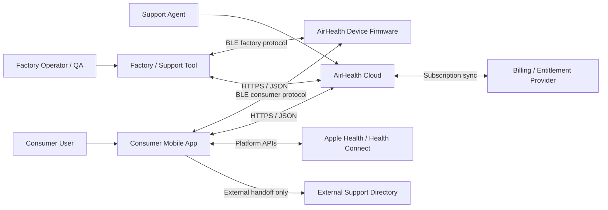

### 6.2 High-Level Software Architecture

```mermaid
flowchart TB
  subgraph Device["Handheld Device"]
    Boot[Secure Boot + Provisioning Latch]
    BLE[BLE Transport]
    Sess[Session Orchestrator]
    Factory[Factory Mode Controller]
    Sense[Sensor Pipelines + Algorithms]
    Profile[HW-ID / VOC Profile Resolver]
    LED[LED + Button Controller]
    Store[Secure Storage + Journals]
  end

  subgraph Consumer["Consumer App"]
    UX[Feature Hub + Guided Flows]
    MobileBLE[BLE Session Client]
    Sync[Offline Cache + Sync Queue]
    Ent[Entitlement Cache]
    Export[Health Export Adapters]
  end

  subgraph Tooling["Factory / Support Tooling"]
    ToolBLE[BLE Factory Client]
    Capture[Factory Log Capture]
    SupportUX[Factory / Support UI]
  end

  subgraph Cloud["Cloud Services"]
    API[API Gateway / BFF]
    Registry[Device Registry]
    Sessions[Session Service]
    Goals[Goal + Recommendation Service]
    EntSvc[Entitlement Service]
    FactorySvc[Factory Record Service]
    ProfileSvc[Device Profile Mapping]
    OTA[OTA Release Service]
    Analytics[Analytics + Support Views]
  end

  UX --> MobileBLE
  MobileBLE <-->|BLE session traffic| BLE
  ToolBLE <-->|BLE factory traffic| BLE
  ToolBLE --> Capture
  Capture --> FactorySvc
  Sync <-->|HTTPS| API
  SupportUX <-->|HTTPS| API
  API --> Registry
  API --> Sessions
  API --> Goals
  API --> EntSvc
  API --> FactorySvc
  API --> ProfileSvc
  API --> OTA
  Sessions --> Analytics
  FactorySvc --> Analytics
  ProfileSvc --> Analytics
  Sync --> Export
```

### 6.3 Domain Decomposition

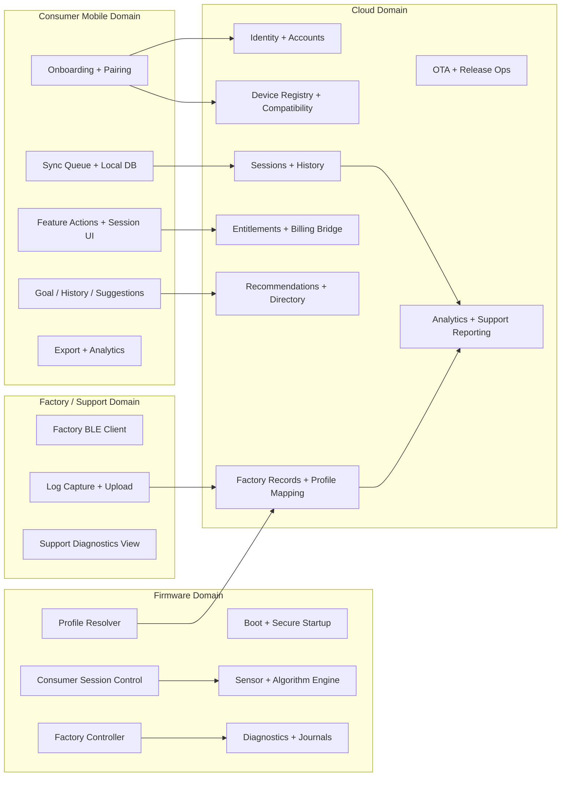

### Partitioning Summary

| Domain | Purpose | Owned Data | Inbound Interfaces | Outbound Interfaces | Failure Boundary | Versioning Boundary |
| --- | --- | --- | --- | --- | --- | --- |
| Firmware | Execute consumer sessions, Factory mode, profile tagging, diagnostics | Device config, calibration refs, provisioning latch, session journal, factory log bundle, firmware version | BLE commands, button input, sensors, OTA chunks | BLE notifications, LED states, local journals | Device reboot, watchdog reset, low-power transitions | Firmware semantic version |
| Consumer app | Orchestrate consumer UX and offline behavior | Local cache, sync queue, export status, cached entitlement snapshot | User input, BLE notifications, cloud responses, OS health APIs | BLE commands, HTTPS APIs, external-link handoff | App crash, backgrounding, permission denial | App release version |
| Factory / support tooling | Run factory verification and diagnostics capture | Factory session state, upload receipts, support lookup cache | Operator actions, BLE factory events, cloud responses | BLE factory commands, HTTPS factory/support APIs | Tool failure should not corrupt device state; retryable upload path required | Tool release version |
| Cloud backend | Durable source of truth for identity, entitlements, goals, history, factory records, profile routing | Users, devices, sessions, goals, recommendations, entitlements, factory records, profile mappings, releases, audits | HTTPS requests, internal events | Analytics events, admin/support views | Service degradation or regional outage | API version + schema version |

## 7. Component Responsibilities

### 7.1 Firmware

| Component | Responsibility | Inputs / Outputs | Owned State | Dependencies | Error Handling | Observability | Upgrade / Migration Notes |
| --- | --- | --- | --- | --- | --- | --- | --- |
| Boot and secure startup manager | Validate images, initialize provisioning state, expose boot reason | Input: signed image, reset cause. Output: boot status, active slot, provisioning state | Boot flags, rollback slot, provisioning latch | Secure boot chain, secure element, flash | Enter recovery slot on signature failure; refuse invalid downgrade | Boot reason, image hash, recovery count | Provisioning-latch schema must survive updates |
| BSP and drivers | Abstract sensors, button, LED, flash, secure element, battery, BLE radio | Input: hardware interrupts and read requests. Output: normalized device signals | Driver config, hardware health | SoC, sensors, fuel gauge | Mark unhealthy peripherals and emit deterministic fault codes | Driver init latency, sensor health counters | Hardware revision gates by board revision |
| BLE connectivity stack | Maintain bonded transport for consumer and factory profiles | Input: app/tool commands. Output: device info, session events, factory events, logs | Bonding data, transport state, feature gating flags | BLE controller, crypto stack | Re-advertise on link loss; fence factory-only commands unless allowed | RSSI, reconnect count, GATT errors | Major protocol version negotiation required |
| Session orchestrator | Enforce one active consumer session and coordinate transitions | Input: start/cancel/finish commands, readiness, low-power triggers. Output: session events and final result | Active `session_id`, mode, timers, session lock | Sensor manager, power manager, BLE stack | Convert invalid transitions into explicit error events; persist terminal status | Session duration, cancel/fail cause, illegal transitions | Must remain compatible with app state model |
| Measurement algorithm engine | Run sample validation and mode-specific scoring | Input: compensated sensor samples. Output: oral score or fat deltas with quality flags | Warm-up baseline, sample windows, thresholds, best delta | Flow/CO2/VOC/electrochemical pipelines | Reject invalid sample instead of emitting result | Sample acceptance rate, score variance, calibration warnings | Algorithm version included in every result |
| Factory mode controller | Run one-time hardware verification and enforce post-provisioning lockout | Input: long-press entry, tool authorization, hardware checks. Output: factory state, pass/fail, BLE log stream | Factory latch state, check progress, last factory result | Drivers, diagnostics buffer, LED controller | If log upload fails, retain buffered result and logs for retry until retention limit | Factory pass/fail counts, log transfer success, re-entry block count | Factory-state schema must be stable across firmware updates |
| Profile resolver | Resolve raw HW-ID to firmware-known hardware profile and detected VOC type tags | Input: calibration, hardware straps/config, sensing context. Output: internal profile metadata | HW-ID, profile class, detected VOC type | Secure storage, algorithm engine | Fallback to explicit `unknown_profile` rather than misclassify silently | Profile resolution rate, unknown-profile incidence | Mapping table versioned and reported |
| LED and button controller | Map device state to button handling and 3-color LED behavior | Input: state transitions. Output: LED patterns and button intents | Current LED state, long-press timers | Session orchestrator, factory controller | Prefer safe fallback LED state if state source is unavailable | LED state transition count, stuck-state warnings | Pattern table can be config-versioned |
| Secure storage and journals | Persist config, checkpoints, unreconciled results, factory bundles | Input: state snapshots, final results, logs. Output: recovery data on reboot/reconnect | Config, result journal, factory log bundle, profile metadata | Flash, secure element | CRC protect records; tombstone after ACK | Replay count, write failures | Schema versioned separately from firmware |
| OTA agent | Receive images over BLE, verify, stage, and apply | Input: manifest, chunks, apply command. Output: progress and completion status | Chunk bitmap, artifact hash, pending slot | Bootloader, flash, BLE transport | Abort on hash mismatch; resume partial transfer | OTA duration, failure reason | Enforce compatibility matrix |

Firmware architectural notes:

- The same BLE transport should support consumer and factory flows, but factory commands must be unreachable once provisioning is complete.
- Factory logs and session journals should be stored separately so a noisy factory failure cannot crowd out consumer recovery metadata.
- HW-ID and detected VOC routing data are internal artifacts and must not be promoted into consumer-facing result payloads.

### 7.2 Consumer Mobile App

| Component | Responsibility | Inputs / Outputs | Owned State | Dependencies | Error Handling | Observability | Upgrade / Migration Notes |
| --- | --- | --- | --- | --- | --- | --- | --- |
| App shell and feature hub | Render feature cards and enforce one-action-at-a-time behavior | Input: user taps, entitlement state, session state. Output: routes and disabled states | Current route, action lock, selected feature | Design system, local store | Refuse conflicting navigation with deterministic explanation | Screen views, blocked-action reasons | Stable route IDs for analytics |
| Onboarding and pairing flow | Permissions, BLE discovery, claim, mode setup | Input: advertisements, auth state, claim response. Output: paired device and setup completion | Pairing progress, last compatible device | BLE client, auth, registry API | Guided retry, permission education, timeout recovery | Pairing funnel, failure step | Backward-compatible for protocol changes |
| Session coordinator | Drive guided measurement and reconcile results after interruption | Input: BLE events, user actions, entitlement state. Output: measurement UI, sync enqueue | Current session, local `session_id`, recovery markers | BLE client, local DB, sync queue | Distinguish canceled, failed, interrupted, reconciled | Session start/finish, reconnect outcome | Migration-safe local schema |
| Goal and recommendation module | Goal CRUD and suggestion retrieval | Input: cloud responses, cached content. Output: user-facing goals and suggestions | Goals cache, recommendation cache | Goal API, recommendation API | Fallback to cached data in temporary access/read-only | Goal save failures, suggestion opens | Cache schema versioned |
| History and progress store | Show trends, baseline-building, and fat session summaries | Input: synced sessions and local pending sessions. Output: charts and summaries | SQLite tables, baseline caches | Session API, sync queue | Mark pending vs synced clearly; merge on conflict | History render latency, sync lag | Migration scripts required |
| Entitlement client and cache | Evaluate session eligibility and UI gating | Input: entitlement API response, clock, cached snapshot. Output: effective entitlement state | Last verified state, verification timestamp | Auth, subscription API | Switch to temporary access or read-only by rule | Entitlement refresh latency, stale-cache incidence | Time-source consistency across releases |
| Sync queue | Persist writes and replay when allowed | Input: completed results, goal writes, export audits. Output: retried cloud requests | Durable queue, idempotency keys, backoff state | Network stack, auth tokens | Exponential backoff, dedupe, quarantine poison messages | Queue age, retry counts, upload SLA | Queue contract locked early |
| Health export adapters | Map completed summaries to Apple Health and Health Connect | Input: completed local summary. Output: platform write result | Export permission and audit status | OS health frameworks | Surface permission denial separately from sync success | Export success rate by platform | Platform API changes per OS release |
| Consult professionals viewer | Show curated directory and external handoff message | Input: directory content. Output: localized list and outbound taps | Cached directory entries | Directory API / CMS | Permit read-only use without entitlement | Open rate, outbound taps | Content schema versioning |
| Analytics client | Emit consumer telemetry without leaking internal-only identifiers | Input: app and session events. Output: analytics events | Session correlation IDs, sampling config | Analytics ingest | Drop non-critical events when offline; never block UX | Event delivery rate, schema errors | Track schema versions |

Mobile architectural notes:

- Consumer app must not expose Factory mode, HW-ID values, or manufacturing-only log bundles anywhere in runtime UI, settings, exports, or support views.
- Consumer BLE clients should ignore any factory-only advertisement flags or message families after provisioning.
- Internal routing metadata may be present in local records for sync integrity, but must be filtered from UI view models and platform exports.

### 7.3 Cloud

| Component | Responsibility | Inputs / Outputs | Owned State | Dependencies | Error Handling | Observability | Upgrade / Migration Notes |
| --- | --- | --- | --- | --- | --- | --- | --- |
| API gateway / BFF | Authenticate clients and compose versioned product responses | Input: HTTPS requests. Output: JSON APIs | Request routing rules, rate limits | Identity, downstream services | Typed error model and retry hints | Request latency, 4xx/5xx rates | Version headers and deprecation policy |
| Identity and account service | User auth, token issuance, account linkage | Input: sign-in flows, token refresh. Output: access tokens and user IDs | User account records | External IdP, billing linkage | Token revocation and mismatch handling | Auth success, token refresh failures | Auth contract must remain stable |
| Device registry service | Track claimed devices, ownership, firmware compatibility, provisioning status | Input: claim requests, compatibility checks. Output: device records, capabilities | Device metadata, ownership, compatibility, provisioning state | Identity, OTA service, profile mapping | Reject duplicate claim or unauthorized rebind | Claim success, incompatible version count | Capability schema versioned |
| Session service | Persist completed sessions and serve history/trends | Input: completed session summaries. Output: session record IDs and history feeds | Session headers, derived metrics, routing metadata | Identity, goal service, profile mapping | Idempotent upsert by `session_id`; quarantine malformed payloads | Sync SLA, conflict rate, query latency | `result_schema_version` contract locked |
| Goal service | Store goals and mode preferences | Input: goal updates. Output: active goal and change history | Goal records, revision history | Identity | Optimistic concurrency, validation failures | Goal update error rate | Version goal schema by mode |
| Recommendation service | Produce goal suggestions and post-result guidance | Input: session summaries, goal context, entitlement state. Output: suggestion artifacts | Prompt/templates, suggestion records, audit | Model/runtime provider or rules engine | Degrade to templated content if generator unavailable | Suggestion latency, fallback rate | Version prompt/template sets |
| Entitlement service | Resolve trial, paid, temporary-access eligibility | Input: billing events, mobile checks. Output: effective entitlement snapshot | Subscription ledger mirror, trial windows, grace rules | Billing provider, identity | Cache-safe signed responses and explainability fields | Verification latency, outage rate | Billing abstraction required |
| Factory record service | Persist factory pass/fail outcomes, logs, and upload receipts | Input: tooling uploads, support lookups. Output: factory records and searchable status | Factory record headers, log bundle pointers, upload status | Device registry, profile mapping, analytics | Accept retries idempotently by `factory_run_id`; keep incomplete uploads retryable | Factory upload success, log capture completeness | Factory schema versioned separately |
| Device profile mapping service | Normalize HW-ID and detected VOC type into durable routing identifiers | Input: raw profile metadata from firmware and tools. Output: normalized profile IDs and lookup responses | Profile mappings, normalization rules, support labels | Device registry, analytics | Return `unknown_profile` rather than forcing incorrect mapping | Unknown-profile rate, mapping drift alerts | Mapping table versioned and auditable |
| Support directory service | Serve curated professional-support content | Input: content management updates and app reads. Output: localized directory data | Directory entries, locale mappings | CMS | Fail read-only; never block measurement stack | Content freshness, locale coverage | Content schema independently versioned |
| OTA release service | Publish manifests and staged rollout rules | Input: firmware artifacts and release settings. Output: app-visible release manifests | Releases, rollout cohorts, compatibility matrix | Artifact storage, device registry | Halt rollout on failure thresholds | Install success, rollback rate | Support phased cohorts |
| Analytics pipeline | Aggregate telemetry and product KPIs, including factory routing coverage | Input: app/cloud/factory events. Output: dashboards and anomaly alerts | Event lake, derived KPIs | API gateway, services | Dead-letter malformed events | Event lag, schema errors | Schema registry recommended |
| Admin and support console | Provide role-gated support and operational diagnostics | Input: operator actions. Output: read-only or audited support actions | Cases, audit trails, support annotations | Session, entitlement, factory, OTA services | All writes audited and role-gated | Support latency, manual override counts | RBAC and audit schema locked early |

Cloud architectural notes:

- Cloud should not expose raw HW-ID values to the consumer API surface; consumer-safe responses should use only public capability and compatibility data.
- Factory records and session records should share normalized device profile routing data so analytics and support can correlate manufacturing quality with field behavior.
- Recommendation and entitlement services should remain consumer-facing, while factory and support surfaces stay role-gated and separately audited.

### 7.4 Shared And Supporting Systems

- Shared schema package:
  Canonical definitions for `session_summary`, `factory_record`, `entitlement_snapshot`, `device_profile`, `firmware_manifest`, and analytics events.
- CI/CD:
  Separate firmware, consumer app, tooling, and cloud pipelines with shared contract-test gates.
- Observability:
  Unified dashboards for pairing, session completion, sync latency, entitlement outages, factory pass/fail by profile, and HW-ID routing coverage.
- Release management:
  Staged app release, staged firmware release, compatibility matrix review, and separate tooling release governance.

## 8. API Specifications

### 8.1 API: AirHealth BLE Consumer And Factory Protocol

- Consumers: Consumer mobile app, factory/support tooling
- Provider: Device firmware
- Protocol: BLE GATT with CBOR-encoded application messages
- Transport pattern: Writable command characteristic plus notify characteristics for state, result, diagnostics, and factory events
- Authentication:
  Consumer: BLE bond plus claim-established trust
  Factory: factory-tool authorization token and unprovisioned factory state
- Idempotency: Required on `session.start`, `session.cancel`, `factory.check.begin`, and `ota.commit` by `request_id`
- Ordering: In-order within one BLE connection; reconnect requires idempotent resend only
- Timeout: 5s command timeout, 20s reconnect grace for resumable consumer sessions, 30s per factory log chunk upload ACK
- Versioning: `protocol_version` advertised in `device.info`; unsupported major versions rejected

#### Message Families

Consumer-visible:

- `device.info.get`
- `device.claim.begin`
- `session.start`
- `session.cancel`
- `session.finish`
- `session.resume.query`
- `session.event`
- `session.result`
- `power.state`
- `ota.begin`
- `ota.chunk`
- `ota.commit`

Factory-only:

- `factory.enter.authorize`
- `factory.check.begin`
- `factory.state`
- `factory.log.bundle.meta`
- `factory.log.bundle.chunk`
- `factory.lock.status`

#### Request Schema: `session.start`

```json
{
  "request_id": "uuid",
  "session_id": "uuid",
  "mode": "oral_health|fat_burning",
  "goal_context": {
    "oral_baseline_state": "building|locked|not_applicable",
    "fat_target_delta_pct": 18
  },
  "app_context": {
    "app_version": "1.1.0",
    "platform": "ios|android",
    "entitlement_state": "trial_active|paid_active|temporary_access"
  }
}
```

#### Event Schema: `session.event`

```json
{
  "session_id": "uuid",
  "event_id": "uuid",
  "event_type": "ready|warming|measuring|paused|low_power|complete|canceled|failed",
  "mode": "oral_health|fat_burning",
  "timestamp_ms": 1774573200000,
  "details": {
    "step": "hold_breath|blow|wait|finish",
    "battery_state": "ok|low_blocked",
    "quality_gate": "pending|passed|failed",
    "failure_code": "NONE|LOW_BATTERY|BLE_LINK_LOST|INVALID_SAMPLE|SENSOR_WARMUP_FAILED"
  }
}
```

#### Event Schema: `factory.state`

```json
{
  "factory_run_id": "uuid",
  "state": "factory_mode|check_running|pass|fail|locked",
  "timestamp_ms": 1774573200000,
  "led_state": "orange|green|red|off",
  "profile": {
    "hw_id": "internal_enum",
    "device_profile_id": "profile_rev_a",
    "detected_voc_type": "standard_oral|standard_fat|unknown"
  },
  "result": {
    "status": "pending|pass|fail",
    "failure_count": 0
  }
}
```

#### Error Model

- `UNSUPPORTED_MODE`
- `SESSION_ALREADY_ACTIVE`
- `INVALID_TRANSITION`
- `PROTOCOL_VERSION_MISMATCH`
- `OTA_IN_PROGRESS`
- `FACTORY_AUTH_REQUIRED`
- `FACTORY_LOCKED`
- `FACTORY_LOG_UNAVAILABLE`
- `UNKNOWN_PROFILE`

#### Privacy / Security Notes

- Consumer flows must not receive factory-only commands, HW-ID values, or diagnostic bundles.
- Factory-only commands must be gated by provisioning state and operator/tool authorization.
- Device journals only bounded session metadata and bounded diagnostic bundles, not raw long-duration breath traces.

### 8.2 API: Claim Device

- Consumers: Consumer mobile app
- Provider: Cloud device registry service
- Protocol: HTTPS REST
- Endpoint: `POST /v1/devices:claim`
- Auth: User access token
- Idempotency: Required via `Idempotency-Key`
- Timeout: 10s client timeout, 30s server deadline
- Rate limits: 10 attempts per account per hour, 30 attempts per device per day
- Versioning: URI major version plus `X-AirHealth-App-Version`

#### Request

```json
{
  "device_serial": "AH-26-000123",
  "claim_nonce": "base64",
  "claim_proof": "base64",
  "hw_revision": "rev_a",
  "fw_version": "1.0.0",
  "protocol_version": 2,
  "platform": "ios"
}
```

#### Response

```json
{
  "device_id": "dev_123",
  "owner_user_id": "usr_456",
  "device_capabilities": {
    "supports_ota": true,
    "supported_modes": ["oral_health", "fat_burning"],
    "min_app_version": "1.1.0"
  },
  "bootstrap_config": {
    "config_version": 2,
    "sampling_profile": "default_v2"
  }
}
```

#### Errors

- `INVALID_CLAIM_PROOF`
- `DEVICE_ALREADY_CLAIMED`
- `DEVICE_REQUIRES_FACTORY_RESET`
- `FW_APP_INCOMPATIBLE`
- `RATE_LIMITED`

### 8.3 API: Upload Completed Session

- Consumers: Consumer app sync queue
- Provider: Cloud session service
- Protocol: HTTPS REST
- Endpoint: `POST /v1/session-records`
- Auth: User access token
- Idempotency: Required by `session_id`
- Timeout: 15s client timeout
- Consistency: Eventual consistency for history views, strong dedupe by `session_id`
- Retry policy: Exponential backoff with jitter for 5xx and network failures; no automatic retry for validation failures

#### Request

```json
{
  "session_id": "uuid",
  "device_id": "dev_123",
  "mode": "fat_burning",
  "started_at": "2026-03-27T18:00:00Z",
  "completed_at": "2026-03-27T18:05:42Z",
  "completion_status": "completed",
  "entitlement_state_at_completion": "trial_active",
  "result_schema_version": 2,
  "routing_metadata": {
    "device_profile_id": "profile_rev_a",
    "detected_voc_type": "standard_fat"
  },
  "summary": {
    "primary_result_value": 12,
    "primary_result_unit": "%",
    "best_delta_pct": 18,
    "session_baseline_value": 0,
    "measurement_count": 4
  }
}
```

#### Response

```json
{
  "session_record_id": "sess_789",
  "accepted": true,
  "deduplicated": false
}
```

#### Errors

- `INVALID_RESULT_SCHEMA`
- `SESSION_ALREADY_RECORDED`
- `ENTITLEMENT_NOT_ELIGIBLE`
- `UNKNOWN_DEVICE`
- `UNKNOWN_PROFILE`

### 8.4 API: Get Effective Entitlement

- Consumers: Consumer mobile app
- Provider: Cloud entitlement service
- Protocol: HTTPS REST
- Endpoint: `GET /v1/entitlements/me`
- Auth: User access token
- Timeout: 5s client timeout
- Caching: Signed response may be cached up to 24h on the client

#### Response

```json
{
  "source_state": "trial_active|paid_active|expired",
  "effective_state": "trial_active|paid_active|temporary_access|read_only",
  "verified_at": "2026-03-27T18:10:00Z",
  "fresh_until": "2026-03-28T18:10:00Z",
  "action_flags": {
    "can_start_session": true,
    "can_change_goals": true,
    "can_view_history": true,
    "can_use_cached_recommendations": true
  },
  "signature": "base64"
}
```

### 8.5 API: Upload Factory Record

- Consumers: Factory/support tooling
- Provider: Cloud factory record service
- Protocol: HTTPS REST
- Endpoint: `POST /v1/factory-records`
- Auth: Tool/service credential with factory role
- Idempotency: Required via `factory_run_id`
- Timeout: 20s client timeout
- Retry policy: Retryable until all chunks and metadata are acknowledged

#### Request

```json
{
  "factory_run_id": "uuid",
  "device_serial": "AH-26-000123",
  "device_id": "dev_123",
  "device_profile": {
    "hw_id": "internal_enum",
    "device_profile_id": "profile_rev_a",
    "detected_voc_type": "standard_oral"
  },
  "result": {
    "status": "pass|fail",
    "completed_at": "2026-03-27T16:20:00Z",
    "failure_codes": ["NONE"]
  },
  "log_bundle": {
    "bundle_id": "diag_456",
    "chunk_count": 4,
    "sha256": "hex"
  }
}
```

#### Response

```json
{
  "factory_record_id": "fac_123",
  "accepted": true,
  "missing_chunks": []
}
```

#### Errors

- `FACTORY_RUN_ALREADY_RECORDED`
- `DEVICE_NOT_FACTORY_ELIGIBLE`
- `UNKNOWN_PROFILE`
- `LOG_BUNDLE_INCOMPLETE`
- `UNAUTHORIZED_FACTORY_ROLE`

### 8.6 Event Contract: `session.completed.v2`

- Producer: Cloud session service
- Consumers: Analytics pipeline, recommendation service, support console
- Transport: Internal event bus
- Ordering: Best-effort ordered by `device_id`, not global
- Idempotency: `event_id` and `session_id` pair

```json
{
  "event_id": "uuid",
  "event_type": "session.completed.v2",
  "occurred_at": "2026-03-27T18:05:45Z",
  "user_id": "usr_456",
  "device_id": "dev_123",
  "session_id": "uuid",
  "mode": "oral_health",
  "routing_metadata": {
    "device_profile_id": "profile_rev_a",
    "detected_voc_type": "standard_oral"
  },
  "summary_hash": "sha256",
  "entitlement_state_at_completion": "trial_active"
}
```

## 9. Data Model And Event Model

### 9.1 Core Entities

| Entity | Purpose | Owner | Key Fields |
| --- | --- | --- | --- |
| `device` | Consumer-claimable device record | Cloud device registry | `device_id`, `serial`, `owner_user_id`, `fw_version`, `provisioning_state` |
| `device_profile` | Internal normalized profile record | Cloud profile mapping | `device_profile_id`, `hw_id`, `detected_voc_type`, `mapping_version` |
| `session_summary` | Completed consumer measurement summary | Firmware -> mobile -> cloud | `session_id`, `mode`, `summary`, `quality`, `routing_metadata` |
| `goal` | User target per mode | Cloud goal service | `goal_id`, `user_id`, `mode`, `target_value`, `revision` |
| `entitlement_snapshot` | Effective subscription state | Cloud entitlement service | `effective_state`, `verified_at`, `fresh_until`, `action_flags` |
| `factory_record` | One-time factory verification outcome | Tooling -> cloud factory record service | `factory_run_id`, `device_id`, `status`, `failure_codes`, `profile_id` |
| `diagnostic_log_bundle` | Bounded factory log payload | Firmware / tooling | `bundle_id`, `chunk_count`, `checksum`, `retention_status` |
| `firmware_release` | OTA release metadata | Cloud OTA service | `release_id`, `version`, `compatibility_matrix`, `rollout_state` |
| `export_audit` | Local or cloud export trail | Mobile / cloud | `audit_id`, `platform`, `result`, `timestamp` |

### 9.2 Session Summary Model

Consumer-visible fields:

- `mode`
- `started_at`
- `completed_at`
- `completion_status`
- `primary_result_value`
- `primary_result_unit`
- `measurement_count`
- `goal_target_value`
- `baseline_reference_value` when oral
- `best_delta_value` when fat-burning

Internal-only routing fields:

- `device_profile_id`
- `detected_voc_type`
- `algorithm_version`
- `result_schema_version`

Never exported to consumer UI or third-party health platforms:

- raw `hw_id`
- factory failure codes
- manufacturing logs
- device serial number

### 9.3 Factory Record Model

```json
{
  "factory_run_id": "uuid",
  "device_id": "dev_123",
  "device_profile_id": "profile_rev_a",
  "hw_id": "internal_enum",
  "detected_voc_type": "standard_oral",
  "status": "pass|fail",
  "completed_at": "2026-03-27T16:20:00Z",
  "failure_codes": ["FLOW_SENSOR_FAIL"],
  "log_bundle_id": "diag_456",
  "log_capture_status": "captured|partial|missing",
  "provisioning_latch_consumed": true
}
```

### 9.4 Important Events

- `pairing.claimed.v1`
- `session.completed.v2`
- `session.upload.retried.v1`
- `entitlement.snapshot.issued.v1`
- `factory.check.completed.v1`
- `factory.log.uploaded.v1`
- `device.profile.normalized.v1`
- `ota.release.applied.v1`

## 10. Top-Level State Machines

### 10.1 Product Operational State Machine

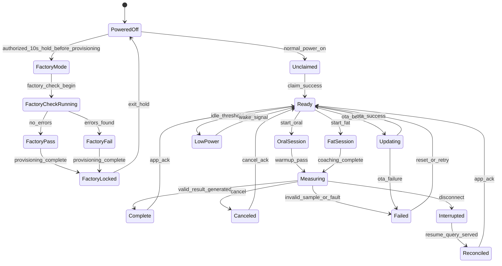

### 10.2 Entitlement Overlay State Machine

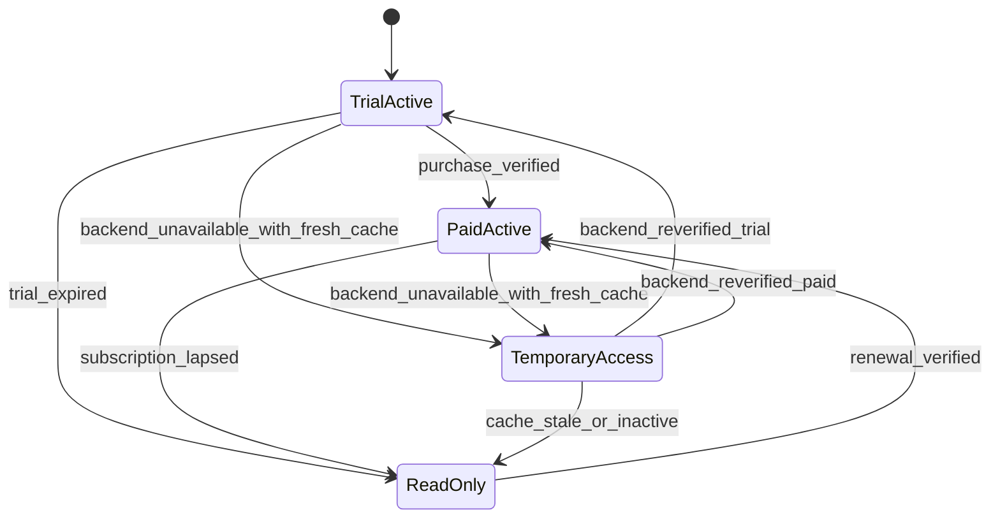

### 10.3 Factory Provisioning State Machine

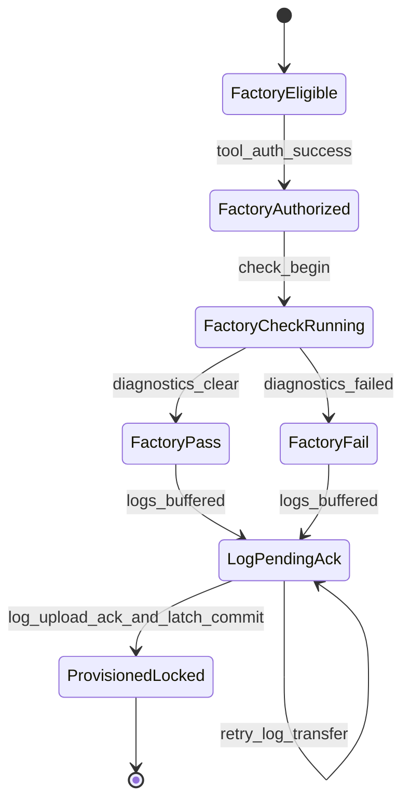

## 11. UML Sequence Diagrams

### 11.1 Consumer Onboarding And Claim

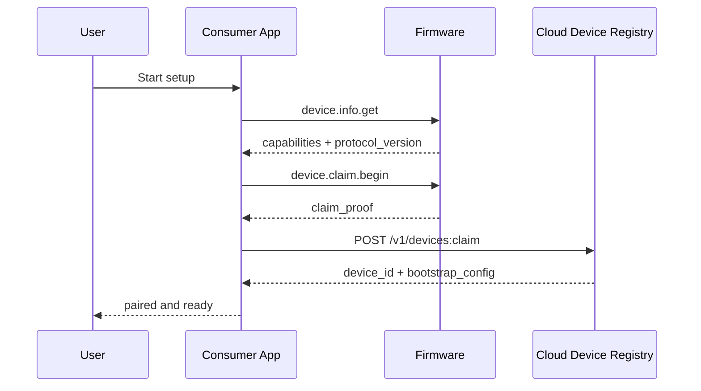

### 11.2 Measurement Completion And Sync

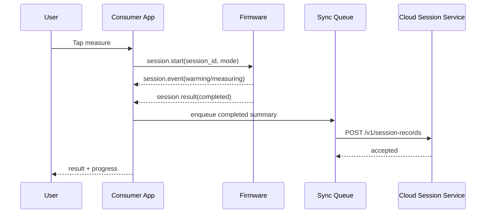

### 11.3 Factory Verification And Log Upload

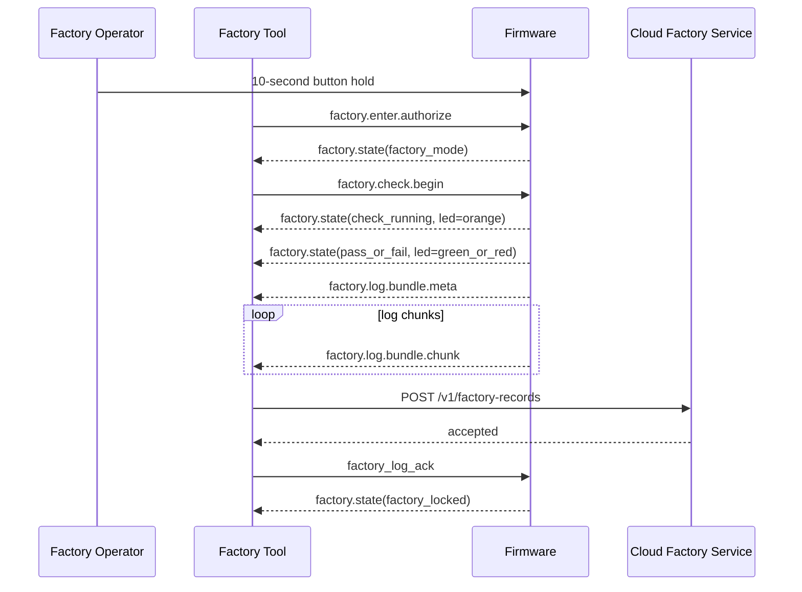

### 11.4 OTA Firmware Update

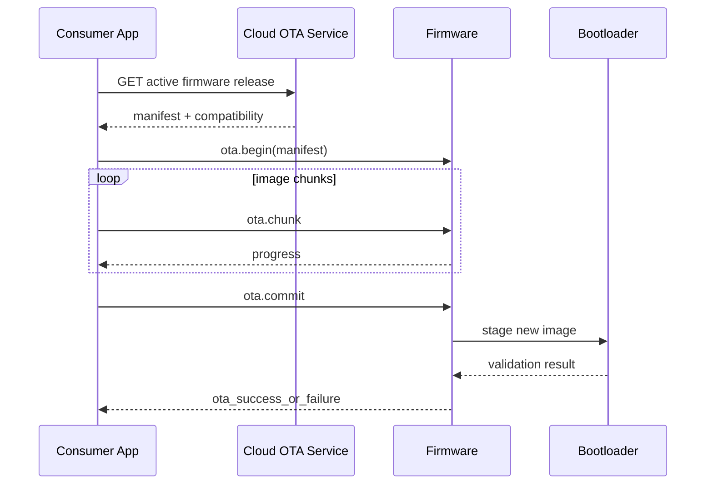

### 11.5 Disconnect Recovery And Result Reconciliation

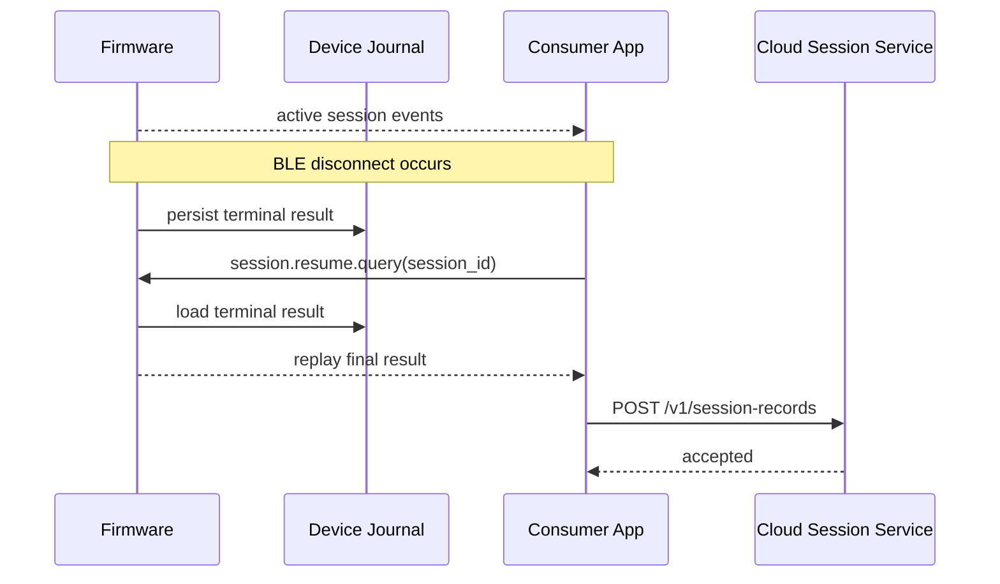

## 12. Quality Attributes And Cross-Cutting Concerns

### Security

- Secure boot, signed firmware images, and protected provisioning state are required.
- Factory-only functions must be role-gated and unavailable after provisioning lockout.
- Consumer APIs must not return internal-only HW-ID or manufacturing diagnostics.

### Reliability And Resilience

- Device must tolerate transient disconnects without losing valid completed-session truth.
- Factory log capture must support retryable upload if BLE or network transfer fails mid-run.
- Unknown HW-ID or VOC mappings must fail safe into explicit routing buckets rather than silent misclassification.

### Performance

- Pairing and claim should fit the PRD launch target of 95% within 10 minutes.
- Completed sessions should sync within the PRD target window when connectivity is available.
- Factory verification should minimize operator dwell time by streaming pass/fail and logs without requiring enclosure access.

### Compatibility And Versioning

- BLE protocol, session summary schema, factory record schema, and profile mapping table each need explicit versioning.
- Firmware, app, tooling, and cloud compatibility must be validated as a matrix, not only pairwise.
- Normalized `device_profile_id` should shield cloud systems from raw HW-ID churn over time.

### Operations And Observability

- Dashboards should track pairing funnel, session completion, sync latency, temporary-access incidence, factory pass/fail by profile, factory BLE log capture success, and routing coverage.
- Support tooling should distinguish consumer-session issues from manufacturing-only verification failures.
- Factory and support actions must be separately audited from consumer flows.

### Compliance And Safety

- Consumer outputs remain non-diagnostic.
- Support and manufacturing logs must follow retention and access-control policy.
- Export behavior remains limited to completed summaries only.

## 13. Verification, Rollout, And Operational Readiness

### Verification Matrix

| Area | Verification Focus |
| --- | --- |
| Firmware consumer path | Oral/fat state machines, low-power hysteresis, disconnect recovery, OTA |
| Firmware factory path | 10-second entry/exit, one-time latch, LED mapping, log buffering, lockout after provisioning |
| Consumer app | Pairing UX, one-action lock, entitlement gating, export, offline queue replay |
| Factory/support tooling | Tool auth, BLE log capture, retry upload, operator-visible pass/fail flow |
| Cloud | Claim, session upload, entitlement snapshot, factory record ingestion, profile normalization |
| Cross-domain | Contract tests for BLE protocol, session schema, factory record schema, profile routing, analytics events |

### Release Plan

1. Lock shared schemas: BLE v2, session summary v2, factory record v1, device profile mapping v1.
2. Validate firmware consumer measurement and low-power path on engineering hardware.
3. Validate factory mode, provisioning latch, LED state mapping, and log capture in manufacturing fixture flow.
4. Launch consumer app and cloud against staged firmware compatibility matrix.
5. Enable factory analytics and support dashboards before first production lot shipment.

### Operational Readiness Requirements

- Factory tooling runbook for failed BLE log transfer and re-upload.
- Support playbook for unknown profile mapping or session-routing anomalies.
- Compatibility matrix review gate before firmware or app promotion.
- Alerting for factory upload failures, routing gaps, entitlement outages, and sync SLA regressions.

## 14. Risks, Tradeoffs, And Alternatives

### Primary Risks

- Factory-only BLE paths could accidentally leak into consumer workflows if authorization and provisioning gating are not strict.
- HW-ID misclassification could group results, logs, or manufacturing defects under the wrong hardware profile.
- BLE log transfer during factory verification could fail often enough to slow manufacturing throughput unless retries and buffering are solid.
- The added tooling surface increases operational scope compared with a consumer-only architecture.

### Tradeoffs

- Separating consumer and factory tooling increases system count, but it is the cleanest way to keep Factory mode out of consumer UX.
- Normalizing HW-ID into a cloud profile service adds one more mapping layer, but it reduces long-term coupling to firmware enumerations.
- BLE-only Phase 1 avoids device-cloud complexity, but it keeps the phone and tooling as the mandatory bridge for all field and factory transfers.

### Considered Alternatives

- Put Factory mode inside the consumer app:
  Rejected because the PRD explicitly keeps Factory mode out of consumer workflows.
- Send raw HW-ID directly through all downstream systems:
  Rejected because it creates brittle coupling and increases accidental exposure risk.
- Add direct device-cloud connectivity for factory upload:
  Rejected for Phase 1 because the EE baseline and power/space envelope remain BLE-centric.

## 15. Recommendations And Next Steps

### Architectural Decisions To Lock Now

- BLE-only consumer connectivity in Phase 1.
- Separate factory/support tooling surface from the consumer app.
- One-time provisioning latch owned by firmware and mirrored in cloud registry.
- Internal profile normalization through `device_profile_id` rather than raw HW-ID exposure.

### Assumptions That Need Validation

- Flash budget is sufficient for bounded factory log buffering plus session recovery journals.
- Manufacturing tooling can authenticate to factory-only BLE flows without unacceptable operator friction.
- Detected VOC type routing can be made stable enough for downstream grouping without consumer-facing impact.

### Risky Areas Needing Prototype Or Spike Work

- Factory BLE log throughput and retry behavior.
- Provisioning latch durability across firmware updates and brownouts.
- Unknown-profile fallback and mapping-table ownership.
- Support console correlation between factory failures and field session behavior.

### APIs Or Contracts To Review Cross-Functionally

- BLE protocol v2, especially factory-only message gating.
- Session summary v2 routing metadata fields.
- Factory record ingestion contract and retention model.
- Device profile normalization contract between firmware, factory tooling, backend, analytics, and support.

### Test And Rollout Actions Required Before Launch

- End-to-end manufacturing dry run with factory pass, factory fail, interrupted log upload, and post-lockout consumer pairing.
- Field-validation run confirming consumer app never surfaces factory-only data.
- Analytics validation for factory pass/fail by profile and HW-ID routing coverage.
- Compatibility test sweep across firmware, consumer app, tooling, and cloud versions.
