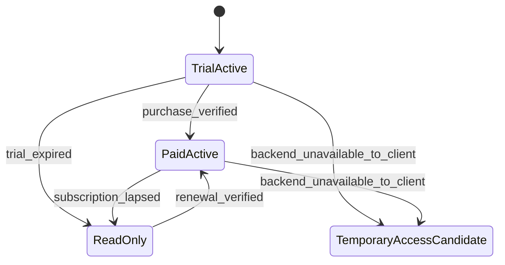
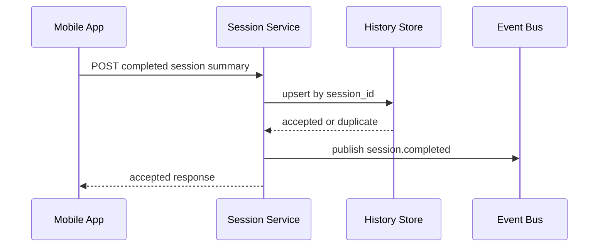
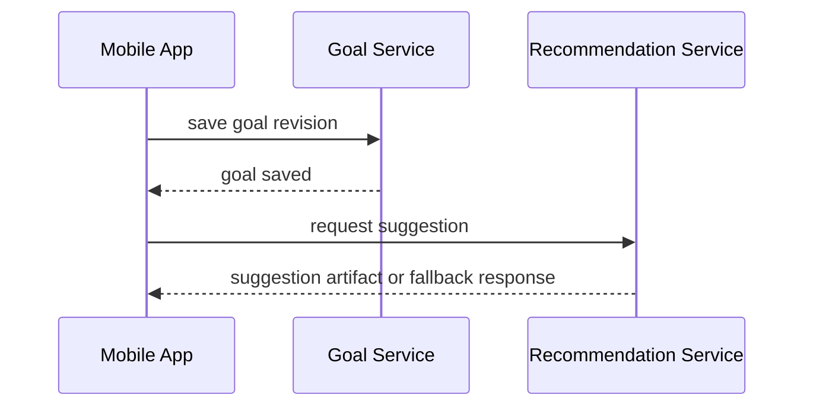
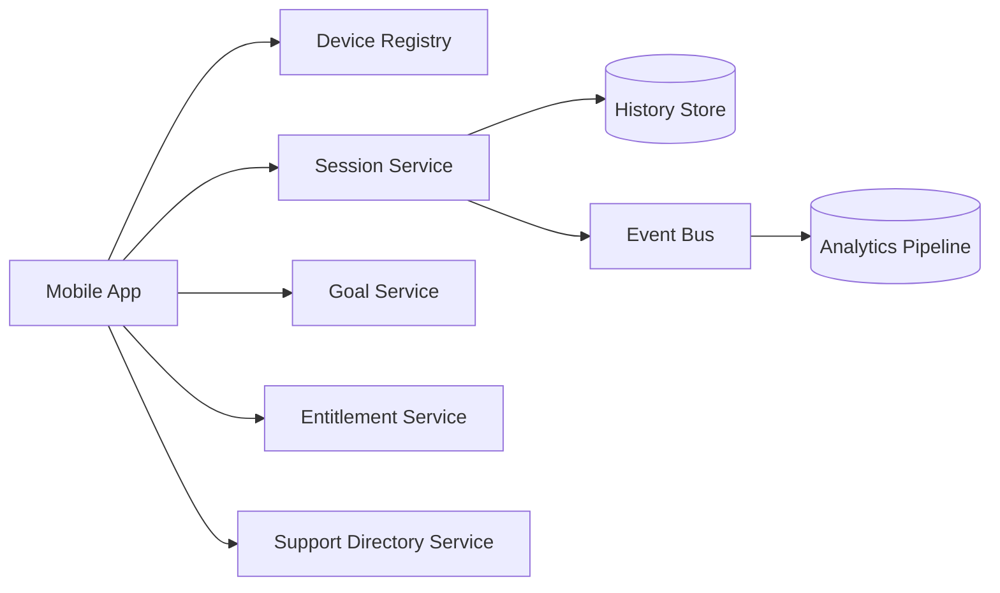

# AirHealth Backend Feature Design

## Versioning

- Version: v0.1
- Date: 2026-03-26
- Author: Codex

## 1. Summary

This document covers only cloud-resident backend systems. It excludes device-local firmware logic and phone-local UX/state logic except where backend contracts must serve those clients.

Backend scope in Phase 1:

- device claim and registry
- session summary persistence and history queries
- goal persistence and recommendation support
- entitlement and read-only gating contracts
- support directory content service
- analytics, audit, and support surfaces
- OTA metadata service when enabled

## 2. Inputs Reviewed

- `PM/PRD/PRD.md` v0.6
- `SW/Architecture/Software_Architecture_Spec_v0.1.md`
- `PM/Designs/design-spec.md`

## 3. Scope And Requirements Baseline

### Must-Have

- Bind devices to users through claim flows.
- Persist completed session summaries idempotently.
- Provide history/trend queries for completed sessions.
- Persist goals and serve recommendation inputs/outputs.
- Provide entitlement snapshots with effective app-state semantics.
- Serve consult-professionals directory content without requiring measurement payloads.

### Non-Goals

- firmware sensor processing
- phone-local navigation and cache management
- direct platform health export

### Dependencies

- identity provider
- billing / subscription provider
- storage for session history and goals
- content operations for support directory

## 4. Responsibilities And Interfaces

| Feature area | Backend responsibility | Inbound interface | Outbound interface |
| --- | --- | --- | --- |
| Device claim | register ownership and capabilities | claim request from app | claim response + capability info |
| Session persistence | store completed oral/fat summaries and dedupe by `session_id` | session upload | accepted history record + query responses |
| Goals and suggestions | persist goals and generate or fetch suggestions | goal writes, suggestion requests | goal state + suggestion artifacts |
| Entitlement | derive effective app state and freshness info | entitlement check | snapshot with gating flags |
| Support directory | serve feature- and locale-scoped support content | directory requests | directory entries |
| Analytics / support | ingest events and expose support-facing audit views | app/cloud events | dashboards, support data |

## 5. Behavioral Design

### 5.1 Entitlement State Machine

### 5.2 Session Upload Sequence

### 5.3 Goal And Suggestion Sequence

### 5.4 Backend Data Flow

## 6. Contracts And Data Model Impacts

| Contract / Entity | Backend requirement |
| --- | --- |
| `POST /v1/devices:claim` | idempotent ownership bind and capability response |
| `POST /v1/session-records` | idempotent completed-session acceptance using `session_id` |
| `GET /v1/session-records` | history and trend query by mode and time window |
| `PUT /v1/goals/{mode}` | versioned goal revisions |
| `POST /v1/goal-suggestions` | feature-aware suggestion response or fallback |
| `GET /v1/entitlements/me` | signed snapshot with effective state, freshness, and action flags |
| `GET /v1/support-directory` | feature + locale scoped content |

Primary backend entities:

- `device`
- `pairing_record`
- `session_summary`
- `goal`
- `recommendation_artifact`
- `entitlement_snapshot`
- `support_directory_entry`
- `audit_event`

## 7. Failure Handling And Observability

Required failure modes:

- duplicate claim
- duplicate session upload
- invalid result schema
- stale entitlement response dependency
- recommendation unavailable
- directory content unavailable

Required observability:

- claim success / failure
- session upload latency and duplicate rate
- history query latency
- suggestion fallback rate
- entitlement outage incidence
- directory fallback usage

## 8. Verification Strategy

- API contract tests for claim, session, goal, entitlement, and directory endpoints
- idempotency tests for repeated session uploads
- recommendation fallback tests
- entitlement snapshot schema and freshness tests
- analytics event schema validation

## 9. Planning And Coding Handoff

| Task | Objective | Acceptance criteria |
| --- | --- | --- |
| Implement device registry claim endpoint | bind device ownership and return capability metadata | duplicate claim and incompatible device flows handled deterministically |
| Implement session summary service | store completed oral/fat summaries idempotently | duplicate upload returns success-equivalent semantics |
| Implement history query views | return trend-ready summaries by mode and time window | 7/30/90-day queries perform and match persisted data |
| Implement goal revision and suggestion surfaces | support goal writes and suggestion retrieval | stale revisions rejected cleanly; fallback response exists |
| Implement entitlement snapshot service | expose effective app state and freshness window | client can derive active/temporary/read-only behavior from one contract |
| Implement support directory service | serve feature and locale scoped entries | no account or measurement data required to query |
