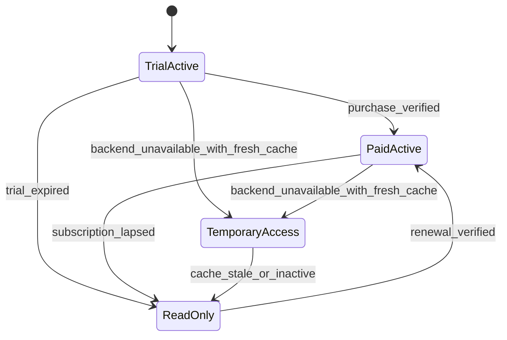
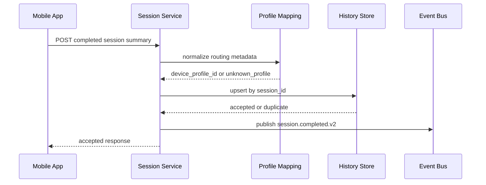
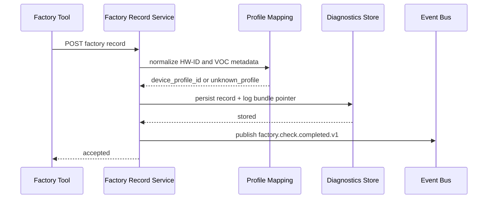
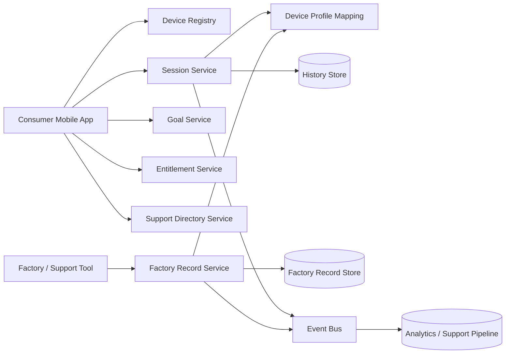

# AirHealth Backend Feature Design

## Versioning

- Version: v0.2
- Date: 2026-03-27
- Author: Codex

## 1. Summary

This document covers only cloud-resident backend systems. It excludes device-local firmware logic, phone-local UX/state logic, and factory-tool client behavior except where backend contracts must serve those clients.

Backend scope in Phase 1:

- device claim and registry
- session summary persistence and history queries
- goal persistence and recommendation support
- entitlement and read-only gating contracts
- support directory content service
- factory record ingestion and diagnostics persistence
- device-profile normalization from HW-ID and detected VOC metadata
- analytics, audit, and support/admin surfaces
- OTA release metadata service

## 2. Inputs Reviewed

- `PM/PRD/PRD.md` v0.7
- `SW/Architecture/Software_Architecture_Spec_v0.2.md`

## 3. Scope And Requirements Baseline

### Must-Have

- Bind devices to users through claim flows.
- Persist completed session summaries idempotently.
- Provide history and trend queries for completed sessions.
- Persist goals and serve recommendation inputs/outputs.
- Provide entitlement snapshots with effective app-state semantics.
- Serve consult-professionals directory content without requiring measurement payloads.
- Persist factory pass/fail records, BLE diagnostics upload status, and profile-routing metadata.
- Normalize internal HW-ID and detected VOC type into durable backend routing identifiers.
- Expose support and analytics views that can group data by normalized device profile without leaking internal-only identifiers to consumer APIs.

### Non-Goals

- firmware sensor processing
- phone-local navigation and cache management
- direct platform health export
- factory-tool BLE client behavior
- consumer exposure of raw HW-ID values

### Dependencies

- identity provider
- billing and subscription provider
- storage for session history, goals, and factory records
- content operations for support directory
- device-profile mapping ownership and governance

## 4. Assumptions And Dependencies

- Backend can own the durable `device_profile_id` mapping even if raw HW-ID originates in firmware.
- Factory tooling authenticates separately from the consumer app and uses role-gated APIs.
- Session records and factory records can share profile-routing metadata without changing the consumer result model.

Open questions:

- whether support users need raw factory failure codes or only normalized support categories
- whether profile normalization should be fully synchronous on ingestion or tolerate delayed reconciliation for unknown profiles
- whether returned-field consumer APIs need explicit contract tests preventing raw HW-ID leakage

## 5. Responsibilities And Interfaces

| Feature area | Backend responsibility | Inbound interface | Outbound interface |
| --- | --- | --- | --- |
| Device claim | register ownership, capabilities, and provisioning state | claim request from app | claim response, compatibility info |
| Session persistence | store completed oral and fat summaries and dedupe by `session_id` | session upload | accepted history record, query responses |
| Goals and suggestions | persist goals and generate or fetch suggestions | goal writes, suggestion requests | goal state, suggestion artifacts |
| Entitlement | derive effective app state and freshness info | entitlement check | snapshot with gating flags |
| Support directory | serve feature- and locale-scoped support content | directory requests | directory entries |
| Factory records | persist pass/fail outcomes, diagnostics status, and upload receipts | factory tooling upload | accepted factory record, support lookup responses |
| Profile mapping | normalize HW-ID and detected VOC type to durable internal routing identifiers | raw profile metadata from firmware/tooling | `device_profile_id`, support labels, analytics grouping |
| Analytics and support | ingest events and expose support-facing audit and routing views | app/cloud/factory events | dashboards, support data, alerts |

## 6. Behavioral Design

### 6.1 Entitlement State Machine

### 6.2 Session Upload Sequence

### 6.3 Factory Record Ingestion Sequence

### 6.4 Backend Data Flow

## 7. Contracts And Data Model Impacts

| Contract / Entity | Backend requirement |
| --- | --- |
| `POST /v1/devices:claim` | idempotent ownership bind, capability response, and provisioning-state awareness |
| `POST /v1/session-records` | idempotent completed-session acceptance using `session_id` plus routing metadata normalization |
| `GET /v1/session-records` | history and trend query by mode and time window |
| `PUT /v1/goals/{mode}` | versioned goal revisions |
| `POST /v1/goal-suggestions` | feature-aware suggestion response or fallback |
| `GET /v1/entitlements/me` | signed snapshot with effective state, freshness, and action flags |
| `GET /v1/support-directory` | feature and locale scoped content |
| `POST /v1/factory-records` | idempotent ingestion of factory pass/fail metadata and diagnostics upload status |
| `device_profile` mapping | normalize raw HW-ID plus detected VOC metadata into durable routing identifiers |

Primary backend entities:

- `device`
- `pairing_record`
- `session_summary`
- `goal`
- `recommendation_artifact`
- `entitlement_snapshot`
- `support_directory_entry`
- `factory_record`
- `diagnostic_log_bundle`
- `device_profile`
- `audit_event`

## 8. Success Metrics And Instrumentation

| Metric | Why it matters | Source | Owner |
| --- | --- | --- | --- |
| Device claim success rate | confirms onboarding requests bind devices cleanly without avoidable backend rejection | claim endpoint request and outcome logs | Backend |
| Session upload duplicate rate | measures idempotency pressure and catches retry storms or client replay bugs | session service dedupe outcomes by `session_id` | Backend |
| Session upload acceptance latency | ensures completed summaries are persisted fast enough for history and export follow-up | API latency telemetry for `POST /v1/session-records` | Backend |
| Entitlement snapshot freshness success rate | validates that app gating decisions are backed by fresh cloud state | entitlement service freshness checks and dependency health logs | Backend |
| Recommendation fallback rate | highlights degraded suggestion generation using backup behavior too often | recommendation responses tagged as primary or fallback | Backend |
| Support directory availability | ensures consult-professionals content remains available during partial outages | support directory request success and error telemetry | Backend |
| Factory record upload completion rate | measures whether production units are arriving with durable factory verification evidence | factory record ingestion and diagnostics upload status | Backend |
| Factory BLE log capture completeness | catches missing or partial manufacturing evidence before shipment | diagnostics bundle completeness telemetry | Backend |
| Profile normalization coverage | measures how often raw profile metadata resolves to a known durable profile | profile mapping outcomes by ingestion path | Backend |
| Consumer API internal-field leakage rate | guardrail metric that should remain zero | API response schema validation and contract-test telemetry | Backend |

Instrumentation notes:

- externally visible APIs should log request id, user id or tool id, device id when applicable, and contract version
- idempotent endpoints should record first-write vs duplicate-write outcomes explicitly
- factory and session events should both emit normalized `device_profile_id` when available so analytics can correlate manufacturing and field behavior

## 9. Failure Handling And Observability

Required failure modes:

- duplicate claim
- duplicate session upload
- invalid result schema
- stale entitlement response dependency
- recommendation unavailable
- directory content unavailable
- duplicate factory upload
- incomplete diagnostics bundle
- unknown profile mapping
- accidental raw HW-ID exposure in consumer API surface

Required observability:

- claim success and failure
- session upload latency and duplicate rate
- history query latency
- suggestion fallback rate
- entitlement outage incidence
- directory fallback usage
- factory upload success and completeness
- profile normalization unknown rate
- consumer-response schema violation count

## 10. Verification Strategy

- API contract tests for claim, session, goal, entitlement, directory, and factory endpoints
- idempotency tests for repeated session uploads and repeated factory uploads
- profile-normalization tests covering supported and unknown hardware profiles
- recommendation fallback tests
- entitlement snapshot schema and freshness tests
- analytics event schema validation
- contract tests proving raw HW-ID and manufacturing-only diagnostics never appear in consumer-facing APIs

## 11. Planning And Coding Handoff

| Task | Objective | Acceptance criteria |
| --- | --- | --- |
| Implement device registry claim updates | bind device ownership and expose compatibility plus provisioning state safely | duplicate claim and incompatible device flows are deterministic |
| Implement session summary service v2 | store completed oral and fat summaries idempotently with routing metadata normalization | duplicate upload returns success-equivalent semantics and normalized profile data is attached |
| Implement history query views | return trend-ready summaries by mode and time window | 7/30/90-day queries perform and match persisted data |
| Implement goal revision and suggestion surfaces | support goal writes and suggestion retrieval | stale revisions reject cleanly and fallback response exists |
| Implement entitlement snapshot service | expose effective app state and freshness window | client can derive active, temporary, and read-only behavior from one contract |
| Implement support directory service | serve feature and locale scoped entries | no account or measurement data is required to query |
| Implement factory record ingestion service | persist factory pass/fail outcomes, diagnostics status, and upload receipts | repeated upload by `factory_run_id` is idempotent and support can retrieve the stored result |
| Implement device-profile mapping service | normalize HW-ID and detected VOC type into durable routing identifiers | unknown profiles are explicit and do not block ingestion of otherwise valid records |
| Implement consumer-API shielding checks | prevent internal-only fields from leaking to consumer endpoints | contract tests fail if raw HW-ID or factory diagnostics appear in consumer responses |
