# AirHealth Feature Design Specification

## Versioning

- Version: v0.1
- Date: 2026-03-26
- Author: Codex

## Revision History

| Version | Date | Author | Summary of Changes | Source of Change | Affected Sections |
| --- | --- | --- | --- | --- | --- |
| v0.1 | 2026-03-26 | Codex | Initial software feature design package derived from the current PRD, architecture specification, and UX design specification. Added implementation-ready feature designs, diagrams, contracts, and handoff task breakdowns across firmware, mobile, and backend. | `PM/PRD/PRD.md` v0.6; `SW/Architecture/Software_Architecture_Spec_v0.1.md`; `PM/Designs/design-spec.md` | Entire document |

## 1. Summary

This document converts the approved AirHealth PRD and software architecture into feature-scoped implementation designs that are ready for planning and coding follow-up. It focuses on the software features that materially affect firmware, mobile app, backend, and supporting systems in Phase 1.

The document intentionally stays below full detailed low-level design for every UI widget or database column. Instead, it defines enough behavior, contracts, data movement, failure handling, and implementation slices that another skill can safely turn the output into tickets, sprint plans, or code tasks without having to re-derive the feature intent.

## 2. Inputs Reviewed

- `PM/PRD/PRD.md` v0.6
- `SW/Architecture/Software_Architecture_Spec_v0.1.md`
- `PM/Designs/design-spec.md`

Confirmed inputs carried forward:

- Two measurement modes exist in Phase 1: Oral & Dental Health and Fat Burning.
- The device is authoritative for sensing, sample completion, and final result generation.
- The app is authoritative for action gating, local queueing, and entitlement-based UX.
- The cloud is authoritative for identity, entitlement, durable history, and recommendations.
- The system enforces one active measurement session at a time and one active action at a time.
- Phase 1 sharing is limited to Apple Health on iOS and Health Connect on Android.
- `consult professionals` is informational and must not transmit account or measurement data.

Key design inferences used in this document:

- Feature implementation should preserve the Phase 1 mobile-mediated architecture: BLE-only device connectivity, app-mediated sync, app-mediated OTA.
- `session_id` is the cross-domain feature correlation key for active session handling, sync, analytics, and recovery.
- The app sync queue should persist both the final payload and the eligibility context used when the payload was produced.
- Feature teams should use shared schema packages for session summary, entitlement snapshot, analytics events, and BLE payloads rather than copy local feature-only versions.

## 3. Cross-Feature Requirement Baseline

### Must-Have Product Rules

- Only one feature action may be active at a time.
- Only one measurement session may be active at a time.
- Completed measurements require device confirmation before the app presents them as final.
- Canceled, failed, or incomplete sessions are not stored as completed measurement results.
- Entitlement state can block new session starts while still allowing history viewing and queued-result sync.
- Temporary access and read-only behavior must be explicit in the UI.
- Health export includes completed summary data only.

### Shared Engineering Constraints

- Firmware must preserve enough state for reconnect and post-disconnect result reconciliation.
- Mobile must persist durable offline queue state across process death.
- Backend contracts must remain compatible across firmware/app version skew.
- Feature implementations must avoid hidden state mismatches between firmware and app.
- Observability must support pairing, session, sync, entitlement, export, and recovery troubleshooting.

### Open Questions

- Whether sign-in is mandatory before first measurement or only before sync-dependent features.
- How recommendations are generated in Phase 1: rules-only, hybrid, or model-assisted.
- Whether support/admin tools need manual session-replay or entitlement override capability at launch.
- Whether OTA should be considered MVP-critical or release-gated behind firmware compatibility stabilization.

## 4. Shared Feature Foundations

These items are not standalone user-facing features, but every downstream planning or coding effort depends on them.

| Shared foundation | Why it exists | Primary owners | Downstream consumers |
| --- | --- | --- | --- |
| `session_id` correlation contract | Reconcile measurement state, sync, analytics, export, and recovery | Firmware, mobile, backend | All measurement and history features |
| Action lock model | Enforce one active action at a time | Mobile | Goals, measurement, support, history |
| Entitlement snapshot contract | Produce deterministic gating and fallback behavior | Backend, mobile | Measurement start, goal edit, suggestion, history |
| Sync queue + idempotency model | Support offline completion and delayed upload | Mobile, backend | Results, export audit, entitlement recovery |
| Compatibility matrix | Prevent incompatible app/fw feature behavior | Firmware, mobile, backend | Pairing, measurement, OTA |

Recommended sequencing:

1. Lock the shared feature contracts first.
2. Implement measurement features after the shared contracts exist.
3. Layer history/export, entitlement gating, and support flows on top.

## 5. Feature Design: Pairing And Onboarding

### 5.1 Summary

- User outcome: connect a new device, verify compatibility, establish trust, and land in a ready state with one mode configured.
- Primary entry points: first launch, explicit `Add device`, reconnect after ownership reset.
- Feature class: cross-cutting, mobile-led with firmware and backend dependencies.

### 5.2 Requirements Baseline

Must-have:

- BLE discovery, permission handling, identity verification, claim, compatibility check, and ready-state confirmation.
- Clear recovery for permission denial, timeout, wrong device, and claim rejection.
- Initial goal/mode setup handoff after successful pairing.

Should-have:

- Friendly compatibility messaging for outdated firmware or app versions.
- Lightweight reconnect path for already-claimed devices.

Dependencies:

- Device claim protocol
- Device registry
- entitlement snapshot fetch
- design-system onboarding flow

### 5.3 Domain Decomposition

| Domain | Responsibilities | Owned state | Dependencies |
| --- | --- | --- | --- |
| Firmware | Advertise, respond to `device.info`, issue claim proof, persist claim status | Device identity, claim status, protocol version | Secure element, BLE stack |
| Mobile | Permission UX, discovery, pairing orchestration, claim request, compatibility messaging | Pairing progress, selected device, retry state | BLE client, auth, device registry, entitlement service |
| Backend | Device ownership binding, capability response, compatibility rules | Device record, owner binding, capability metadata | Identity service |
| Supporting systems | Analytics for funnel drop-off and failures | Pairing funnel events | Analytics pipeline |

### 5.4 Behavioral Design

#### State Machine

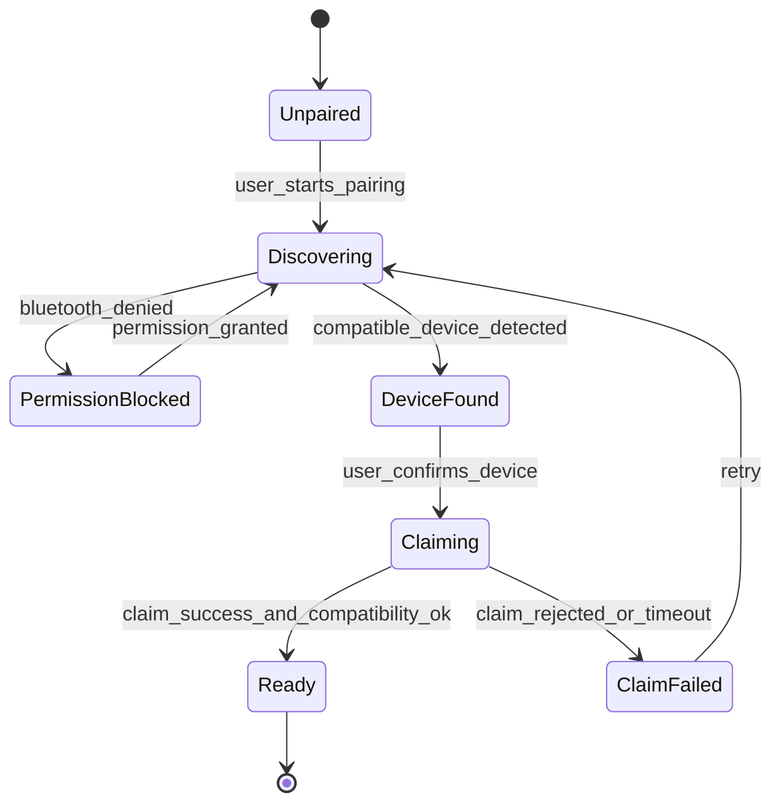

#### Happy-Path Sequence

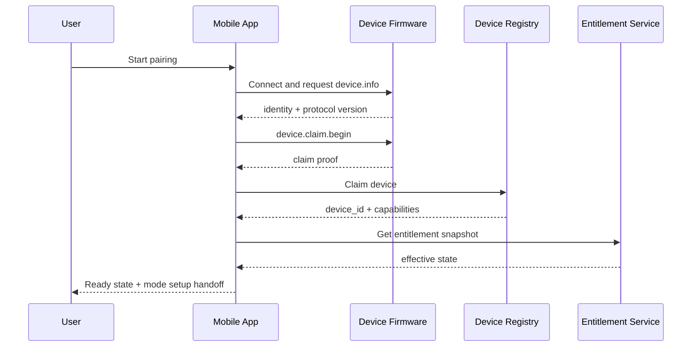

#### Failure / Recovery Sequence

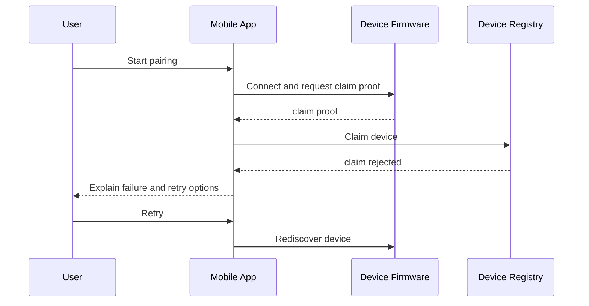

#### Data Flow

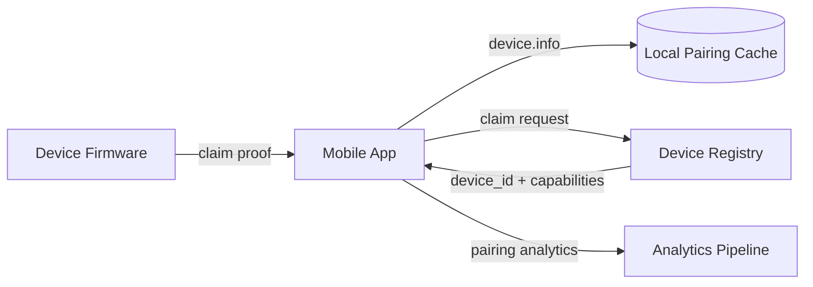

### 5.5 Contracts And Data Impacts

| Contract / Entity | Change / Requirement |
| --- | --- |
| BLE `device.info` | Must include protocol version, device identity, and capability summary |
| BLE `device.claim.begin` | Must return claim proof tied to device identity |
| `POST /v1/devices:claim` | Must be idempotent and return capability metadata |
| Local pairing cache | Stores temporary discovery state, last attempted device, and compatibility outcome |
| Analytics events | `pairing.started`, `pairing.permission_blocked`, `pairing.claim_failed`, `pairing.completed` |

### 5.6 Failure Handling And Observability

- Distinguish permission denial, no-device-found, duplicate claim, and version incompatibility.
- Never leave the action lock active when onboarding fails.
- Emit reason-coded analytics events and support-visible fault summaries.

### 5.7 Verification Strategy

- BLE discovery and reconnect test matrix across iOS/Android.
- Claim idempotency and duplicate-ownership tests.
- UX tests for permission denial, timeouts, and incompatibility messaging.

### 5.8 Planning And Coding Handoff

| Task | Owner | Objective | Acceptance criteria |
| --- | --- | --- | --- |
| Define BLE claim payloads | Firmware + mobile | Lock `device.info` and claim-proof schema | Shared schema reviewed and versioned |
| Build pairing flow state model | Mobile | Implement deterministic onboarding states | App recovers cleanly from all pairing failures |
| Add claim endpoint behavior | Backend | Bind device to user and return capabilities | Duplicate claim and stale claim handled predictably |
| Add pairing analytics | Shared | Capture funnel and failure reasons | Dashboard can segment by failure step |

## 6. Feature Design: Feature Hub, Goals, And Suggestions

### 6.1 Summary

- User outcome: choose a feature, perform one allowed action, set or accept goals, and request suggestions without conflicting with active sessions.
- Feature class: mobile-led and backend-assisted, with firmware context for session lock state.

### 6.2 Requirements Baseline

Must-have:

- Consistent feature action vocabulary: `set goals`, `view history`, `measure`, `get suggestion`, `consult professionals`.
- One-action-at-a-time lock across the feature hub.
- Goal editing and suggestion flows that respect entitlement and active session rules.

Should-have:

- Goal suggestion fallback content when recommendation generation is unavailable.

Dependencies:

- action lock state
- entitlement snapshot
- recommendation service
- selected feature context

### 6.3 Domain Decomposition

| Domain | Responsibilities | Owned state | Dependencies |
| --- | --- | --- | --- |
| Firmware | Surface session-active and readiness state to app | Mode/session active flags | BLE state notifications |
| Mobile | Feature hub UI, action lock, goal forms, suggestion rendering | Selected feature, action lock, goal draft, suggestion cache | BLE state, entitlement cache, goal API, recommendation API |
| Backend | Goal persistence, suggestion generation, suggestion audit | Goal revisions, suggestion artifacts | Identity, session history |
| Supporting systems | Analytics and policy review hooks | Goal and suggestion events | Analytics pipeline, safety review process |

### 6.4 Behavioral Design

#### State Machine

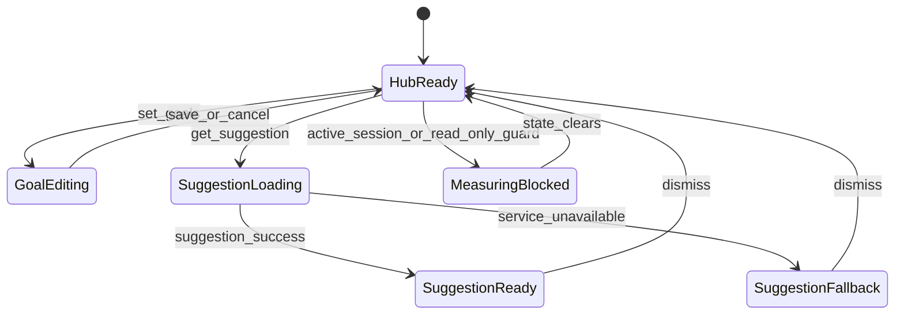

#### Sequence Diagram

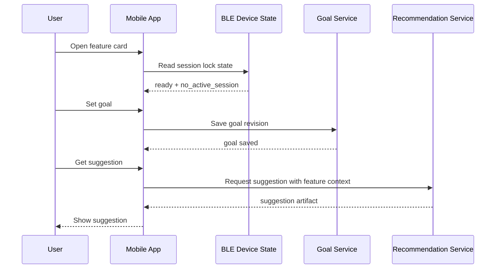

#### Data Flow

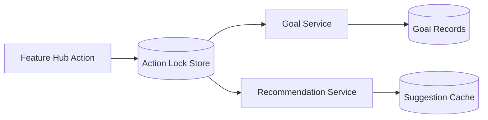

### 6.5 Contracts And Data Impacts

| Contract / Entity | Change / Requirement |
| --- | --- |
| Feature action lock model | Must store active action type, feature mode, and blocking reason |
| Goal API | Needs mode-scoped goal revisioning and optimistic concurrency |
| Suggestion API | Needs feature context, entitlement state, and history summary inputs |
| Local caches | Store last successful goal and suggestion artifacts per feature |

### 6.6 Failure Handling And Observability

- Block conflicting actions with deterministic copy rather than silent disable only.
- Suggestion failures must not erase the last known cached suggestion.
- Emit analytics for blocked-action reasons and suggestion fallback rate.

### 6.7 Verification Strategy

- UI state tests for action lock behavior.
- Goal revision conflict tests.
- Recommendation fallback tests.

### 6.8 Planning And Coding Handoff

| Task | Owner | Objective | Acceptance criteria |
| --- | --- | --- | --- |
| Implement feature action lock store | Mobile | Enforce one-action rule at route and state level | Conflicting actions are blocked with reason codes |
| Add goal revision endpoint | Backend | Persist mode-scoped goals with concurrency control | Goal overwrites require expected revision |
| Add suggestion request surface | Mobile + backend | Render suggestions with cache fallback | Cached suggestions shown when backend unavailable |
| Add blocked-action analytics | Shared | Measure action conflicts and state causes | Dashboard segments by feature and block reason |

## 7. Feature Design: Oral & Dental Health Measurement

### 7.1 Summary

- User outcome: complete one valid oral measurement session and review an `Oral Health Score` relative to baseline state.
- Feature class: firmware-heavy with mobile orchestration and backend persistence.

### 7.2 Requirements Baseline

Must-have:

- Guided oral measurement flow with warm-up, readiness, valid completion, and baseline-aware result presentation.
- Invalid, canceled, and disconnected sessions must not surface as completed results.
- Baseline-building state must progress deterministically from `1/5` to `5/5`.

Should-have:

- Clear in-session progress copy and quality gating feedback.

Dependencies:

- session orchestration
- oral sensing algorithm
- goal/history services
- sync queue

### 7.3 Domain Decomposition

| Domain | Responsibilities | Owned state | Dependencies |
| --- | --- | --- | --- |
| Firmware | Warm-up, sample validation, oral score computation, session finalization | Active session, oral score, baseline status hint, fault code | Sensors, flow validation, BLE |
| Mobile | Guided oral UX, progress, baseline-building copy, sync enqueue | Session UI state, pending upload, local result cache | BLE, sync queue, entitlement cache |
| Backend | Persist oral session summaries, derive history and baseline reference views | Completed oral sessions, history aggregates | Session service, goal service |
| Supporting systems | Analytics, export audit, support diagnostics | Session analytics and audit events | Analytics pipeline |

### 7.4 Behavioral Design

#### State Machine

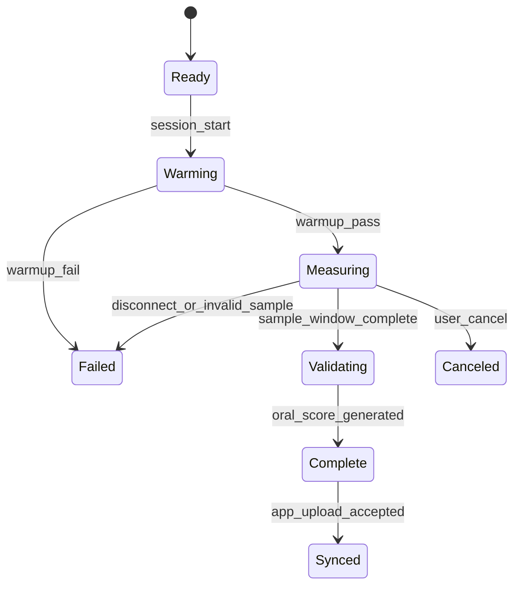

#### Happy-Path Sequence

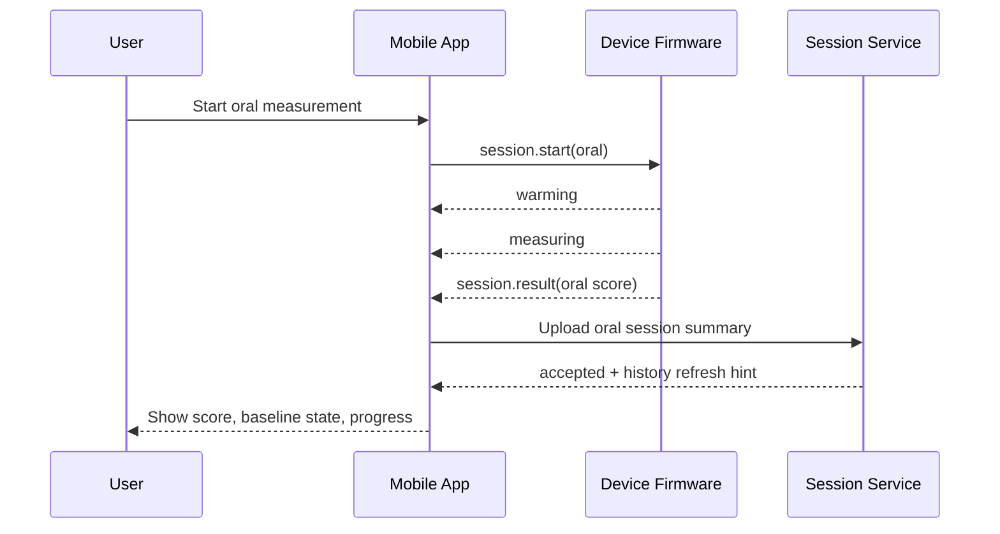

#### Failure / Recovery Sequence

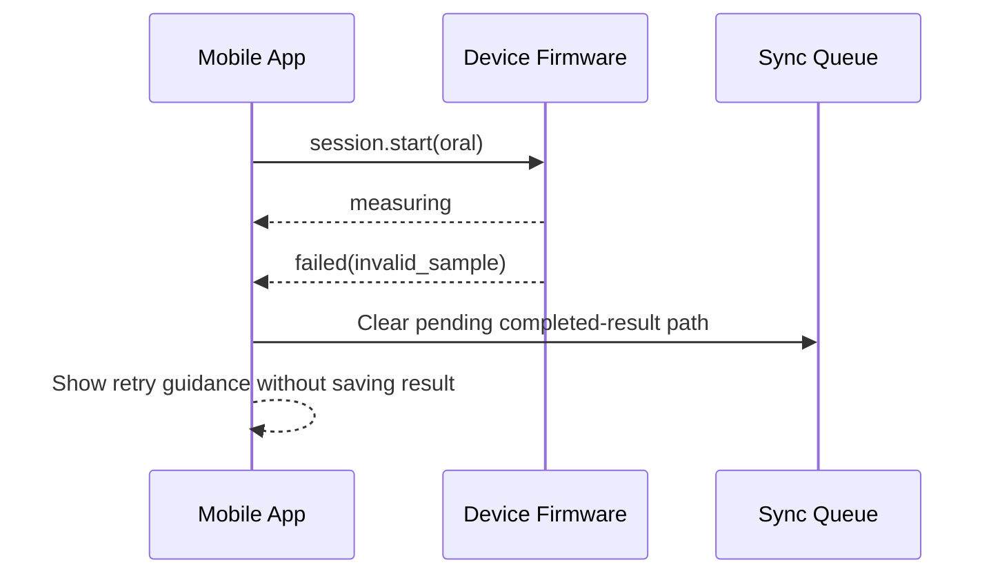

#### Data Flow

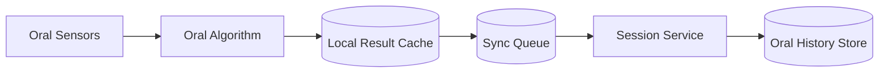

### 7.5 Contracts And Data Impacts

| Contract / Entity | Change / Requirement |
| --- | --- |
| BLE `session.start` | Needs mode `oral_health` plus baseline context hint |
| BLE `session.result` | Must include oral score, baseline status, completed baseline session count, and quality flags |
| Session summary schema | Must support oral score plus baseline reference metadata |
| History query | Must provide comparable 7/30/90-day trend slices with baseline reference |

### 7.6 Failure Handling And Observability

- Invalid oral samples should be explicit retry outcomes, not generic failures.
- Disconnections during measurement should preserve `session_id` for reconciliation only if the device later finalizes successfully.
- Track oral baseline-building completion rate and invalid-sample rate.

### 7.7 Verification Strategy

- HIL tests for warm-up failure, invalid sample, cancel, and disconnect.
- Baseline-building progression tests.
- Oral session summary schema contract tests.

### 7.8 Planning And Coding Handoff

| Task | Owner | Objective | Acceptance criteria |
| --- | --- | --- | --- |
| Implement oral session state machine | Firmware | Support warm-up, measuring, validation, complete/fail/cancel | Illegal transitions return deterministic error events |
| Build oral guided flow UI | Mobile | Render preparation, measuring, completion, and retry states | User cannot exit with a false completed result |
| Extend oral session summary persistence | Backend | Store oral result and baseline metadata | History queries return baseline-aware views |
| Add oral analytics | Shared | Track starts, completions, invalid samples, baseline progress | Dashboard reports oral funnel and baseline build rate |

## 8. Feature Design: Fat Burning Measurement

### 8.1 Summary

- User outcome: complete a multi-reading session, view current delta, best delta, target progress, and final session summary.
- Feature class: firmware-heavy, cross-cutting in session UI and persistence.

### 8.2 Requirements Baseline

Must-have:

- Repeated readings within one session with first valid reading as session baseline.
- Distinct display of current delta and best delta so far.
- Goal progress uses best delta rather than latest delta.

Should-have:

- Session-complete UX that explains best-delta versus final-delta distinction clearly.

Dependencies:

- multi-reading session orchestration
- CO2 / VOC gating
- goal service
- sync queue and history service

### 8.3 Domain Decomposition

| Domain | Responsibilities | Owned state | Dependencies |
| --- | --- | --- | --- |
| Firmware | Reading loop, baseline capture, best-delta tracking, validity gating | Current delta, best delta, reading count, final summary | CO2 gate, VOC sensing, BLE |
| Mobile | Guided repeated-reading UI, finish action, session summary | Live session cache, finish state, target progress view | BLE, entitlement cache, sync queue |
| Backend | Persist session summary and best-delta fields for comparison | Fat session summaries | Session service, goal service |
| Supporting systems | Analytics and support diagnostics | Reading count metrics, failure causes | Analytics pipeline |

### 8.4 Behavioral Design

#### State Machine

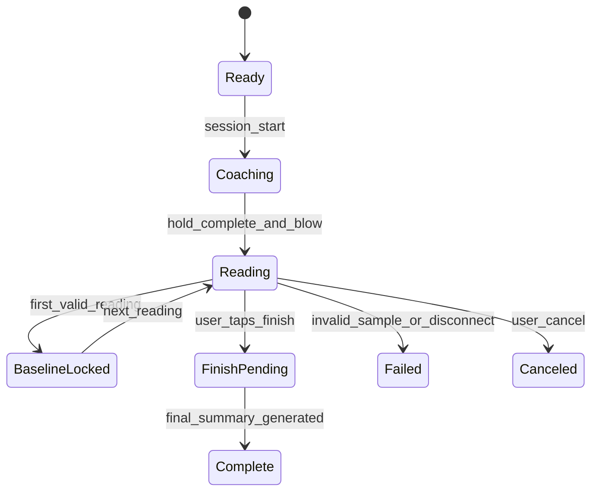

#### Happy-Path Sequence

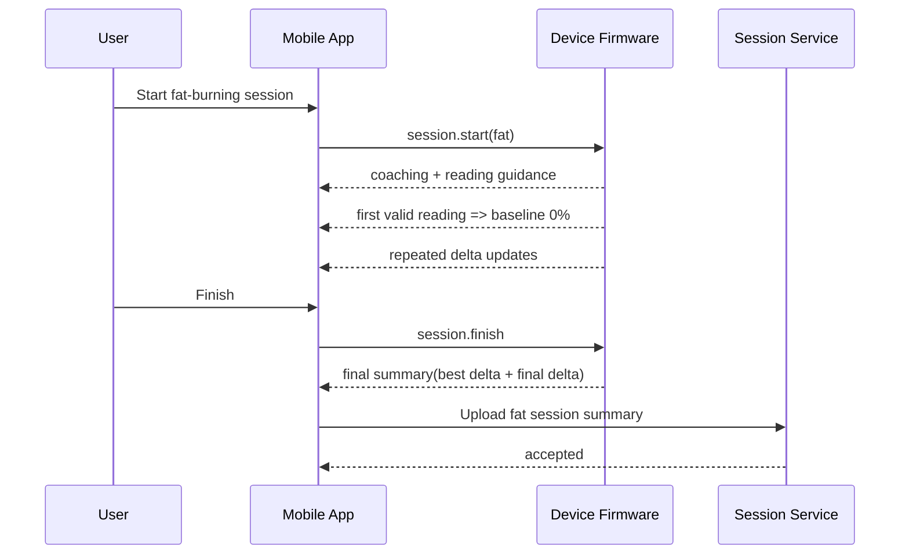

#### Failure / Recovery Sequence

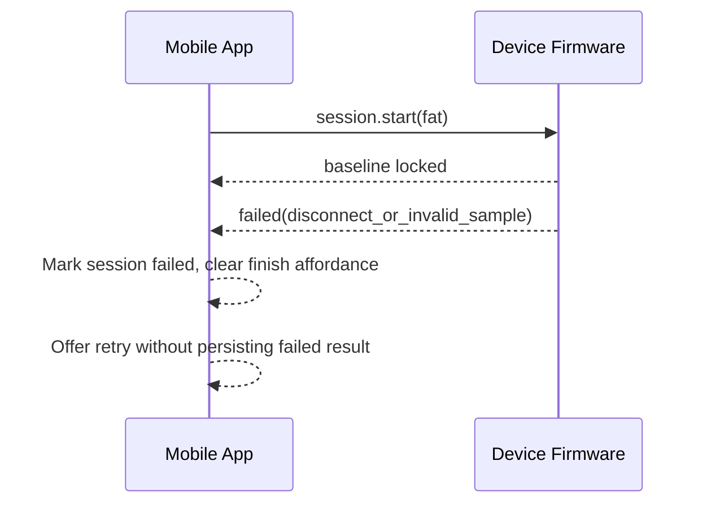

#### Data Flow

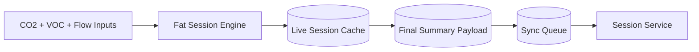

### 8.5 Contracts And Data Impacts

| Contract / Entity | Change / Requirement |
| --- | --- |
| BLE live session events | Must support repeated delta updates with reading sequence numbers |
| BLE final session summary | Must include final delta, best delta, reading count, target delta, goal-achieved flag |
| Fat session summary schema | Must distinguish final delta from best delta |
| Goal model | Must support mode-specific positive target delta |

### 8.6 Failure Handling And Observability

- Ensure the app never compares intermediate points across sessions.
- Invalid readings inside an active session must not overwrite the best valid delta.
- Emit metrics for average reading count and finish versus cancel rate.

### 8.7 Verification Strategy

- HIL tests for repeated reading sequences and best-delta tracking.
- UI tests that verify goal progress is tied to best delta.
- Schema tests for final summary persistence.

### 8.8 Planning And Coding Handoff

| Task | Owner | Objective | Acceptance criteria |
| --- | --- | --- | --- |
| Implement repeated-reading engine | Firmware | Support baseline lock, best-delta tracking, and finish | Final summary matches reading loop semantics |
| Build repeated-reading UI | Mobile | Show current delta, best delta, target progress, finish flow | Latest and best values are never conflated |
| Extend session persistence for fat mode | Backend | Store best delta and final delta separately | History query supports session comparisons |
| Add fat-session analytics | Shared | Track reading counts, finish rate, invalid reading causes | Metrics available by app/fw version |

## 9. Feature Design: Results, History, And Health Export

### 9.1 Summary

- User outcome: review completed results, trends, goal progress, and optionally export completed summaries to Apple Health or Health Connect.
- Feature class: mobile-led with backend persistence and platform integration.

### 9.2 Requirements Baseline

Must-have:

- Completed result screen per mode.
- History list and detail views backed by synced cloud data plus visible local pending state when needed.
- Platform export for completed summaries only.

Should-have:

- Clear differentiation between synced and pending-upload results.

Dependencies:

- session summary storage
- local cache + sync queue
- platform export adapters

### 9.3 Domain Decomposition

| Domain | Responsibilities | Owned state | Dependencies |
| --- | --- | --- | --- |
| Firmware | Final result payload only | None beyond final summary | BLE result payload |
| Mobile | Result rendering, trend charts, export permission flow, pending/synced labeling | History cache, export status, chart state | Sync queue, health frameworks |
| Backend | Durable completed history and query views | Session records, derived trend views | Session service |
| Supporting systems | Export audit, analytics | Export events, view events | Analytics pipeline |

### 9.4 Behavioral Design

#### Sequence Diagram

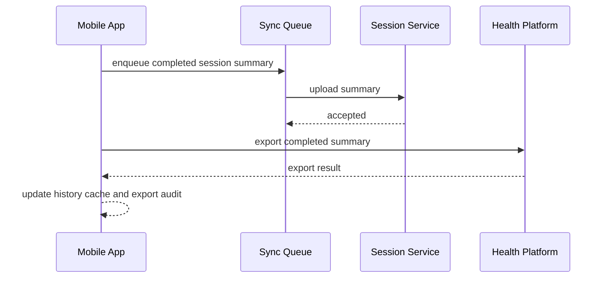

#### Data Flow

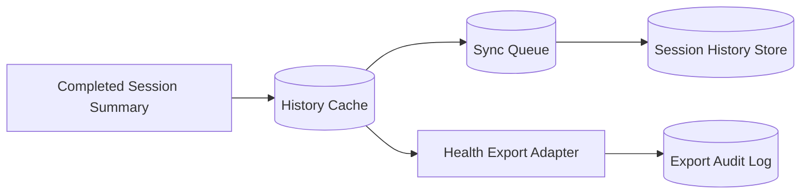

### 9.5 Contracts And Data Impacts

| Contract / Entity | Change / Requirement |
| --- | --- |
| History query API | Must return completed sessions plus enough metadata for pending/synced reconciliation |
| Export adapter payload | Must include completed summary fields only |
| Export audit entity | Must track platform, attempt time, and result status |

### 9.6 Failure Handling And Observability

- Export failure must not invalidate the local or cloud session record.
- Pending results should remain clearly marked until server acceptance.
- Track history load latency and export success rate by platform.

### 9.7 Verification Strategy

- Sync queue replay tests.
- History reconciliation tests for pending then synced state.
- Platform export tests for iOS and Android permission flows.

### 9.8 Planning And Coding Handoff

| Task | Owner | Objective | Acceptance criteria |
| --- | --- | --- | --- |
| Build result and history cache models | Mobile | Support pending and synced result rendering | Pending records reconcile cleanly after upload |
| Implement history query endpoints/views | Backend | Provide trend-ready completed session data | 7/30/90-day queries return expected summaries |
| Implement export adapters | Mobile | Write completed summaries to Apple Health / Health Connect | Only completed summaries are exported |
| Add export audit events | Shared | Track export attempts and outcomes | Support can see export failures by platform |

## 10. Feature Design: Entitlement, Subscription Access, And Read-Only Mode

### 10.1 Summary

- User outcome: understand whether they can start new sessions, edit goals, or only view history, with resilient behavior during backend outages.
- Feature class: backend-led with strong mobile UX impact.

### 10.2 Requirements Baseline

Must-have:

- Support `trial active`, `paid active`, `temporary access`, and `read-only mode`.
- Block new session starts outside active entitlement.
- Allow history viewing and eligible queued-result sync during degraded entitlement states.

Should-have:

- Explainability fields for UX copy and support tooling.

Dependencies:

- entitlement service
- mobile entitlement cache
- sync queue eligibility checks

### 10.3 Domain Decomposition

| Domain | Responsibilities | Owned state | Dependencies |
| --- | --- | --- | --- |
| Firmware | Respect session-start eligibility hint only | None durable beyond current start request | BLE start command |
| Mobile | Effective entitlement derivation, UI gating, stale-cache handling | Last verified snapshot, freshness clock, gating reasons | entitlement API, local clock |
| Backend | Source-of-truth entitlement resolution and explanation | entitlement ledger mirror, trial windows, explanation codes | billing provider |
| Supporting systems | Support/admin visibility into entitlement changes | entitlement audit events | analytics/support tooling |

### 10.4 Behavioral Design

#### State Machine

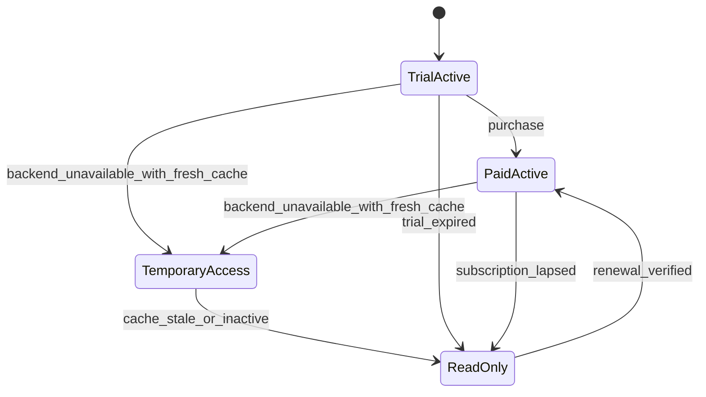

#### Sequence Diagram

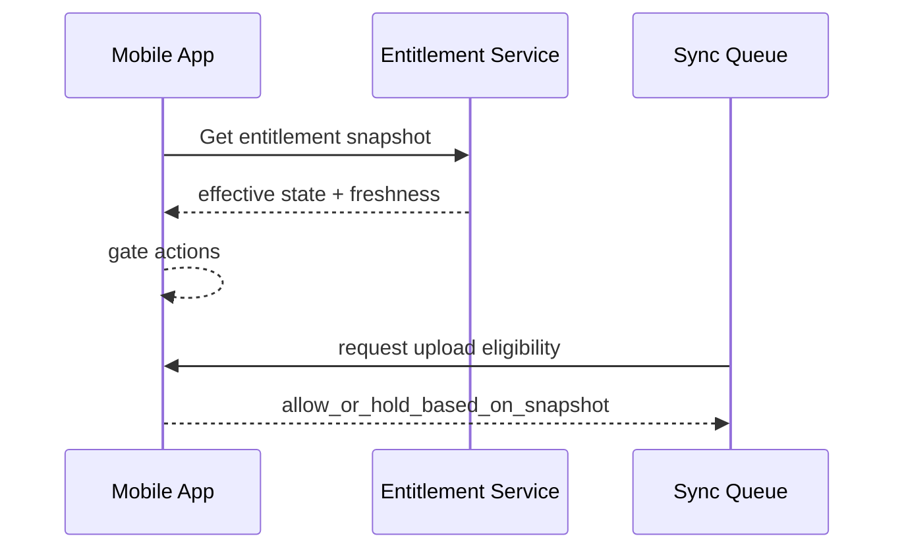

### 10.5 Contracts And Data Impacts

| Contract / Entity | Change / Requirement |
| --- | --- |
| Entitlement snapshot schema | Must include source state, effective app state, freshness, and action flags |
| Sync queue eligibility metadata | Must persist entitlement-at-completion and last verification context |
| Analytics events | Must capture stale-cache incidence and read-only transitions |

### 10.6 Failure Handling And Observability

- Backend outage must degrade to `Temporary access` or `Read-only mode`, never to silent session-start failure.
- Goal edit and suggestion actions must read from the same entitlement snapshot, not separate inconsistent checks.
- Track entitlement refresh latency and stale-cache fallback frequency.

### 10.7 Verification Strategy

- Stale-cache unit tests.
- Backend outage integration tests.
- Session-start gating tests under each effective state.

### 10.8 Planning And Coding Handoff

| Task | Owner | Objective | Acceptance criteria |
| --- | --- | --- | --- |
| Define entitlement snapshot contract | Backend + mobile | Lock shared entitlement flags and freshness fields | Mobile and backend use same state vocabulary |
| Implement effective-state reducer | Mobile | Derive active/temporary/read-only UX consistently | All action gates use one reducer |
| Add queue eligibility enforcement | Mobile + backend | Hold or upload pending results correctly | Eligible results upload after recovery |
| Add entitlement audit surfaces | Backend/support | Expose transitions for support and debugging | Support can trace why a user is blocked |

## 11. Feature Design: Consult Professionals

### 11.1 Summary

- User outcome: access feature-specific support resources with explicit external handoff and zero measurement/account data sharing.
- Feature class: mobile-led with lightweight backend content support.

### 11.2 Requirements Baseline

Must-have:

- Feature-specific curated directory.
- No data transfer beyond selected feature and locale context.
- Disabled during conflicting active actions.

Should-have:

- Generic fallback directory when localized content is missing.

Dependencies:

- feature context
- directory content service
- action lock model

### 11.3 Domain Decomposition

| Domain | Responsibilities | Owned state | Dependencies |
| --- | --- | --- | --- |
| Firmware | None | None | None |
| Mobile | Directory UI, external handoff notice, action-lock gating | Cached directory entries, handoff state | directory API, action lock |
| Backend | Curated directory content and locale filtering | directory entries, locale mapping | content operations |
| Supporting systems | Analytics for directory open and outbound taps | support directory events | analytics pipeline |

### 11.4 Behavioral Design

#### Sequence Diagram

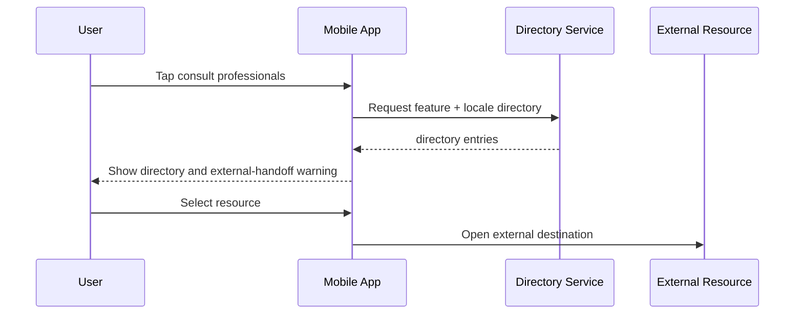

#### Data Flow

```mermaid
flowchart LR
  FeatureContext[Feature + Locale Context] --> DirectoryAPI[Directory Service]
  DirectoryAPI --> Cache[(Directory Cache)]
  Cache --> DirectoryUI[Directory UI]
  DirectoryUI --> Analytics[Open / Tap Events]
```

### 11.5 Contracts And Data Impacts

| Contract / Entity | Change / Requirement |
| --- | --- |
| Directory query API | Must accept feature and locale only |
| Directory cache | Stores entries by feature and locale |
| Analytics events | `consult_opened`, `consult_link_opened`, `consult_fallback_used` |

### 11.6 Failure Handling And Observability

- If localized content is missing, fall back to generic feature content and record the fallback.
- If another action is active, block with an explicit reason rather than silently hiding the action.

### 11.7 Verification Strategy

- Action lock gating tests.
- Locale fallback tests.
- External handoff copy verification.

### 11.8 Planning And Coding Handoff

| Task | Owner | Objective | Acceptance criteria |
| --- | --- | --- | --- |
| Build directory API and content model | Backend | Serve feature/locale-scoped support entries | API never requires user or result data |
| Build support directory UI | Mobile | Render entries and handoff notice | External handoff always shows warning |
| Add support analytics | Shared | Track opens, taps, and fallback usage | Dashboard shows support engagement |

## 12. Feature Design: Low-Power, Disconnect Recovery, And Queued Sync

### 12.1 Summary

- User outcome: understand that the device can idle safely, recover from disconnects, and eventually sync eligible completed results without data loss.
- Feature class: firmware-heavy with cross-cutting mobile/backend effects.

### 12.2 Requirements Baseline

Must-have:

- Low-power entry and exit that do not create false failure states.
- Result reconciliation by `session_id` after transient disconnect.
- Queued sync retry when connectivity or entitlement verification returns.

Should-have:

- Explicit support diagnostics around reconnect and replay outcomes.

Dependencies:

- firmware journal
- session result reconciliation
- sync queue
- entitlement snapshot

### 12.3 Domain Decomposition

| Domain | Responsibilities | Owned state | Dependencies |
| --- | --- | --- | --- |
| Firmware | Idle detection, low-power transitions, session journal, reconnect result replay | low-power state, active checkpoint, unreconciled result | sensor activity, flash journal |
| Mobile | Wake/resume UX, reconnect flow, pending sync replay | interrupted session markers, queued jobs | BLE reconnect, sync queue, entitlement cache |
| Backend | Idempotent session acceptance after delayed upload | session dedupe state | session service |
| Supporting systems | Diagnostics and analytics | reconnect outcome, replay latency | support tooling |

### 12.4 Behavioral Design

#### State Machine

```mermaid
stateDiagram-v2
  [*] --> Ready
  Ready --> LowPower: idle_threshold_met
  LowPower --> Ready: wake_signal
  Ready --> ActiveSession: session_start
  ActiveSession --> Interrupted: disconnect
  Interrupted --> Reconciled: reconnect_and_result_replayed
  Interrupted --> Failed: recovery_window_expires
  Reconciled --> Synced: upload_accepted
```

#### Sequence Diagram

```mermaid
sequenceDiagram
  participant D as Device Firmware
  participant M as Mobile App
  participant Q as Sync Queue
  participant S as Session Service

  D-->>M: disconnect during active session
  D->>D: persist final result journal
  M->>D: reconnect + session.resume.query
  D-->>M: final result payload
  M->>Q: enqueue upload
  Q->>S: upload by session_id
  S-->>Q: accepted or duplicate_ok
```

### 12.5 Contracts And Data Impacts

| Contract / Entity | Change / Requirement |
| --- | --- |
| Firmware journal schema | Must persist unreconciled final result payload and checkpoint metadata |
| BLE resume query | Must allow the app to ask for terminal status by `session_id` |
| Session upload endpoint | Must be idempotent on `session_id` for delayed replay |
| Sync queue | Must keep retry metadata and final eligible payload |

### 12.6 Failure Handling And Observability

- Low power must not reuse generic failure copy.
- Duplicate uploads after recovery should return success-equivalent semantics to the client.
- Track recovery success rate, replay latency, and queued sync age.

### 12.7 Verification Strategy

- Disconnect-after-completion and disconnect-before-completion HIL tests.
- Low-power entry/exit hysteresis tests.
- Idempotent replay tests against the session service.

### 12.8 Planning And Coding Handoff

| Task | Owner | Objective | Acceptance criteria |
| --- | --- | --- | --- |
| Implement firmware result journal | Firmware | Persist terminal result for reconnect replay | Reconnect can recover completed result by `session_id` |
| Implement resume reconciliation flow | Mobile | Recover result after disconnect without duplicate UI states | App resolves interrupted sessions into recovered or failed states |
| Make upload endpoint duplicate-safe | Backend | Accept delayed or duplicate replay safely | Duplicate replays do not create duplicate history |
| Add recovery diagnostics | Shared | Surface recovery and replay metrics | Support can inspect reconnect and replay outcomes |

## 13. Recommended Cross-Team Delivery Order

1. Shared schemas and correlation contracts
2. Pairing and onboarding
3. Oral and fat session orchestration
4. Results/history and sync queue
5. Entitlement gating and read-only mode
6. Goals/suggestions and consult professionals
7. Low-power/reconnect hardening

## 14. High-Risk Integration Areas

- Session lock versus action lock drift between firmware and mobile.
- Entitlement gating races between local stale cache and backend truth.
- Fat-burning session semantics when best delta and latest delta diverge.
- Replay of completed results after disconnect without duplicate history or export attempts.
- Health export triggered before cloud acceptance if product/legal later requires server acknowledgment first.

## 15. Next-Step Recommendations

1. Use this document as the planning input for feature-level ticket breakdown.
2. Lock the shared schema package before domain teams start parallel implementation.
3. Build HIL coverage for oral, fat, and reconnect flows before polishing secondary UX.
4. Treat entitlement gating and sync recovery as launch blockers, not cleanup work.
