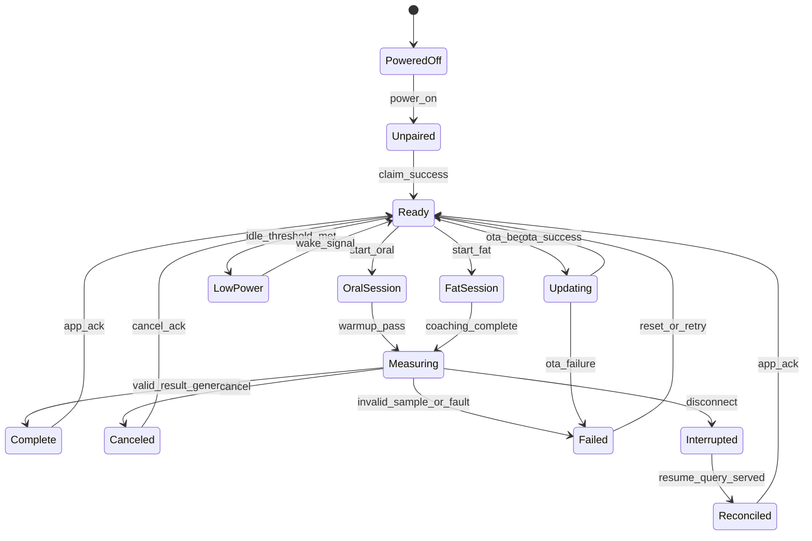
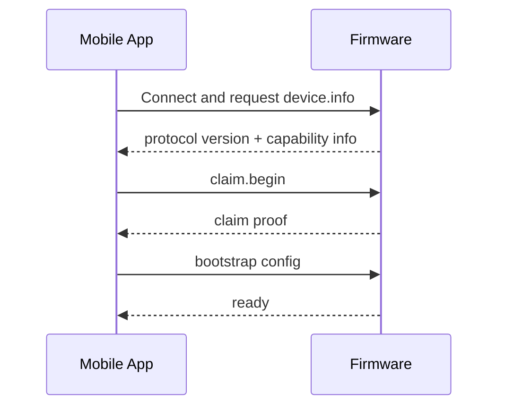
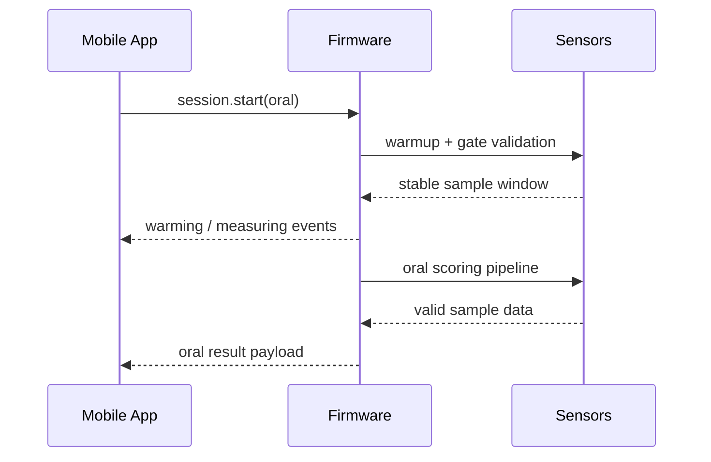
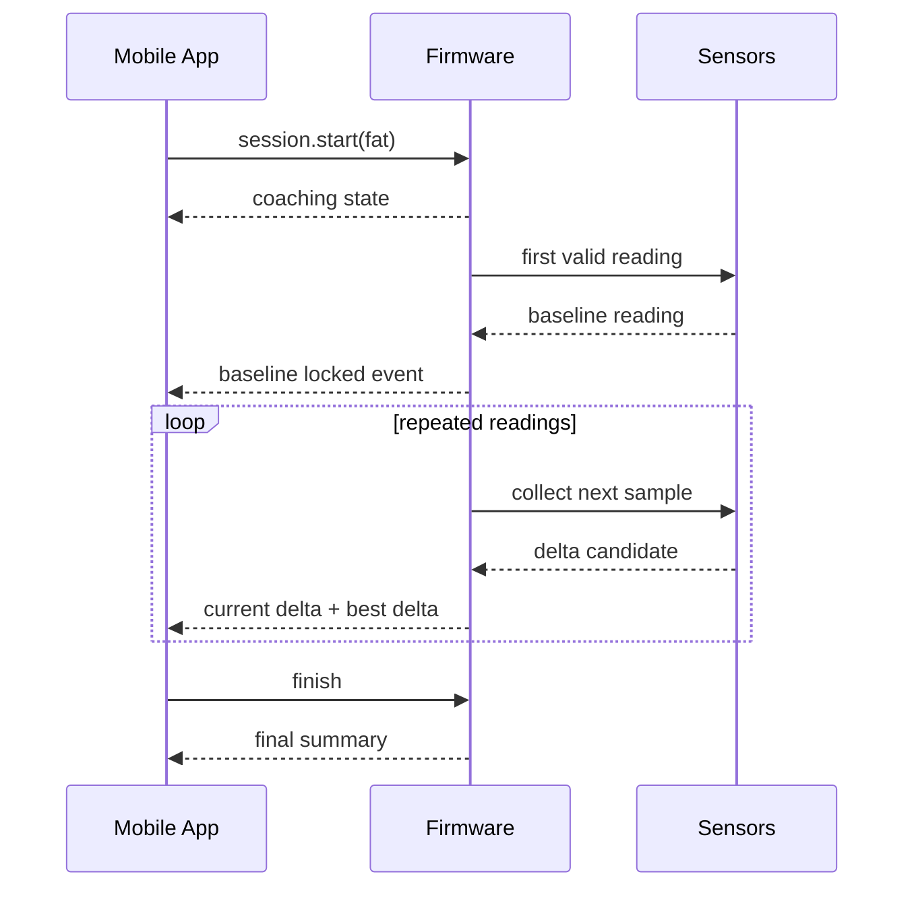
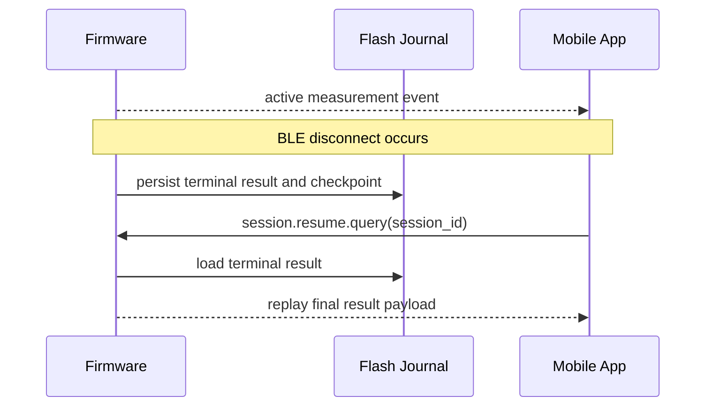
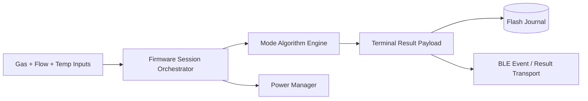

# AirHealth Firmware Feature Design

## Versioning

- Version: v0.1
- Date: 2026-03-26
- Author: Codex

## 1. Summary

This document covers only firmware running on the local AirHealth device. It excludes phone-only UX and cloud-only processing except where those systems constrain firmware behavior or require explicit contracts.

Firmware scope in Phase 1:

- pairing and claim support over BLE
- oral measurement orchestration and result generation
- fat-burning repeated-reading orchestration and result generation
- low-power entry and exit
- disconnect recovery and result journaling
- diagnostics and OTA transport support

## 2. Inputs Reviewed

- `PM/PRD/PRD.md` v0.6
- `SW/Architecture/Software_Architecture_Spec_v0.1.md`
- `PM/Designs/design-spec.md`
- `HW/EE/EE_Design_Spec_v0.4.md`

## 3. Scope And Requirements Baseline

### Must-Have

- Device must expose BLE state and feature capability to the mobile app.
- Device must enforce one active measurement session at a time.
- Device must be authoritative for sensing, sample validity, and final result generation.
- Device must support oral measurement, fat-burning repeated-reading measurement, and deterministic terminal states.
- Device must enter low power only when safe and preserve valid session context.
- Device must support session-result replay after transient disconnect.

### Non-Goals

- Cloud sync logic
- entitlement source-of-truth logic
- phone UX rendering or navigation
- third-party health export

### Dependencies

- BLE stack and secure identity support
- oral and fat algorithm/calibration inputs
- flash journal availability
- shared BLE payload schemas

## 4. Responsibilities And Interfaces

| Feature area | Firmware responsibility | Inbound interface | Outbound interface |
| --- | --- | --- | --- |
| Pairing and claim | advertise, report device info, return claim proof, persist claim status | BLE connect, claim request | `device.info`, claim proof, fault codes |
| Oral measurement | warm-up, sample validation, oral score computation, terminal result | `session.start(oral)`, cancel | session events, final oral result |
| Fat measurement | repeated-reading loop, baseline lock, best-delta tracking, final summary | `session.start(fat)`, finish, cancel | live reading events, final fat result |
| Low power | monitor idle threshold and wake threshold, prevent false failure | sensor idle state, user/app wake | `power.state` events |
| Disconnect recovery | persist unreconciled terminal result, serve replay query | reconnect + resume query | replayed terminal result |
| OTA support | accept manifest/chunks, verify digest, stage apply | OTA commands over BLE | OTA progress/failure events |

## 5. Behavioral Design

### 5.1 Top-Level Firmware State Machine

### 5.2 Pairing / Claim Sequence

### 5.3 Oral Measurement Sequence

### 5.4 Fat Measurement Sequence

### 5.5 Disconnect Recovery Sequence

### 5.6 Firmware Data Flow

## 6. Contracts And Data Model Impacts

| Contract | Firmware requirement |
| --- | --- |
| `device.info` | include protocol version, hw revision, mode capability, OTA support flag |
| `claim.begin` | emit claim proof tied to device identity |
| `session.start` | accept mode, `session_id`, and limited context hints only |
| `session.event` | include state, timestamp, step, failure code, and quality gate status |
| `session.result` | include mode-specific summary, quality flags, and algorithm version |
| `session.resume.query` | return terminal status by `session_id` if available in journal |
| `ota.*` | accept manifest/chunk/apply commands and emit progress/failure |

Local firmware-owned state:

- claim status
- active `session_id`
- current mode
- low-power counters
- unreconciled terminal result
- pending OTA slot metadata

## 7. Failure Handling And Observability

Required failure classes:

- low battery blocked
- sensor warm-up failed
- invalid sample
- BLE link lost
- protocol version mismatch
- OTA validation failed

Required observability:

- boot reason
- session duration
- invalid-sample count by mode
- reconnect replay count
- low-power enter/exit count
- OTA failure reason

## 8. Verification Strategy

- HIL tests for oral and fat state machines
- disconnect/reconnect replay tests
- flash journal corruption and CRC tests
- low-power hysteresis bench tests
- OTA resume and rollback tests

## 9. Planning And Coding Handoff

| Task | Objective | Acceptance criteria |
| --- | --- | --- |
| Implement shared session orchestrator | unify oral/fat terminal-state handling | one active session enforced and terminal states deterministic |
| Implement oral algorithm pipeline hooks | support warm-up, validation, and oral score payload | oral result payload emitted only after valid completion |
| Implement fat repeated-reading engine | lock baseline, update best delta, finalize summary | best delta and final delta semantics match PRD |
| Implement flash journal replay | recover terminal result after disconnect | resume query returns final result by `session_id` |
| Implement power manager thresholds | enter/exit low power without false failure | low power never surfaces as failed measurement |
| Implement OTA transport and staging | receive BLE OTA and stage verified image | OTA apply succeeds or fails with explicit reason |
