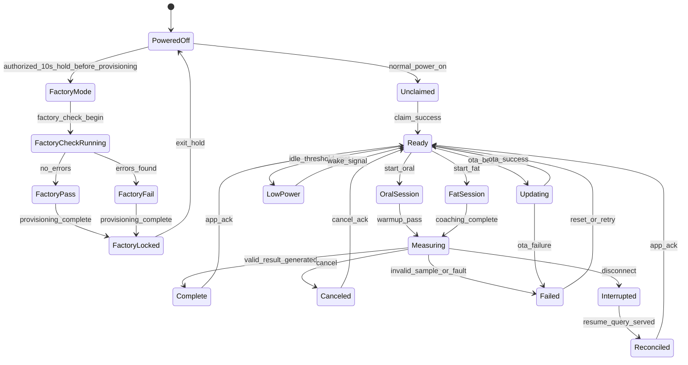
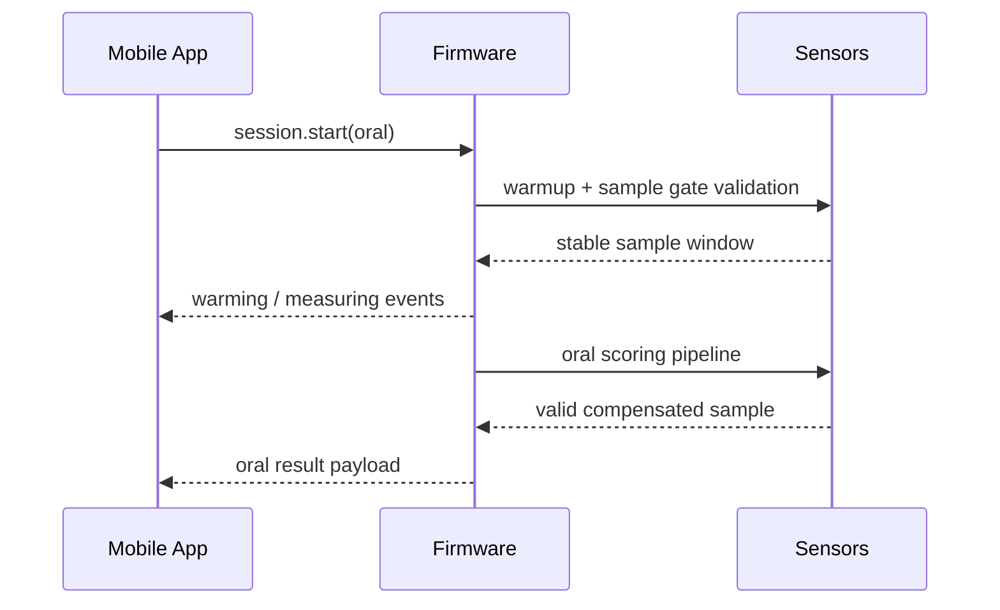
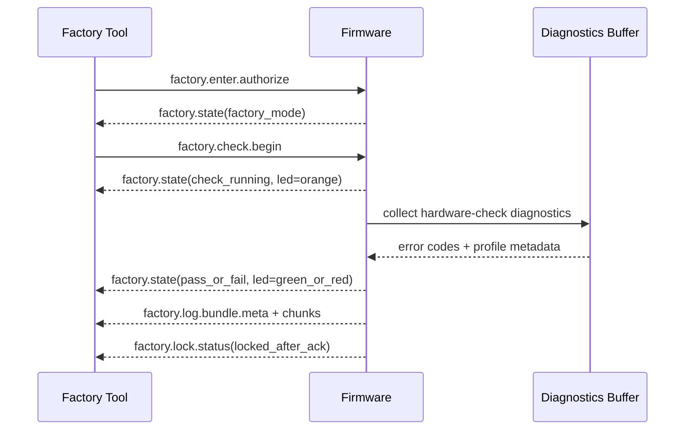
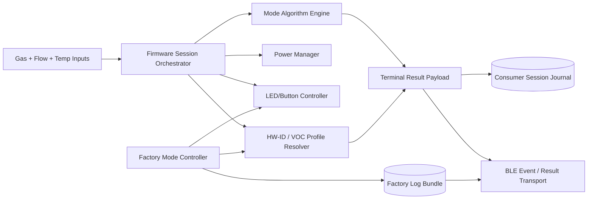

# AirHealth Firmware Feature Design

## Versioning

- Version: v0.2
- Date: 2026-03-27
- Author: Codex

## 1. Summary

This document covers only firmware running on the local AirHealth device. It excludes phone-only UX, manufacturing tool UI, and cloud-internal processing except where those systems constrain firmware contracts or state ownership.

Firmware scope in Phase 1:

- BLE consumer transport for claim, measurement, recovery, and OTA
- oral measurement orchestration and result generation
- fat-burning repeated-reading orchestration and result generation
- low-power entry and exit with hysteresis
- disconnect recovery and result journaling
- manufacturing-only Factory mode with one-time provisioning latch
- 3-color LED and long-press button control
- internal HW-ID and detected-VOC profile tagging
- bounded diagnostics and factory-log buffering

## 2. Inputs Reviewed

- `PM/PRD/PRD.md` v0.7
- `SW/Architecture/Software_Architecture_Spec_v0.2.md`
- `HW/EE/EE_Design_Spec_v0.4.md`

## 3. Scope And Requirements Baseline

### Must-Have

- Device must expose BLE state, protocol version, and consumer capability to the mobile app.
- Device must enforce one active consumer measurement session at a time.
- Device must remain authoritative for sensing, sample validity, final measurement result generation, and recovery truth.
- Device must support oral measurement, fat-burning repeated-reading measurement, and deterministic terminal states.
- Device must enter low power only when safe and preserve valid session context.
- Device must support session-result replay after transient disconnect.
- Device must support a manufacturing-only Factory mode entered and exited by a 10-second button hold.
- Device must run the factory hardware check exactly once per unit, buffer BLE error logs, and lock Factory mode after provisioning.
- Device must control the 3-color LED locally, including orange during factory check, green for factory pass, and red for factory fail.
- Device must attach internal HW-ID and detected-VOC routing metadata to factory and session outputs without surfacing that metadata as consumer-facing payload semantics.

### Non-Goals

- cloud sync logic
- entitlement source-of-truth logic
- phone UX rendering or navigation
- manufacturing tool UI behavior
- third-party health export

### Dependencies

- BLE stack and secure identity support
- oral and fat algorithm/calibration inputs
- flash journal availability for consumer and factory bundles
- flow/CO2/VOC/electrochemical sensor pipelines
- shared BLE payload schemas and profile mapping versioning

## 4. Assumptions And Dependencies

- Provisioning-latch state can be stored durably enough to survive brownouts and firmware updates.
- Factory authorization can be represented by a tool credential or signed command token before factory-only commands are enabled.
- HW-ID is detectable locally from configuration, calibration, or hardware profile sources without requiring a cloud round trip.
- Factory logs can be stored in bounded form without crowding out consumer recovery journals.

Open questions:

- whether detected VOC type is fully decided on-device or only tentatively tagged on-device before backend normalization
- retention policy for factory log bundles after successful upload and ACK
- exact hardware-check subtests and failure-code taxonomy for factory execution

## 5. Responsibilities And Interfaces

| Feature area | Firmware responsibility | Inbound interface | Outbound interface |
| --- | --- | --- | --- |
| Pairing and claim | advertise, report device info, return claim proof, persist claim status | BLE connect, claim request | `device.info`, claim proof, fault codes |
| Oral measurement | warm-up, sample validation, oral score computation, terminal result | `session.start(oral)`, cancel | session events, final oral result |
| Fat measurement | repeated-reading loop, baseline lock, best-delta tracking, final summary | `session.start(fat)`, finish, cancel | live reading events, final fat result |
| Low power | monitor idle threshold and wake threshold, prevent false failure | sensor idle state, user/app wake | `power.state` events |
| Disconnect recovery | persist unreconciled terminal result, serve replay query | reconnect plus resume query | replayed terminal result |
| Factory mode | authorize entry, run one-time hardware check, enforce lockout | 10-second button hold, tool auth, factory check begin | `factory.state`, diagnostic log bundle metadata, lock status |
| LED and button | map runtime state to LED output and button semantics | session state, factory state, battery state | LED patterns, long-press intents |
| Profile resolution | attach HW-ID and detected VOC routing metadata | calibration/config data, sensing context | internal routing tags in factory/session outputs |
| OTA support | accept manifest/chunks, verify digest, stage apply | OTA commands over BLE | OTA progress and failure events |

## 6. Behavioral Design

### 6.1 Firmware State Machine

### 6.2 Oral Measurement Sequence

### 6.3 Factory Verification Sequence

### 6.4 Firmware Data Flow

## 7. Contracts And Data Model Impacts

| Contract | Firmware requirement |
| --- | --- |
| `device.info` | include protocol version, hw revision, supported modes, OTA flag, and consumer-safe capability info |
| `claim.begin` | emit claim proof tied to device identity |
| `session.start` | accept mode, `session_id`, and limited context hints only |
| `session.event` | include state, timestamp, step, failure code, battery state, and quality gate status |
| `session.result` | include mode-specific summary, quality flags, algorithm version, and internal routing metadata fields |
| `session.resume.query` | return terminal status by `session_id` if available in journal |
| `factory.enter.authorize` | require explicit tool authorization before factory-only commands are honored |
| `factory.state` | emit state, LED color, factory result, and internal profile tags |
| `factory.log.bundle.*` | expose bounded diagnostic log metadata and chunked payloads with retryable transfer |
| `factory.lock.status` | return whether provisioning latch has permanently disabled re-entry |
| `ota.*` | accept manifest/chunk/apply commands and emit progress/failure |

Local firmware-owned state:

- claim status
- provisioning latch status
- active `session_id`
- current consumer mode
- low-power counters and hysteresis timers
- unreconciled terminal result
- current LED state and long-press timer state
- last factory run result
- buffered factory log bundle metadata
- current HW-ID and detected VOC routing tag
- pending OTA slot metadata

## 8. Success Metrics And Instrumentation

| Metric | Why it matters | Source | Owner |
| --- | --- | --- | --- |
| Valid oral measurement completion rate | confirms oral sessions reliably reach a terminal result after start | `session.start` and `session.result` telemetry tagged by mode | Firmware |
| Valid fat measurement completion rate | confirms repeated-reading flow can complete without device-side instability | `session.start`, `session.finish`, and `session.result` telemetry tagged by mode | Firmware |
| Invalid-sample rate by mode | detects gating or algorithm-tuning issues before they surface as broad user friction | `session.event` records with quality and failure codes | Firmware |
| Disconnect recovery replay success rate | measures whether journaling and resume-query behavior actually recover completed sessions | replay counter plus `session.resume.query` outcomes | Firmware |
| Factory pass/fail completion rate | verifies every production unit can finish the one-time hardware check | `factory.state` pass/fail terminal events | Firmware |
| Factory BLE log transfer completion rate | catches manufacturing blind spots caused by interrupted diagnostics upload | `factory.log.bundle.*` chunk and ACK telemetry | Firmware |
| Factory lockout enforcement rate | confirms provisioned units cannot re-enter Factory mode | blocked re-entry events after provisioning latch is set | Firmware |
| Unknown-profile incidence | detects HW-ID or detected-VOC routing uncertainty | profile resolver output events with `unknown_profile` | Firmware |
| LED state mismatch rate | catches divergence between internal state and visible device feedback | LED controller telemetry compared with runtime source state | Firmware |
| OTA transport failure rate | measures update stability before broader rollout | `ota.*` progress and failure events with reason codes | Firmware |

Instrumentation notes:

- every session-scoped event should include `session_id`, mode, firmware version, hardware revision, and algorithm version
- every factory-scoped event should include `factory_run_id`, provisioning state, and profile-mapping version
- failure and quality events should use stable reason codes rather than free-form text
- LED and profile metrics should be segmented by hardware revision so board-specific issues surface quickly

## 9. Failure Handling And Observability

Required failure classes:

- low battery blocked
- sensor warm-up failed
- invalid sample
- BLE link lost
- protocol version mismatch
- factory authorization failed
- factory re-entry blocked
- factory diagnostics transfer interrupted
- unknown profile classification
- OTA validation failed

Required observability:

- boot reason
- session duration
- invalid-sample count by mode
- reconnect replay count
- low-power enter/exit count
- factory pass/fail count
- factory log upload completion count
- provisioning-lock write success
- profile resolution status
- OTA failure reason

## 10. Verification Strategy

- HIL tests for oral and fat state machines
- disconnect/reconnect replay tests
- flash journal corruption and CRC tests for both session and factory bundles
- low-power hysteresis bench tests
- factory-mode one-time latch tests across reboot and brownout scenarios
- LED color/state conformance tests for factory and consumer runtime states
- profile-resolution tests covering supported and unknown HW-ID paths
- OTA resume and rollback tests

## 11. Planning And Coding Handoff

| Task | Objective | Acceptance criteria |
| --- | --- | --- |
| Implement shared session orchestrator updates | preserve one-session-at-a-time behavior while carrying routing metadata and low-power rules | terminal states stay deterministic and recovery works by `session_id` |
| Implement oral algorithm pipeline hooks | support warm-up, validation, and oral score payload generation | oral result payload emits only after valid completion and includes required metadata |
| Implement fat repeated-reading engine | lock baseline, update best delta, and finalize summary | best-delta and final-delta semantics match the PRD |
| Implement factory mode controller and provisioning latch | run one-time hardware verification and permanently lock re-entry after provisioning | second entry attempt after successful provisioning is rejected deterministically |
| Implement LED/button state controller | map runtime state to 3-color LED output and long-press behavior | factory orange/green/red mapping and consumer-safe LED cues remain consistent |
| Implement diagnostic bundle buffering and transfer | capture bounded factory logs and retry chunk transfer until ACK or retention expiry | interrupted log transfer can resume without rerunning the hardware check |
| Implement profile resolver and metadata attachment | derive HW-ID and detected-VOC routing tags locally | every session and factory bundle carries profile metadata or explicit `unknown_profile` |
| Implement flash journal replay | recover completed session result after disconnect | resume query returns final result by `session_id` |
| Implement power manager thresholds | enter/exit low power without false failure | low power never surfaces as failed measurement |
| Implement OTA transport and staging | receive BLE OTA and stage verified image | OTA apply succeeds or fails with explicit reason |
