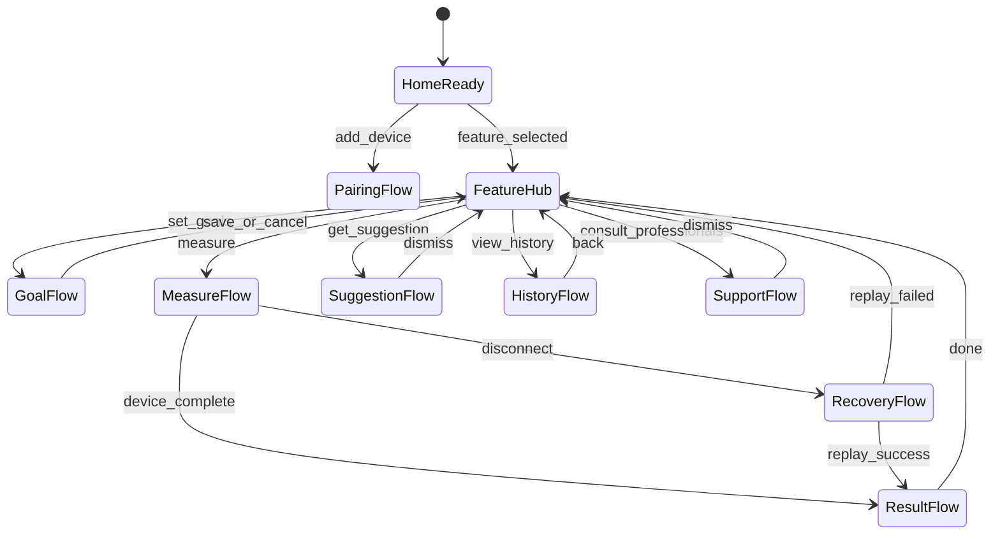
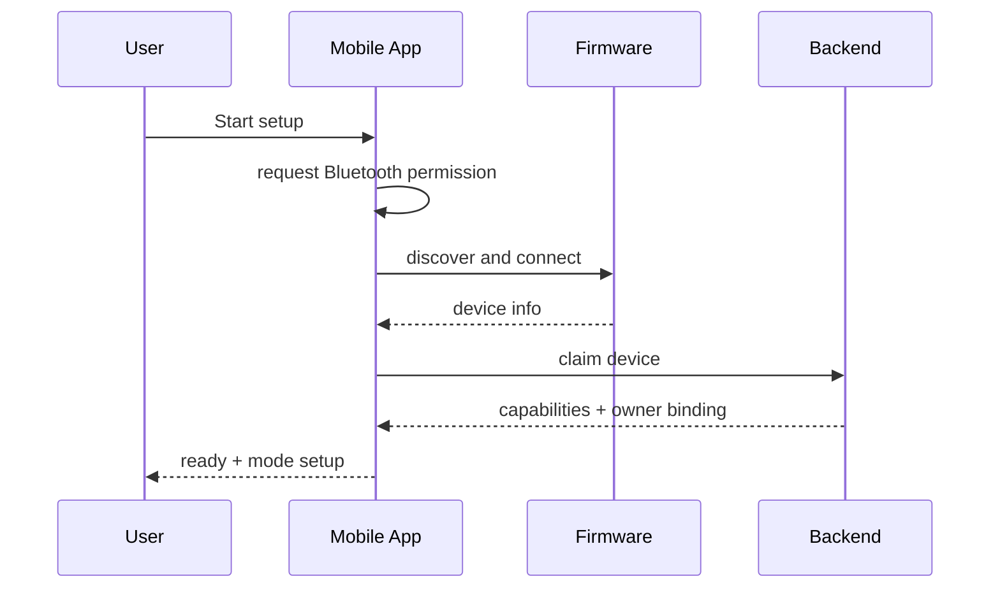
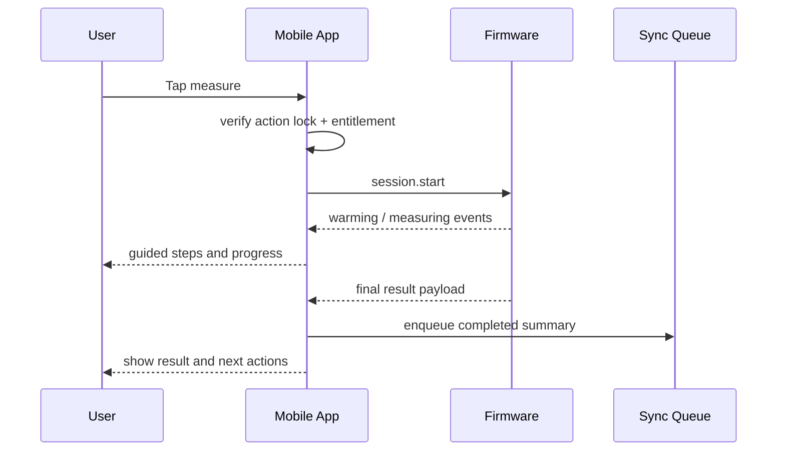
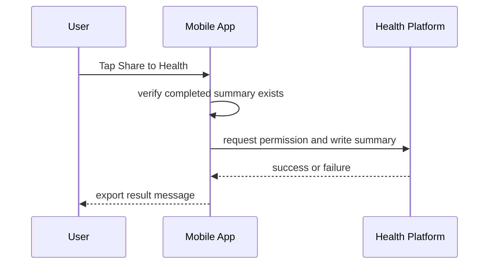
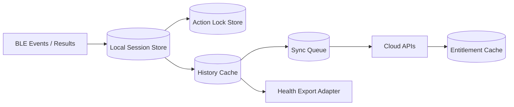

# AirHealth Mobile App Feature Design

## Versioning

- Version: v0.1
- Date: 2026-03-26
- Author: Codex

## 1. Summary

This document covers only the mobile app running on the user’s phone. It excludes firmware-internal sensing logic and cloud-internal processing except where the app consumes contracts from those systems.

Mobile scope in Phase 1:

- onboarding and pairing UX
- feature hub and action locking
- goal setup and suggestion UX
- oral and fat measurement guidance and result presentation
- history, progress, and health export
- entitlement and read-only behavior
- consult professionals
- reconnect, replay, and queued sync handling

## 2. Inputs Reviewed

- `PM/PRD/PRD.md` v0.6
- `SW/Architecture/Software_Architecture_Spec_v0.1.md`
- `PM/Designs/design-spec.md`

## 3. Scope And Requirements Baseline

### Must-Have

- App is the primary instructional and user-facing state surface.
- App must enforce one active action at a time.
- App must gate actions using effective entitlement state.
- App must drive measurement UX while respecting device-authoritative results.
- App must persist queue state and recover from process death or network loss.
- App must export completed summaries only.

### Non-Goals

- local device sensing or algorithm computation
- source-of-truth subscription ledger behavior
- backend event processing

### Dependencies

- BLE payload contracts
- session summary schemas
- entitlement snapshot contract
- health-export platform APIs

## 4. Responsibilities And Interfaces

| Feature area | Mobile responsibility | Inbound interface | Outbound interface |
| --- | --- | --- | --- |
| Pairing and onboarding | permission handling, discovery, claim flow, compatibility copy | BLE `device.info`, claim result | device claim API, analytics |
| Feature hub | route entry, action lock, enabled/disabled actions | session lock state, entitlement state | goal/suggestion/history/support routes |
| Measurement guidance | preparation UI, live state rendering, finish/cancel controls | BLE events and result payloads | session start/cancel/finish commands |
| History and export | trend rendering, pending/synced labeling, export action | local cache, cloud history, platform API status | session upload, export audit |
| Entitlement | derive effective UI state, read-only behavior | entitlement snapshot | blocked-action messaging |
| Support directory | render directory and external handoff | directory content API | external app/browser handoff |
| Recovery | reconnect UX, resume query orchestration, queue replay | BLE replay result, sync outcomes | sync queue, analytics |

## 5. Behavioral Design

### 5.1 Mobile Action State Machine

### 5.2 Pairing And Setup Sequence

### 5.3 Measurement UI Sequence

### 5.4 Health Export Sequence

### 5.5 Mobile Data Flow

## 6. Contracts And Data Model Impacts

| Contract | Mobile requirement |
| --- | --- |
| Pairing contracts | consume `device.info`, claim proof, and compatibility flags |
| Session contracts | send `session.start`, `session.cancel`, `session.finish`; consume state and result payloads |
| Entitlement snapshot | derive effective app state from signed response and freshness timestamp |
| Goal and suggestion APIs | persist goal revisions and render cached or fresh suggestions |
| History query and upload | maintain pending/synced reconciliation |
| Export audit | persist platform, timestamp, result, and failure reason |

Mobile-owned persisted state:

- action lock
- selected feature context
- local history cache
- sync queue jobs
- entitlement snapshot cache
- suggestion cache
- export audit records

## 7. Success Metrics And Instrumentation

| Metric | Why it matters | Source | Owner |
| --- | --- | --- | --- |
| Pairing funnel completion rate | shows whether users can reach first-use readiness from app entry through successful claim | onboarding analytics from discovery, connect, claim, and ready milestones | Mobile |
| Measurement start-to-result completion rate | confirms the app can shepherd users from action entry to confirmed device result | session UI events correlated with firmware `session.result` receipt | Mobile |
| Blocked-action rate by reason | highlights friction caused by entitlement, action lock, permissions, or incompatible state | route gating analytics with explicit block reason codes | Mobile |
| Recovery success rate after disconnect | measures how often reconnect and replay flows preserve user progress | reconnect state analytics plus replay result outcomes | Mobile |
| Sync queue drain latency | shows whether completed summaries are reaching backend within acceptable delay | local queue job timestamps and upload completion timestamps | Mobile |
| Health export success rate | measures user success for completed-summary exports without leaking partial data | export audit records and platform callback outcomes | Mobile |

Instrumentation notes:

- analytics events should use shared `session_id`, feature, and entitlement-state attributes for cross-domain correlation
- blocked-action and recovery events should use normalized reason codes so product and engineering can segment issues reliably
- queue and export metrics should distinguish user-canceled actions from system failures

## 8. Failure Handling And Observability

Required user-visible states:

- permission denied
- device not found
- session canceled
- session failed
- temporary access
- read-only mode
- export denied / export failed
- reconnecting / recovered

Required analytics:

- pairing funnel
- blocked-action reasons
- session start / finish / cancel / fail
- export success rate
- read-only transition rate
- recovery success rate

## 9. Verification Strategy

- route-level tests for one-action lock behavior
- BLE-driven integration tests for measurement flows
- stale entitlement reducer tests
- local queue persistence and replay tests
- iOS/Android export permission tests

## 10. Planning And Coding Handoff

| Task | Objective | Acceptance criteria |
| --- | --- | --- |
| Implement action lock store and route gating | enforce one-action-at-a-time behavior | conflicting actions block with explicit reasons |
| Build onboarding and pairing flow | connect permissions, discovery, and claim UX | all failure branches recover without broken state |
| Build oral and fat measurement screens | render guided steps, progress, finish, and result states | UI never invents completed result without firmware confirmation |
| Build local history and sync queue models | reconcile pending and synced records | completed summaries survive process death and replay correctly |
| Implement entitlement reducer and read-only surfaces | derive and render effective access state | active, temporary, and read-only states behave consistently |
| Implement consult professionals and export flows | support external handoff and health export | support flow never transmits measurement data; export only sends completed summary |
