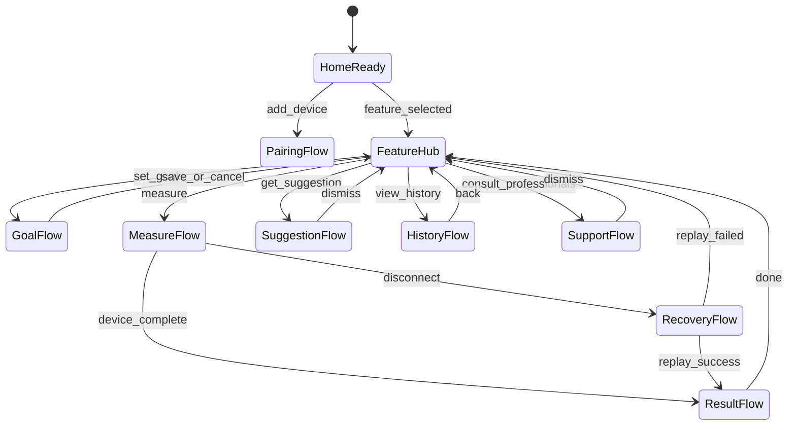
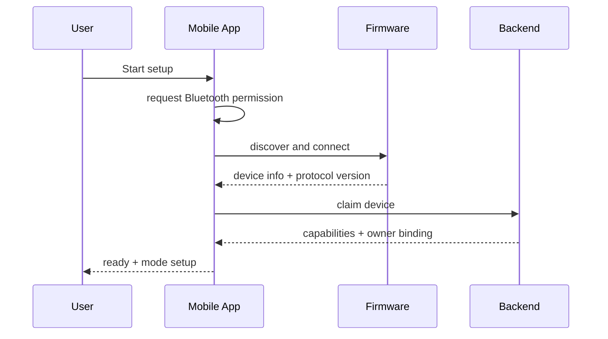
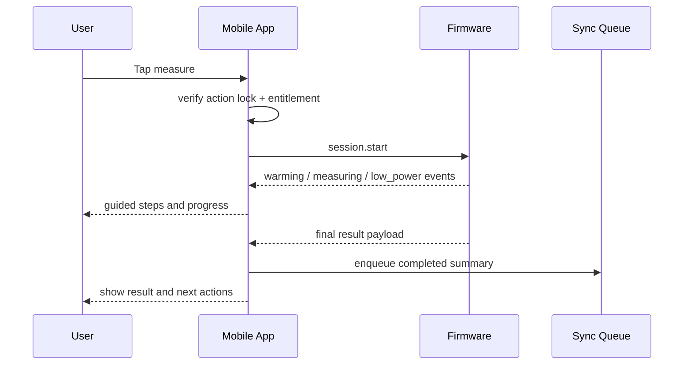
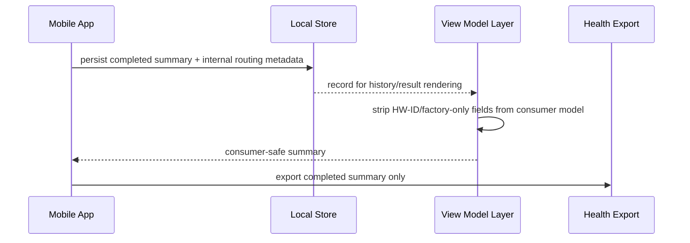
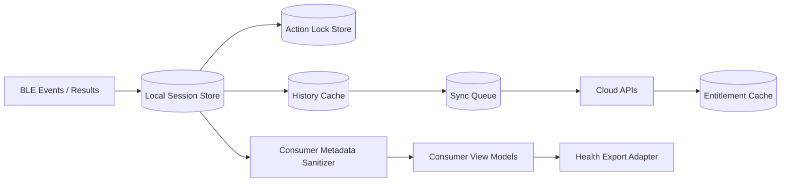

# AirHealth Mobile App Feature Design

## Versioning

- Version: v0.2
- Date: 2026-03-27
- Author: Codex

## 1. Summary

This document covers only the mobile app running on the user’s phone. It excludes firmware-internal sensing logic, factory-tool UI, and cloud-internal processing except where the app consumes contracts from those systems.

Mobile scope in Phase 1:

- onboarding and BLE pairing UX
- feature hub and one-action-at-a-time gating
- goal setup and suggestion UX
- oral and fat measurement guidance and result presentation
- history, progress, and health export
- entitlement, temporary-access, and read-only behavior
- consult professionals directory handoff
- reconnect, replay, and queued sync handling
- consumer-safe handling of internal-only metadata and factory isolation

## 2. Inputs Reviewed

- `PM/PRD/PRD.md` v0.7
- `SW/Architecture/Software_Architecture_Spec_v0.2.md`

## 3. Scope And Requirements Baseline

### Must-Have

- App is the primary instructional and user-facing state surface for consumer flows.
- App must enforce one active user action at a time.
- App must gate actions using effective entitlement state.
- App must drive measurement UX while respecting device-authoritative results.
- App must persist queue state and recover from process death or network loss.
- App must export completed summaries only.
- App must not expose Factory mode entry, HW-ID values, detected VOC type, or manufacturing-only logs anywhere in consumer UI, settings, support, or export paths.
- App must consume factory-related capability differences only as compatibility or filtering inputs, not as user-visible product variants.

### Non-Goals

- local device sensing or algorithm computation
- source-of-truth subscription ledger behavior
- backend event processing
- factory or support tooling UI
- consumer-visible diagnostics for internal HW-ID or factory records

### Dependencies

- BLE payload contracts
- session summary schemas
- entitlement snapshot contract
- health-export platform APIs
- consumer-safe compatibility and capability responses from backend

## 4. Assumptions And Dependencies

- Factory tooling is a separate application or internal tool and is not implemented inside the consumer mobile app.
- Consumer app may receive internal routing metadata in local or sync payloads, but it can reliably filter that metadata from user-visible models and exports.
- BLE protocol versioning can distinguish consumer-visible and factory-only message families so the consumer app can ignore the latter safely.

Open questions:

- whether the consumer app should surface a generic “device not ready” state if a unit is still factory-eligible but not properly provisioned
- whether any support-facing mobile workflow is needed later, or whether all factory/support tooling remains out of scope for the consumer app

## 5. Responsibilities And Interfaces

| Feature area | Mobile responsibility | Inbound interface | Outbound interface |
| --- | --- | --- | --- |
| Pairing and onboarding | permission handling, discovery, claim flow, compatibility copy | BLE `device.info`, claim result | device claim API, analytics |
| Feature hub | route entry, action lock, enabled/disabled actions | session lock state, entitlement state | goal, suggestion, history, and support routes |
| Measurement guidance | preparation UI, live state rendering, finish/cancel controls | BLE events and result payloads | session start/cancel/finish commands |
| History and export | trend rendering, pending/synced labeling, export action | local cache, cloud history, platform API status | session upload, export audit |
| Entitlement | derive effective UI state and read-only behavior | entitlement snapshot | blocked-action messaging |
| Support directory | render directory and external handoff | directory content API | external app/browser handoff |
| Recovery | reconnect UX, resume-query orchestration, queue replay | BLE replay result, sync outcomes | sync queue, analytics |
| Internal metadata shielding | prevent factory/HW-ID data from surfacing in consumer flows | device capabilities, sync payloads, local records | filtered view models, sanitized exports, sanitized analytics |

## 6. Behavioral Design

### 6.1 Mobile Action State Machine

### 6.2 Pairing And Setup Sequence

### 6.3 Measurement UI Sequence

### 6.4 Internal Metadata Shielding Sequence

### 6.5 Mobile Data Flow

## 7. Contracts And Data Model Impacts

| Contract | Mobile requirement |
| --- | --- |
| Pairing contracts | consume `device.info`, claim proof, compatibility flags, and consumer-safe capability info |
| Session contracts | send `session.start`, `session.cancel`, `session.finish`; consume state and result payloads |
| Entitlement snapshot | derive effective app state from signed response and freshness timestamp |
| Goal and suggestion APIs | persist goal revisions and render cached or fresh suggestions |
| History query and upload | maintain pending/synced reconciliation while filtering internal-only fields from UI |
| Export audit | persist platform, timestamp, result, and failure reason |
| Factory-related contracts | ignore factory-only BLE message families and do not expose them in the consumer runtime |

Mobile-owned persisted state:

- action lock
- selected feature context
- local history cache
- sync queue jobs
- entitlement snapshot cache
- suggestion cache
- export audit records
- consumer-safe view model projections

## 8. Success Metrics And Instrumentation

| Metric | Why it matters | Source | Owner |
| --- | --- | --- | --- |
| Pairing funnel completion rate | shows whether users can reach first-use readiness from app entry through successful claim | onboarding analytics from discovery, connect, claim, and ready milestones | Mobile |
| Measurement start-to-result completion rate | confirms the app can shepherd users from action entry to confirmed device result | session UI events correlated with firmware `session.result` receipt | Mobile |
| Blocked-action rate by reason | highlights friction caused by entitlement, action lock, permissions, or incompatible state | route gating analytics with explicit block reason codes | Mobile |
| Recovery success rate after disconnect | measures how often reconnect and replay flows preserve user progress | reconnect state analytics plus replay result outcomes | Mobile |
| Sync queue drain latency | shows whether completed summaries reach backend within acceptable delay | local queue job timestamps and upload completion timestamps | Mobile |
| Health export success rate | measures user success for completed-summary exports without leaking partial data | export audit records and platform callback outcomes | Mobile |
| Internal-field exposure rate | guardrail metric for accidental surfacing of factory/HW-ID data in consumer views | UI snapshot validation telemetry and client-side schema assertions | Mobile |
| Consumer factory-flow invocation count | guardrail metric that should remain zero in production consumer sessions | analytics event for attempted factory message or unauthorized internal route access | Mobile |

Instrumentation notes:

- analytics events should use shared `session_id`, feature, and entitlement-state attributes for cross-domain correlation
- blocked-action and recovery events should use normalized reason codes
- export and history instrumentation should verify that internal-only routing fields never leave consumer-safe rendering or export layers

## 9. Failure Handling And Observability

Required user-visible states:

- permission denied
- device not found
- session canceled
- session failed
- temporary access
- read-only mode
- export denied or export failed
- reconnecting or recovered
- device incompatible or not ready

Required analytics:

- pairing funnel
- blocked-action reasons
- session start, finish, cancel, and fail
- export success rate
- read-only transition rate
- recovery success rate
- internal-field exposure violations

## 10. Verification Strategy

- route-level tests for one-action lock behavior
- BLE-driven integration tests for measurement flows
- stale entitlement reducer tests
- local queue persistence and replay tests
- iOS and Android export permission tests
- UI and serialization tests proving Factory mode, HW-ID, detected VOC type, and factory logs never surface in consumer views or exports
- protocol-version tests proving factory-only message families are ignored or rejected safely by the consumer app

## 11. Planning And Coding Handoff

| Task | Objective | Acceptance criteria |
| --- | --- | --- |
| Implement action lock store and route gating | enforce one-action-at-a-time behavior | conflicting actions block with explicit reasons |
| Build onboarding and pairing flow | connect permissions, discovery, claim UX, and compatibility handling | all failure branches recover without broken state |
| Build oral and fat measurement screens | render guided steps, progress, finish, and result states | UI never invents completed result without firmware confirmation |
| Build local history and sync queue models | reconcile pending and synced records while retaining consumer-safe render models | completed summaries survive process death and replay correctly |
| Implement entitlement reducer and read-only surfaces | derive and render effective access state | active, temporary, and read-only states behave consistently |
| Implement consult professionals and export flows | support external handoff and health export | support flow never transmits measurement data and export only sends completed summary |
| Implement metadata sanitization layer | strip factory/HW-ID fields from UI, analytics, and export surfaces | no consumer-facing screen or export contains internal routing data |
| Implement compatibility and device-readiness handling | show consumer-safe messaging for unsupported or not-ready devices | app never offers factory-only recovery paths to consumers |
