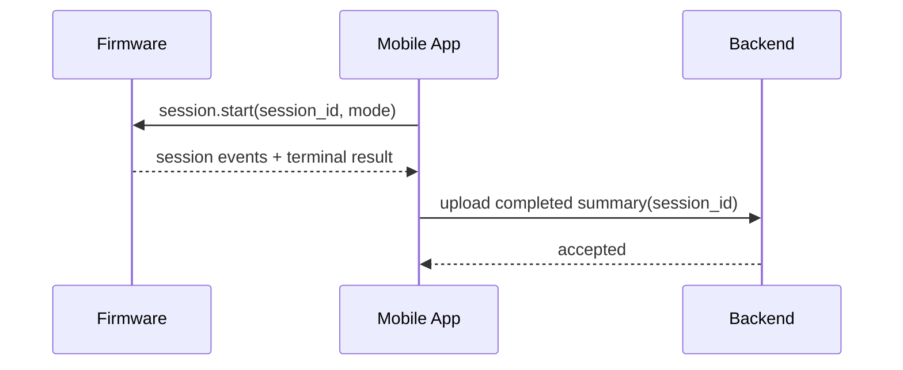

# AirHealth Shared Integration Appendix

## Versioning

- Version: v0.1
- Date: 2026-03-26
- Author: Codex

## 1. Purpose

This appendix contains only the cross-domain contracts and sequencing notes that should remain shared between firmware, mobile, and backend planning. It is intentionally brief so the domain design documents stay cleanly separated.

## 2. Shared Contracts

| Shared contract | Owners | Why it matters |
| --- | --- | --- |
| `session_id` correlation | Firmware, mobile, backend | ties measurement, sync, recovery, and analytics together |
| BLE session schemas | Firmware, mobile | keeps device-local and phone-local behavior aligned |
| completed session summary schema | Firmware, mobile, backend | ensures result payloads and persistence agree |
| entitlement snapshot schema | Backend, mobile | ensures action gating stays consistent |
| analytics event taxonomy | Mobile, backend, support systems | makes troubleshooting and KPI tracking consistent |

## 3. Cross-Domain Sequence

## 4. Delivery Order

1. Lock shared schemas and versioning rules.
2. Implement firmware session behavior and mobile measurement orchestration together.
3. Implement backend session persistence before history/export polish.
4. Add entitlement, support-directory, and recovery hardening after the main session path is stable.

## 5. Recommended Follow-On Use

Use these documents as direct inputs to:

- planning skills for ticket generation
- coding skills for domain-scoped implementation
- review skills for design-vs-code conformance checks
