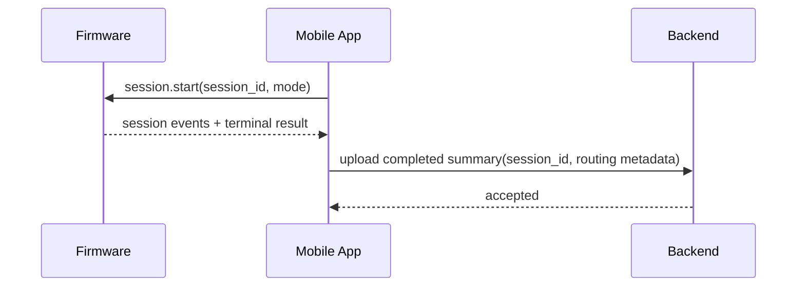
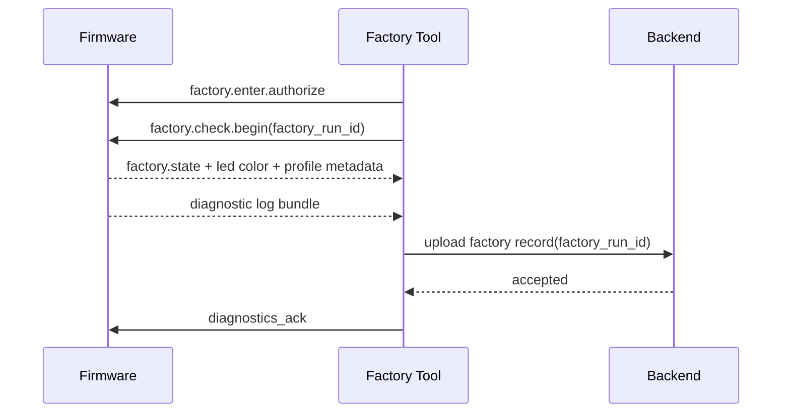

# AirHealth Shared Integration Appendix

## Versioning

- Version: v0.2
- Date: 2026-03-27
- Author: Codex

## 1. Purpose

This appendix contains only the cross-domain contracts and sequencing notes that should remain shared between firmware, mobile, and backend planning. It stays brief so the domain design documents remain cleanly separated.

## 2. Shared Contracts

| Shared contract | Owners | Why it matters |
| --- | --- | --- |
| `session_id` correlation | Firmware, Mobile, Backend | ties measurement, sync, recovery, and analytics together |
| BLE consumer session schemas v2 | Firmware, Mobile | keeps device-local and phone-local measurement behavior aligned |
| completed session summary schema v2 | Firmware, Mobile, Backend | ensures result payloads, sync, history, and export agree |
| entitlement snapshot schema | Backend, Mobile | ensures action gating stays consistent |
| `factory_run_id` correlation | Firmware, Backend, tooling-adjacent integrations | ties one-time factory execution to uploaded backend evidence |
| factory record schema v1 | Firmware-adjacent tooling, Backend | keeps pass/fail, diagnostics status, and profile-routing evidence aligned |
| device profile normalization contract | Firmware, Backend | ensures HW-ID and detected VOC metadata converge into durable routing identifiers |
| analytics event taxonomy | Mobile, Backend, support systems | makes troubleshooting and KPI tracking consistent |

## 3. Cross-Domain Sequences

### 3.1 Consumer Measurement And Sync

### 3.2 Factory Verification And Record Persistence

## 4. Shared Rollout Metrics

| Metric | Owners | Why it matters |
| --- | --- | --- |
| end-to-end session completion rate | Firmware, Mobile, Backend | verifies the full path from measurement start to cloud-accepted summary works in production |
| cross-domain `session_id` correlation coverage | Firmware, Mobile, Backend | confirms telemetry can be stitched together for debugging and KPI analysis |
| replay-to-upload recovery rate | Firmware, Mobile, Backend | measures whether disconnect recovery still results in durable backend history |
| contract version mismatch rate | Firmware, Mobile, Backend | surfaces schema drift before it becomes broad user-visible failure |
| factory record capture rate before shipment | Firmware, Backend, manufacturing-adjacent integrations | verifies every production unit finishes with durable factory evidence |
| profile normalization coverage | Firmware, Backend | confirms internal routing metadata is mappable across domains |
| consumer-field shielding success rate | Mobile, Backend | verifies internal-only factory and HW-ID data never leaks into consumer surfaces |

## 5. Delivery Order

1. Lock shared schemas and versioning rules for BLE v2, session summary v2, factory record v1, and device profile mapping v1.
2. Implement firmware session behavior and mobile measurement orchestration together.
3. Implement backend session persistence and profile normalization before export and history polish.
4. Implement firmware Factory mode, diagnostics buffering, and backend factory-record ingestion together.
5. Add entitlement, support-directory, metadata-shielding, and recovery hardening after the main session and factory paths are stable.

## 6. Recommended Follow-On Use

Use these documents as direct inputs to:

- planning skills for ticket generation
- coding skills for domain-scoped implementation
- review skills for design-vs-code conformance checks
- manufacturing or support tooling design once the factory-adjacent client surface is ready to be specified separately
